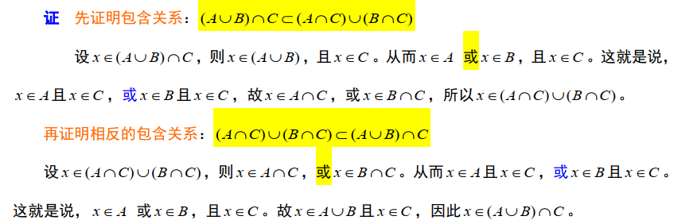
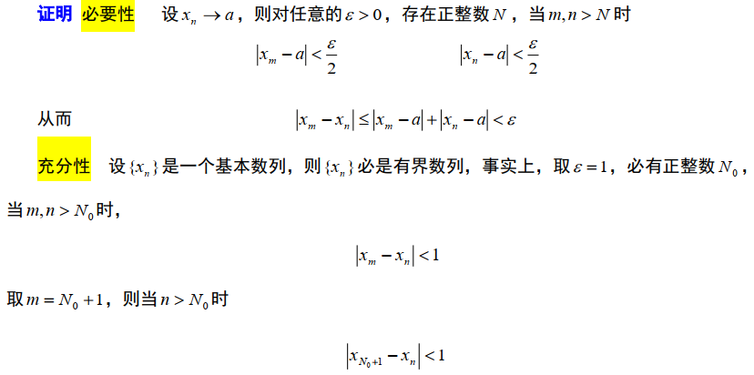
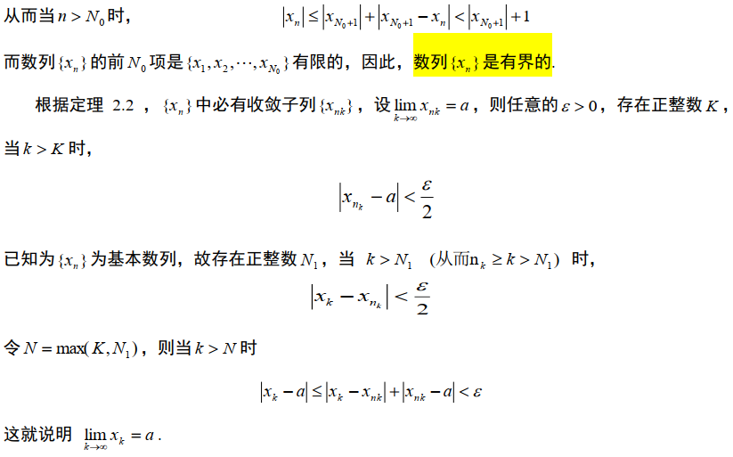
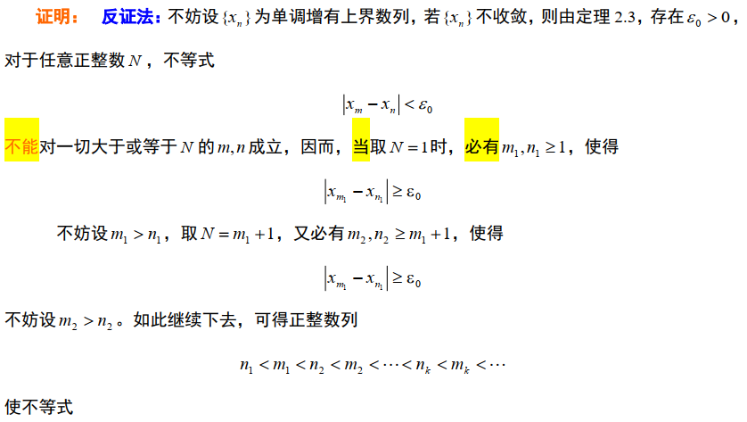
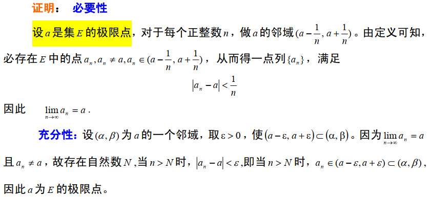

# 第一章 实分析概要

## 第一节 集合及其运算

- ==**例 1.5**== 证明  $(A \cup B) \cap C=(A \cap C) \cup(B \cap C)$

    

- ==**定理 1.1**== 设 X 为基本集，为任意集组，则1）$\left(\bigcup_{\alpha \in I} A_{\alpha}\right)^{C}=\bigcap_{\alpha \in I}\left(A_{\alpha}\right)^{C}$；	2）$\left(\bigcap_{\alpha \in I} A_{\alpha}\right)^{C}=\bigcup_{\alpha \in I}\left(A_{\alpha}\right)^{C}$

## 第二节 实数的完备性

- 定理 2.1 (区间套定理)
    设 $\left\{\left[a_{n}, b_{n}\right]\right\}$ 为实数轴上的任一闭区间套, 其中 $a_{n}$ 与 $b_{n}$ 都是实数, 那么存在唯一的一个实数 $\xi$ 属
    于一切闭区间 $\left[a_{n}, b_{n}\right](n=1,2, \cdots), \quad$ 即 $\xi \in \underset{n=1}{\cap}\left[a_{n}, b_{n}\right],$ 并且$\lim _{n \rightarrow \infty} a_{n}=\lim _{n \rightarrow \infty} b_{n}=\xi$

- ==**命题 2.1**== 设 $\left\{x_{n}\right\}$ 是一个数列，则 $\lim _{n \rightarrow \infty} x_{n}=a$ 的充要条件是$\left\{x_{n}\right\}$ 的每一个子列都收敘而且有相同的极限值 $a $

    证明 $\quad$ 充分性是显然的，只要证明必要性。
    因为 $\lim _{n \rightarrow \infty} x_{n}=a,$ 所以 ${\forall}\varepsilon>0,$ 必 $\exists N\in N^*$ 使得 $n>N$ 时，有$\left|x_{n}-a\right|<\varepsilon$

    取 $K=N,$ 则当 $k>K$ 时，必有 $n_{k}>n_{K} \geq N,$ 从而$\left|x_{n_{k}}-a\right|<\varepsilon$，即$\lim _{k \rightarrow \infty} x_{n_{k}}=a$

- ==**定理 2.2 （列紧性定理）**== 任何有界数列必有收敛子列  

    

    

- ==**定理 2.3 柯西(Cauchy)收敛原理 (完备性定理)**== 数列${x_n}$收敛的充分必要条件是， 它是一个基本数列。

      

    

    

- ==**定理 2.4 (单调收敛定理)**== 单调有界数列（即单调增有上界数列或单调减有下界数列）必然收敛  

    

    

- 从定理2.1 (区间套定理) $\rightarrow$ 定理 2.2 （列紧性定理）$\rightarrow$定理 2.3 柯西（Cauchy）收敛原理 (完备性定理) $\rightarrow$ 定理 2.4 (单调收敛定理)$\rightarrow$定理 2.5 确界存在定理 $\rightarrow$ 定理 2.6 （有限覆盖定理）  

## 第三节 可数集与不可数集
## 第四节 直线上的点集与连续函数

- **==定理 4.2==** 点 $a$ 是集 $E$ 的极限点的**充要**条件是存在 $E$ 中的点列 $\left\{a_{n}\right\}\left(a_{n} \neq a\right),$ 使$\lim _{n \rightarrow \infty} a_{n}=a$

    

- 定理 $4.3$ 非空集 $E$ 是闭集的**充要**条件是 $E \subset E$

- ==**定理 4.4**== 集合 $E$ 为闭集的**充要**条件是 $E=\bar{E}$ 。

    证明：必要性 	设 $E$ 是闭集，由定理 $4.3, \quad E \subset E 。$ 故 $\bar{E}=E \cup E=E$.
    			充分性 	设 $E=\bar{E},$ 则由 $E \subset \bar{E}=E$ 及定理 4.3 知 $E$ 是闭集。

- ==**例 4.4**== 设 $f(x)=\frac{1}{x}, E=(0,1),$ 则 $f(x)$ 在 $E$ 上连续但不一致连续。

    证明： $\forall x_{0} \in E$ ，由$\left|\frac{1}{x}-\frac{1}{x_{0}}\right|=\left|f(x)-f\left(x_{0}\right)\right|<\varepsilon$，得$\frac{1}{x_{0}}-\varepsilon<\frac{1}{x}<\frac{1}{x_{0}}+\varepsilon$

    当 $\frac{1}{x_{0}}-\varepsilon<0$ 时，只要考虑右边的不等式，得$x-x_{0}>-\frac{\varepsilon x_{0}^{2}}{1+\alpha_{0}}$

    当 $\frac{1}{x_{0}}-\varepsilon>0$ 时，则有$\frac{x_{0}}{1-\varepsilon x_{0}}>x>\frac{x_{0}}{1+\varepsilon x_{0}}$

    故$\frac{\varepsilon x_{0}^{2}}{1-\varepsilon x_{0}}>x-x_{0}>-\frac{\varepsilon x_{0}^{2}}{1+\varepsilon x_{0}}$。因此，只要取$\delta=\min \left(\frac{\varepsilon x_{0}^{2}}{1+\varepsilon x_{0}}, \frac{\varepsilon x_{0}^{2}}{1-\varepsilon x_{0}}\right)=\frac{\varepsilon x_{0}^{2}}{1+\varepsilon x_{0}}$

    当 $\left|x-x_{0}\right|<\delta$ 时，就有不等式 (1.14) 成立，从而得知 $f(x)$ 在 $E$ 上处处连续。但由于 $\delta$ 与 $x_{0}$ 有关，因此 $f(x)$ 在 $E$ 上不一致连续。

- **==例 4.5==** 考察函数列 $f_{n}(x)=x^{n}, x \in(0,1), n=1,2, \cdots,$ 显然, 当 $n \rightarrow \infty$ 时, $f_{n}(x) \rightarrow 0$ 。对于任给的 $\varepsilon>0,$ 由不等式$\left|x^{n}-0\right|=x^{n}<\varepsilon$

    容易解得 $N=\left[\frac{\ln \varepsilon}{\ln x}\right]($ 这里 $[a]$ 表示数 $a$ 的不大于 $a$ 得整数部分 $)$ 它既与 $\varepsilon$ 相关，又与 $x$ 相关，可以看成是 $\varepsilon$ 与 $x$ 的函数。

- **==例 4.6==** 证明函数列$f_{n}(x)=\frac{x}{1+n^{2} x^{2}} \quad n=1,2, \cdots$，在 $E=[0,1]$ 上一致收敛于 0 。

    

- **==定理 $4.9$==** 定义在点集 $E \subset R$ 上的函数列 $\left\{f_{n}(x)\right\}$ 一致收敛于 $f(x)$ 的**充要**条件是: 对于 $\forall \varepsilon>0,$ $\exists N(\varepsilon)\in N^*,$ 使得当 $m, n>N(\varepsilon)$ 时，不等式$\left|f_{m}(x)-f_{n}(x)\right|<\varepsilon$对于所有 $x \in E$ 的成立.

    

    

## 第五节 点集的勒贝格测度与可测函数

## 第六节 勒贝格积分  

- 定理 6.7 设 $m E<\infty, f(x)$ 与 $u_{n}(x)(n=1,2, \cdots)$ 都是 $E$ 上的非负可测函数， 并且
    $f(x)=\sum_{n=1}^{\infty} u_{n}(x)(a.e.)$， 则$\int_{E} f(x) d m=\sum_{n=1}^{\infty} \int_{E} u_{n}(x) d m$

- **==例 6.1==** 已知 $\sum_{n=1}^{\infty} \frac{1}{n^{2}}=\frac{\pi^{2}}{6},$ 试计算 $R$ 积分 $\int_{0}^{1} \frac{\ln x}{1-x} d x$ 的值.

    因为$\ln x=\ln [1-(1-x)]=\sum_{n=1}^{\infty} \frac{(1-x)^{n}}{n}, \quad x \in(0,1)$
    所以$\quad \frac{\ln x}{1-x}=\sum_{n=1}^{\infty} \frac{(1-x)^{n-1}}{n}, \quad x \in(0,1)$

    在区间[0,1]内，上面级数的每一项都是非负的，利用定理 6.7，可得
    $$
    \begin{array}{l}
    \int_{0}^{1} \frac{\ln x}{1-x}=\int_{0}^{1} \sum_{n=1}^{\infty} \frac{(1-x)^{n-1}}{n} d x
    =\sum_{n=1}^{\infty} \int_{0}^{1} \frac{(1-x)^{n-1}}{n} d x=\sum_{n=1}^{\infty}\left(-\frac{1}{n^{2}}\right)=-\frac{\pi^{2}}{6}
    \end{array}
    $$

- **==例 6.2==** 求极限 $\lim _{n \rightarrow \infty} \int_{0}^{1} \frac{n x^{1 / 2}}{1+n^{2} x^{2}} \sin ^{5} n x d x$

    

- **==例6. 3==** 设 $f(t)$ 是区间 $(-\infty,+\infty)$ 上的 $L$ 可积函数，称$\tilde{f}(x)=\int_{-\infty}^{+\infty} e^{-i \pi} f(t) d t$为函数 $f(t)$ 的富里哀变换，试证1）$ \tilde{f}(x)$ 是上$(-\infty,+\infty)$的连续函数；     2） $\tilde{f}(x)=-\frac{d}{d x} \int_{-\infty}^{+\infty} \frac{e^{-i \alpha}-1}{i t} f(t) d t$

    

    

# 第二章 距离空间

## 第一节 距离空间的基本概念  

- 距离满足条件：1 ) 非负性, $\rho(x, y) \geq 0$ 且 $\rho(x, y)=0$ 当且仅当 $x=y$;
    2) 对称性, $\rho(x, y)=\rho(y, x)$;	3) 三角不等式，对任意的 $x, y, z \in X,$ 有$\rho(x, y) \leq \rho(x, z)+\rho(z, y)$

- **==例 1.2==** 连续函数空间 $C[a, b]$
    令 $C[a, b]=\{x(t) \mid x(t)$ 为 $[\mathrm{a}, \mathrm{b}]$ 连续函数 $\}$
    在 $C[a, b]$ 上定义$\rho(x, y)=\max _{t \in[a, b]} x(t)-y(t) \mid$

    

- **==例 1.3==** 有界数列空间 $m$ 。
    设 $m$ 表示所有的有界数列$x=\left(\xi_{1}, \xi_{2}, \cdots, \xi_{n}, \cdots\right)$( 其中 $\left|\xi_{i}\right| \leq k_{x}, i=1,2, \cdots, \quad k_{x}$ 是常数 $)$ 所构成的集合。如果 $x=\left(\xi_{1}, \xi_{2}, \cdots, \xi_{n}\right) \in m$$y=\left(\eta_{1}, \eta_{2}, \cdots, \eta_{n}\right) \in m $， 定义$\rho(x, y)=\sup _{i}\left|\xi_{i}-\eta_{i}\right|$

    类似于例 $1.2,$ 容易验证 $\rho(x, y)$ 是距离，从而 $m$ 按这个距离构成距离空间。

- 例 1.4 离散距离空间  $\rho(x, y)=\left\{\begin{array}{ll}0, & x=y \\ 1, & x \neq y\end{array}\right.$

- 例 1.5 空间 $L^{p}(E)(p \geq 1) $。$ L^{p}[a, b]=\left\{f\left((x) \mid\left(\int_{a}^{b}|f(x)|^{p}\right)^{1 / p}<\infty\right\}\right.$

    $\rho(x, y)=\left(\int_{E}|x(t)-y(t)|^{p} d m\right)^{\frac{1}{p}}$

- 例 $1.6 \quad l^{p}$ 空间 $(p \geq 1)$。令$l^{p}=\left\{x=\left.\left(\xi_{1}, \xi_{2}, \cdots \xi_{n}, \cdots\right)\left|\sum_{i=1}^{\infty}\right| \xi_{i}\right|^{p}<+\infty\right\}$

    如 $x=\left(\xi_{1}, \xi_{2}, \cdots \xi_{n}, \cdots\right), \quad y=\left(\eta_{1}, \eta_{2}, \cdots \eta_{n}, \cdots\right) \in l^{p}$， $\rho(x, y)=\left(\sum_{i=1}^{\infty}\left|\xi_{i}-\eta_{i}\right|^{p}\right)^{\frac{1}{p}}$

## 第二节 距离空间中的开集、闭集与连续映射  

- **==定理 2.5==** 设 $X, Y$ 都是距离空间 $, \quad T: X \rightarrow Y$ ，则下列命题是等价的。
    1) $T$ 在 $x_{0} \in X$ 连续;
    2) 对于 $T x_{0}$ 的任一邻域 $s\left(T x_{0}, \varepsilon\right),$ 必存在 $x_{0}$ 的邻域 $s\left(x_{0}, \delta\right),$ 使得$T\left(S\left(x_{0}, \delta\right)\right) \subset S\left(T x_{0}, \varepsilon\right)$

    3) 对于 $X$ 中任一点列 $\left\{x_{n}\right\},$ 若 $x_{n} \rightarrow x_{0},$ 则必有$T x_{n} \rightarrow T x_{0}$

    

## 第三节 距离空间的可分性与完备性

- 定义 3.3 设 $x$ 为距离空间
    1) 如点列 $\left\{x_{n}\right\} \subset X,$ 满足 $\lim _{m, n \rightarrow \infty} \rho\left(x_{m}, x_{n}\right)=0,$ 即任取 $\varepsilon>0,$ 存在正整数 $N,$ 使得当 $m, n>N$ 时， 有 $\rho\left(x_{m}, x_{n}\right)<\varepsilon,$ 则称 $\left\{x_{n}\right\}$ 为基本列或柯西列。
    2) 若 $x$ 中的每个基本列都收敘，则称 $X$ 为完备的距离空间。

- **==例3.4==**  $ \mathrm{C}[a, b]$ 是完备的距离空间

    

    

## 第四节 压缩映射原理及其应用  

- 定理 4.1 设 $X$ 是完备的距离空间, $T: X \rightarrow X$ 是压缩映射。则 $T$ 在 $X$ 中存在唯一的不动点 $\tilde{x},$ 即有$\tilde{x}=T \tilde{x}$

- **==推论 4.1==** 设 $X$ 是完备的距离空间, $T: X \rightarrow X,$ 如 $T$ 在闭球 $\bar{S}\left(x_{0}, r\right)$ 上是压缩映射，并且 $\rho\left(T x_{0}, x_{0}\right) \leq(1-\alpha) r,$ 则 $T$ 在 $\bar{S}$ 中存在唯一的不动点。

    证明: 只要能证明在上述迭代过程中，每个 $x_{n}$ 都在闭球 $\bar{s}$ 中，则定理 4.1 的证明都适用。为此，只要证明 $\bar{T} \bar{\subset} \subset \bar{S}$ 就够了。设 $x \in \bar{S},$ 即 $\rho\left(x, x_{0}\right) \leq r,$ 则$\rho\left(T x, x_{0}\right)  \leq \rho\left(T x, T x_{0}\right)+\rho\left(T x_{0}, x_{0}\right)\leq \alpha \rho\left(x, x_{0}\right)+(1-\alpha) r \leq \alpha r+(1-\alpha) r=r$

    故$T x \in \bar{S}$

- **==推论 4.2==** 设 $X$ 是完备的距离空间 $, \quad T: X \rightarrow X$ 。如存在常数 $\alpha(0 \leq \alpha<1)$ 及正整数$n_{0},$ 使对任何 $x, y \in X$ 都有$\rho\left(T^{n_{0}} x, T^{n_{0}} y\right) \leq \alpha \rho(x, y)$，则 $T$ 存在唯一的不动点。

    

- **==例 4.2==** 微分方程解的存在性与唯一性。
    考察微分方程的初值问题 $\left\{\begin{array}{l}\frac{d y}{d x}=f(x, y) \\\left.y\right|_{x_{0}}=y_{0}\end{array}\right.$

    设 $f(x, y)$ 在 $R^{2}$ 上连续，且关于 $y$ 满足立普希茨（Lipschitz）条件$\left|f\left(x, y_{1}\right)-f\left(x, y_{2}\right)\right| \leq K\left|y_{1}-y_{2}\right|$

    则有满足初始条件的唯一解。

    

    

    

- **==例 4.3==** 线性代数方程解的存在性与唯一性。  

    设有线性方程组$x_{i}-\sum_{j=1}^{n} a_{i j} x_{j}=b_{i} \quad(i=1,2, \cdots, n)$

    如对每个 $i$，$\sum_{j=1}^{n}\left|a_{i j}\right| \leq \alpha<1$，则该方程组有唯一解。

    

    

    

# 第三章 巴拿赫空间、希尔伯特空间及其线性算子  

