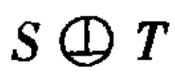
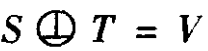
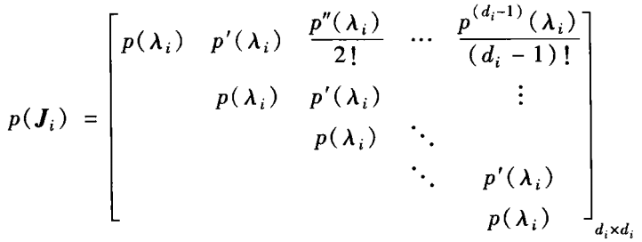
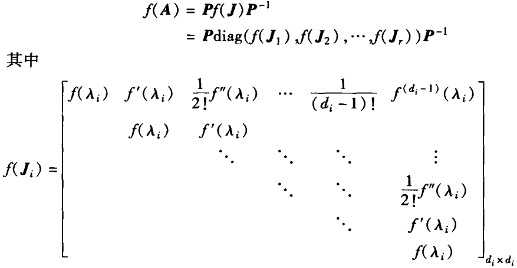

# 第一章 线性空间和线性变换

## 1.1-1.3 线性空间、基与坐标、坐标变换、线性子空间

- 线性空间：
    $Ax=0$解空间、$A$的核/零空间：$N(A)$；$A$的列空间 / 值域：$R(A)$
    
- 同一组点在不同基（$\alpha,\beta,\gamma$）下有不同的坐标（$x,y,z$）：$\alpha x = \beta y = \gamma z$

- 求向量$\alpha$在基$A=(\alpha_1,\alpha_2,...,\alpha_n)$下的坐标$k$：解$Ak=E\alpha$

- **过渡矩阵**P：$\beta=\alpha\boldsymbol{P}$，由基 $\alpha=(\boldsymbol{\alpha}_{1}, \boldsymbol{\alpha}_{2}, \cdots, \boldsymbol{\alpha}_{n})$ 到基 $\beta=(\boldsymbol{\beta}_{1}, \boldsymbol{\beta}_{2}, \cdots, \boldsymbol{\beta}_{n})$

- **坐标变换公式**：$x=Py \Leftarrow \alpha x=\beta y$

- 线性子空间=平凡子空间+非平凡子空间；平凡子空间=零子空间+线性空间本身

    交空间：$V_{1} \cap V_{2}=\left\{\boldsymbol{\alpha} \mid \boldsymbol{\alpha} \in V_{1}\right.$ 且 $\left.\boldsymbol{\alpha} \in V_{2}\right\}$；和空间：$V_{1}+V_{2}=\left\{\boldsymbol{\alpha}=\boldsymbol{\alpha}_{1}+\boldsymbol{\alpha}_{2} \mid \boldsymbol{\alpha}_{1} \in V_{1}\right.$ 且 $\left.\boldsymbol{\alpha}_{2} \in V_{2}\right\}$

    性质：$\operatorname{dim} V_{1}+\operatorname{dim} V_{2}=\operatorname{dim}\left(V_{1}+V_{2}\right)+\operatorname{dim}\left(V_{1} \cap V_{2}\right)$

    直和：$V_{1} \oplus V_{2}=V_{1}+V_{2}$，当$V_{1} \cap V_{2}=\{0\}$

## 1.4-1.5  线性映射、值域、核

- 线性映射：$\mathscr{A}: V_{1} \rightarrow V_{2}$。满足叠加性、齐次性

    恒等映射$E$：$\mathscr{A}: V \rightarrow V, \mathscr{A}(\boldsymbol{\alpha})=\boldsymbol{\alpha} \in V, \quad \forall \boldsymbol{\alpha} \in V$；零映射$0$：$\mathscr{A}: V_{1} \rightarrow V_{2}, \mathscr{A}(\boldsymbol{\alpha})=0$

- 线性映射在基 $\alpha=\left(\boldsymbol{\alpha}_{1}, \boldsymbol{\alpha}_{2}, \cdots, \boldsymbol{\alpha}_{n}\right)$ 与基 $\beta=\left(\boldsymbol{\beta}_{1}, \boldsymbol{\beta}_{2}, \cdots, \boldsymbol{\beta}_{m}\right)$ 下的矩阵表示$A$：$\mathscr{A}\left(\alpha\right)=\left(\beta\right) \boldsymbol{A}$

    线性映射在基 $\alpha$ 与基 $\beta$ 下向量坐标变换公式：$y=Ax$

    与过度矩阵$P$的近似：$A=P^{-1}$

- 在两个线性空间$V_{1},V_{2}$中，对应的不同基的关系为$\begin{aligned} V_{1} &  \quad\quad \left\{\boldsymbol{\alpha}_{i}  \right\} \stackrel{\boldsymbol{P}}{\longrightarrow}\left\{\boldsymbol{\alpha}_{i}^{\prime}  \right\} \\ \mathscr{A}\downarrow & \quad\quad \boldsymbol{A} \downarrow  \quad\quad\quad\downarrow  \boldsymbol{B} \\ V_{2} &\quad \quad\left\{\boldsymbol{\beta}_{i}\right\} \stackrel{Q}{\longrightarrow}\left\{\boldsymbol{\beta}_{i}^{\prime}  \right\} \end{aligned}$，其中$P,Q$为过渡矩阵，$A,B$为线性映射的矩阵表示

    则$\boldsymbol{B}=Q^{-1} \boldsymbol{A} \boldsymbol{P}$

- 线性映射 $\mathscr{A}$ 的值域$R(\mathscr{A})$：所有向量的变换输出的集合，$\mathscr{B}\left(V_{1}\right)=\left\{\boldsymbol{\beta}=\mathscr{B}(\boldsymbol{\alpha}) \in V_{2} \mid \forall \boldsymbol{\alpha} \in V_{1}\right\}$

    为 $\mathscr{A}$ 的秩$\operatorname{rank}\mathscr{A}$=$\operatorname{dim} R(\mathscr{A})$

- 核子空间：$N(\mathscr{A})=\mathscr{A}^{-1}(0)=\left\{\alpha \in V_{1} \mid \mathscr{A}(\alpha)=0\right\}$

    零度：$\operatorname{dim} N( \mathscr{A})$

- 

##  1.6-1.9 线性变换的矩阵与运算、同构、特征值与特征向量、不变子空间

- 线性变换：$\mathscr{A}: V \rightarrow V, \mathscr{A}(\boldsymbol{\alpha})=\boldsymbol{\alpha} A$。

- 相似：$\boldsymbol{B}=\boldsymbol{P}^{-1} \boldsymbol{A P}$，$P$为过渡矩阵

- 恒等变换：$\mathscr{A B}=\mathscr{BA}=\boldsymbol{E}$，其中$\mathscr{B}=\mathscr{A}^{-1}$

- 同构映射$\sigma$：$\begin{aligned}&\sigma(\boldsymbol{\alpha}+\boldsymbol{\beta})=\sigma(\boldsymbol{\alpha})+\sigma(\boldsymbol{\beta}) \\ &\sigma(\lambda \boldsymbol{\alpha})=\lambda \sigma(\boldsymbol{\alpha})\end{aligned}$

    性质： ①$V$中向量组 $\boldsymbol{\alpha}_{1}, \cdots, \boldsymbol{\alpha}_{s}$ 线性相 $($ 无 $)$ 关 $\Longleftrightarrow$ 像 $\sigma\left(\boldsymbol{\alpha}_{1}\right), \cdots, \boldsymbol{\sigma}\left(\boldsymbol{\alpha}_{s}\right)$线性相(无) 关

    ​			②两个线性空间，同构$\Leftrightarrow$有相同的维度

- 特征值$\lambda_0$ 和 特征向量$x$：$\mathscr{A}(\boldsymbol{x})=\lambda_{0} \boldsymbol{x}, \boldsymbol{\lambda}_{0} \in \boldsymbol{F}$

    计算方法：先计算矩阵A，然后计算它的$\lambda_A$和$x_A$，则$\lambda_0=\lambda_A,x=\alpha x_A\overset{例如}{=}\left(\boldsymbol{\alpha}_{1}, \boldsymbol{\alpha}_{2}, \boldsymbol{\alpha}_{3}\right)\left[\begin{array}{r}
    -1 \\1 \\0\end{array}\right]$

- 代数重复度$p_i$：某个特征值$\lambda_i$的重根数

    几何重复度$q_i$：某个特征值$\lambda_i$的特征子空间的维度

- 不变子空间$W$：$W$ 是 $V$ 的子空间，对于任意向量 $\boldsymbol{\alpha} \in W$ 都有 $\mathscr{A}(\boldsymbol{\alpha}) \in \boldsymbol{W}$

- 最小多项式：$\psi_{\lambda}=P_{1}(\lambda)^{d_{1}} P_{2}(\lambda)^{d_{2}} \ldots P_{s}(\lambda)^{d_{0}}$，其中 $P_{i}(\lambda)$ 是首项系数为 1、且互不相同的不可约多项式

- $V=W_{1} \oplus W_{2} \oplus \cdots \oplus W_{s}$ $\Leftrightarrow$ $\mathscr{A}$在某组基下的矩阵是准对角矩阵，$\operatorname{diag}\left\{A_{1}, A_{2}, \cdots, A_{s}\right\}$

## 1.10 矩阵的相似对角形

- $\mathscr{A}$ 可对角 $\Leftrightarrow$ $\boldsymbol{A}$ 可对角化 $\Leftrightarrow$ $\boldsymbol{A}$ 的每一个特征值的几何重复度等于代数重复度 $\Leftrightarrow$ $\lambda_{i}$ 的代数重复度 $p_{i}=n-\operatorname{rank}\left(\lambda_{i} E-A\right)$
- $\boldsymbol{A、B}$ 可同时对角化 $\Leftrightarrow$ $AB=BA$

# 第二章 $\lambda$-矩阵与矩阵的Jordan标准形

## 2.1-2.2 $\lambda$-矩阵及标准形、初等因子与相似条件

- 等价：$\boldsymbol{A}(\lambda) \simeq \boldsymbol{B}(\lambda) \Leftrightarrow \boldsymbol{D}_{k}(\lambda) $相同  $ \Leftrightarrow d_{k}(\lambda)$ 相同 $\Leftrightarrow$ 秩&初等因子相同

- **不变因子**：$d_{i}(\lambda) \mid d_{i+1}(\lambda)$，用于Smith标准型中

- k阶**行列式因子**：$\boldsymbol{D}_{k}(\lambda)=d_{1}(\lambda) d_{2}(\lambda) \cdots d_{k}(\lambda)$

- **初等因子**：$d_{k}(\lambda)$分解成多个一次因式方程后，不为常数的全体

    - 方法一：把$\lambda E-A$化为Smith标准型
    - 方法二：求出所有的$\boldsymbol{D}_{k}$

    ​		不变因子$1,1,(\lambda-2)^{5}(\lambda-3)^{3},(\lambda-2)^{5}(\lambda-3)^{4}(\lambda+2)$

    ​		初等因子$(\lambda-2)^{5},(\lambda-3)^{3},(\lambda-2)^{5},(\lambda-3)^{4},(\lambda+2)$

- **Smith标准型**：唯一
    $$
    \boldsymbol{A}(\boldsymbol{\lambda}) \simeq\left[\begin{array}{llllll}
    d_{1}(\lambda) & & & & \\
    & d_{2}(\lambda) & & & \\
    & & \ddots & & \\
    & & & & d_{r}(\lambda) & & \\
    & & & & & 0 & \\
    & & & & & \ddots \\
    & & & & & & 0
    \end{array}\right]_{m \times n}
    $$
    计算方法：初等变换

    技巧：

## 2.3 矩阵的Jordan标准形

- **Jordan标准型**：
- 方法一：利用初等因子
    - ~~方法二：利用$\operatorname{rank}\left(\lambda_{i} E-A\right)^{k}$~~
    - **方法三**：求出所有特征值。对于重根，$n-rank(\lambda E-A)$为其约旦块数量
- Jordan标准型的**变换矩阵$P$**：①求出J；②令$\boldsymbol{P}=\left(\boldsymbol{X}_{1} \boldsymbol{X}_{2} \boldsymbol{X}_{3}\right)$，解$A P=P J$得$\boldsymbol{X}_{1} \boldsymbol{X}_{2} \boldsymbol{X}_{3}$
- Jordan标准型的应用

    - 求解 常系数线性微分方程组$\frac{\mathrm{d} \boldsymbol{X}}{\mathrm{d} t}=\boldsymbol{A} \boldsymbol{X}$：①求$J$；②求$P$；③求解$\frac{\mathrm{d} \boldsymbol{Y}}{\mathrm{d} t}=\boldsymbol{P}^{-1} \boldsymbol{A P Y}=\boldsymbol{J} \boldsymbol{Y}$；④通过$X=P Y$得$X$
    - 求$A^k$：$A^k=P J^kP^{-1}$

## 2.4 矩阵的有理标准形

- 有理标准形：$\boldsymbol{A} \sim \boldsymbol{F}, \boldsymbol{F}=\left[\begin{array}{llll}
    \boldsymbol{C}_{1} \\
    & \boldsymbol{C}_{2} \\
    & & \ddots \\
    & & & \boldsymbol{C}_{\boldsymbol{k}}
    \end{array}\right], C_{i}=\left[\begin{array}{ccccc}
    0 & 0 & \cdots & 0 & -a_{i} n_{i} \\
    1 & 0 & \cdots & 0 & -a_{i} n_{i-1} \\
    & & \ddots & & \ddots \\
    & \ddots & & 0 & -a_{i 2} \\
    & & & 1 & -a_{i 1}
    \end{array}\right]$

    A的非常数的$k$个不变因子为$\varphi_{i}(\lambda)=\lambda^{n_{i}}+a_{i 1} \lambda^{n_{i}-1}+\cdots+a_{i} n_{i-1} \lambda+a_{i} n_{i}$

- $F=Q^{-1} A Q=(\boldsymbol{P M})^{-1} \boldsymbol{A}\left(\boldsymbol{P} \boldsymbol{M}^{-1}\right)$

    计算有理标准形 $\boldsymbol{F}$ 及变换矩阵 $\boldsymbol{Q}$：①求$J$；②根据不变因子写出$F$；③$\boldsymbol{P}^{-1} \boldsymbol{A} \boldsymbol{P}=\boldsymbol{J}\rightarrow P, F M=M J\rightarrow M$；④$Q=P M^{-1}$

# 第三章 内积空间、正规矩阵、Hermite矩阵

- $G$为基$\{\alpha_i\}$度量矩阵：$g_{i j}=\left(\boldsymbol{\alpha}_{i}, \boldsymbol{\alpha}_{j}\right)$
    $$
    \boldsymbol{G}=\left[\begin{array}{cccc}
    g_{11} & g_{12} & \cdots & g_{1 n} \\
    g_{21} & g_{22} & \cdots & g_{2 n} \\
    \vdots & \vdots & & \vdots \\
    g_{n 1} & g_{n 2} & \cdots & g_{n n}
    \end{array}\right]
    $$

- 复共轭转置矩阵$A^{H}=(\bar{A})^{\mathrm{T}}$

- Hermite矩阵：$\boldsymbol{A}^{\mathrm{H}}=\boldsymbol{A}$；反Hermite矩阵：$\boldsymbol{A}^{\mathrm{H}}=-\boldsymbol{A}$

- Cauchy- Schwarz不等式：$|(\boldsymbol{\alpha}, \boldsymbol{\beta})| \leqslant\|\boldsymbol{\alpha}\|\|\boldsymbol{\beta}\|$ 

- Schmidt方法求标准正交基：

    - 正交化

    $$
    \begin{aligned}
    \boldsymbol{\beta}_{1} &=\boldsymbol{\alpha}_{1} \\
    \boldsymbol{\beta}_{2} &=\boldsymbol{\alpha}_{2}-\frac{\left(\boldsymbol{\alpha}_{2}, \boldsymbol{\beta}_{1}\right)}{\left(\boldsymbol{\beta}_{1}, \boldsymbol{\beta}_{1}\right)} \boldsymbol{\beta}_{1} \\
    \vdots & \quad \vdots \quad\quad\quad\quad \vdots \\
    \boldsymbol{\beta}_{r} &=\boldsymbol{\alpha}_{r}-\frac{\left(\boldsymbol{\alpha}_{r}, \boldsymbol{\beta}_{1}\right)}{\left(\boldsymbol{\beta}_{1}, \boldsymbol{\beta}_{1}\right)} \boldsymbol{\beta}_{1}-\frac{\left(\boldsymbol{\alpha}_{r}, \boldsymbol{\beta}_{2}\right)}{\left(\boldsymbol{\beta}_{2}, \boldsymbol{\beta}_{2}\right)} \boldsymbol{\beta}_{2}-\cdots-\frac{\left(\boldsymbol{\alpha}_{r}, \boldsymbol{\beta}_{r-1}\right)}{\left(\boldsymbol{\beta}_{r-1}, \boldsymbol{\beta}_{r-1}\right)} \boldsymbol{\beta}_{r-1}
    \end{aligned}
    $$

    - 单位化

- | 酉空间                                                       | 欧式空间                                                     |
    | ------------------------------------------------------------ | ------------------------------------------------------------ |
    | 酉矩阵：$A^{\mathrm{H}} A=A A^{\mathrm{H}}=E$，记$A \in U^{n \times n}$ $\boldsymbol{A}^{-1}=\boldsymbol{A}^{\mathrm{H}} \in U^{n \times n}$，$|\operatorname{det} A|=1$ | 正交矩阵：$\boldsymbol{A}^{\mathrm{T}} \boldsymbol{A}=\boldsymbol{A A}^{\mathrm{T}}=\boldsymbol{E}$，记$A \in E^{n \times n}$ ①$A^{-1}=A^{\mathrm{T}} \in E^{n \times n}$；②$\operatorname{det} A=\pm 1$；③$A B, B A \in E^{n \times n}$ |
    | 酉变换(等距变换)：$(\sigma(\boldsymbol{\alpha}), \sigma(\boldsymbol{\beta}))=(\boldsymbol{\alpha}, \boldsymbol{\beta})$ | 正交变换：$(\sigma(\boldsymbol{\alpha}), \boldsymbol{\sigma}(\boldsymbol{\beta}))=(\boldsymbol{\alpha}, \boldsymbol{\beta})$ |

- 幂等矩阵：$A^{2}=A$，$A \in C^{n \times n}$ $\Leftrightarrow$ $rank(A) = r, \boldsymbol{P}^{-1} \boldsymbol{A P}=\left[\begin{array}{l}\boldsymbol{E}_{r} \\ 0\end{array}\right]$

- 正交：$S \perp T$

    正交和：，正交补：$T_{\perp}\Leftrightarrow$

    正交投影：$\boldsymbol{P}_{S}=\boldsymbol{U}_{1} \boldsymbol{U}_{1}^{\mathrm{H}}, U_{1} \in U_{r}^{n \times r}$

- 次酉矩阵：$U_{1}^{\mathrm{H}} U_{1}=E_{r}$，记$\boldsymbol{U}_{1} \in U_{r}^{n \times r}$

- $A=A^{\mathrm{H}}=A^{2}\Leftrightarrow\boldsymbol{A}=\boldsymbol{U} \boldsymbol{U}^{\mathrm{H}},\boldsymbol{U} \in U_{r}^{n \times r}$

    

- | 酉空间                                                       | 欧式空间                                                     |
    | ------------------------------------------------------------ | ------------------------------------------------------------ |
    | Hermite变换 / 自伴(随)变换：$(\mathscr{B}(\boldsymbol{\alpha}), \boldsymbol{\beta})=(\boldsymbol{\alpha}, \mathscr{A}(\boldsymbol{\beta}))$ | 对称变换：$(\mathscr{A}(\boldsymbol{\alpha}), \boldsymbol{\beta})=(\boldsymbol{\alpha}, \mathscr{A}(\boldsymbol{\beta}))$ |
    | 反Hermite变换：$(\mathscr{A}(\boldsymbol{\alpha}), \boldsymbol{\beta})=-(\boldsymbol{\alpha}, \mathscr{A}(\boldsymbol{\beta}))$ | 反对称变换：$(\mathscr{A}(\boldsymbol{\alpha}), \boldsymbol{\beta})=-(\boldsymbol{\alpha}, \mathscr{A}(\boldsymbol{\beta}))$ |
    | 酉相似：$\boldsymbol{U}^{\mathrm{H}} \boldsymbol{A} \boldsymbol{U}=\boldsymbol{U}^{-1} \boldsymbol{A} \boldsymbol{U}=\boldsymbol{B}$ | 正交相似：$\boldsymbol{U}^{\mathrm{T}} \boldsymbol{A} \boldsymbol{U}=\boldsymbol{U}^{-1} \boldsymbol{A} \boldsymbol{U}=\boldsymbol{B}$ |
    |                                                              |                                                              |

- Schur 引理：任何一个n阶复矩阵A酉相似于一个上(下)三角矩阵

    求酉矩阵W使得$\boldsymbol{W}^{\mathrm{H}} \boldsymbol{A} \boldsymbol{W} \Longrightarrow$ 上三角矩阵：

    ​	①取A的一个单位特征向量$\boldsymbol{\varepsilon}_{1}$，通过$\left(\varepsilon_{1}, \varepsilon_{2}\right)=0$的方法构造标准正交基（不唯一），组成$U_1$

    ​	②$\boldsymbol{U}_{1}^{\mathrm{H}} \boldsymbol{A} \boldsymbol{U}_{1}=\left[\begin{array}{ccc}
    \lambda & ?  \\0 &  A_{1} \end{array}\right]$，得到$A_1$。大小为$(n-1)*(n-1)$

    ​	③取$A_1$的一个单位特征向量，构造标准正交基，组成$V_1$，令$U_2=\left[\begin{array}{ccc}1 &   \\&  V_{1} \end{array}\right]$

    ​	④$\boldsymbol{W}=\boldsymbol{U}_{1} \boldsymbol{U}_{2}$

- **正规矩阵**：$A A^{\mathrm{H}}=A^{\mathrm{H}} A$，$A \in C^{n \times n}$；实正规矩阵：$\boldsymbol{A A}^{\mathrm{T}}=\boldsymbol{A}^{\mathrm{T}} \boldsymbol{A}$，$A \in R^{n \times n}$（∵显然$\boldsymbol{A}^{\mathrm{H}}=\boldsymbol{A}^{\mathrm{T}}$）

    A是正规矩阵，求酉矩阵U使得$\boldsymbol{U}^{\mathrm{H}} \boldsymbol{A} \boldsymbol{U} \Longrightarrow$ **对角矩阵**：求出A所有特征向量，经过Schmidt正交化后构成U

- 伴随变换 (酉/欧式空间)：$(\mathscr{A}(\boldsymbol{\alpha}), \boldsymbol{\beta})=\left(\boldsymbol{\alpha}, \mathscr{A}^{\mathrm{H}}(\boldsymbol{\beta})\right) \quad \forall \boldsymbol{\alpha}, \boldsymbol{\beta} \in V$

- 正规变换 (酉/欧式空间)：$\mathscr{A}^{\mathrm{H}} \mathscr{A}=\mathscr{A A}^{\mathrm{H}}$

- Hermite二次型：$f\left(x_{1}, x_{2}, \cdots, x_{n}\right)=X^{\mathrm{H}} A X=\sum_{i, j=1}^{n} a_{i j} \bar{x}_{i} x_{j}$

    使用酉变换将Hermite二次齐式化为标准型：也就是用酉变换把A对角化

- 正定>0，半正定≥0，负定<0，半负定≤0

    正定 $\Leftrightarrow$ n个顺序主子式全>0 $\Leftrightarrow$ n个特征值>0 $\Leftrightarrow$ $P$可逆，$P^HAP$正定 $\Leftrightarrow$ $P^HAP=E$ $\Leftrightarrow$ $Q$可逆，$A=Q^HQ$ $\Leftrightarrow$ 

    半正定  $\Leftrightarrow$ 同理

    负定 $\Leftrightarrow$ n个顺序主子式全负正相间  $\Leftrightarrow$ 

# 第四章 矩阵分解

- **满秩分解**：$A=BC$，不唯一

    ​	①对A作初等行变换，得A的秩r

    ​	②B = A的前r个线性无关列

    ​	③C = A行变换后的前r个线性无关行

- **正交三角分解 / UR分解 / QR分解**：$\begin{aligned} A =U R ,A =R_{1} U_{1} \end{aligned}$，A列满秩。唯一

    $\boldsymbol{U}, \boldsymbol{U}_{1} \in U^{n \times n}, \boldsymbol{R}$是正线上三角阵，$R_1$是正线下三角阵

    用QR分解求解$Ax=b$

    ​	①将所有列向量经Schmidt正交构成矩阵$U$

    ​	②$\boldsymbol{R}=\boldsymbol{U}^{\mathrm{H}} \boldsymbol{A}$

    ​	③$U Rx=b \Longrightarrow \boldsymbol{x}=\boldsymbol{R}^{-1} \boldsymbol{U}^{\mathrm{H}} \boldsymbol{b}$

- 正奇异值 / 奇异值：$\alpha_{i}=\sqrt{\lambda_{i}}=\sqrt{\mu_{i}}$，$A A^{\mathrm{H}}$ 的正特征值 $\lambda_{i}, A^{\mathrm{H}} A$ 的正特征值 $\mu_{i}$（不为0）

- **奇异值分解**：$\boldsymbol{A}=\boldsymbol{U} \boldsymbol{D} \boldsymbol{V}^{\mathrm{H}}=\boldsymbol{U}\left[\begin{array}{ll}\boldsymbol{\Delta} & 0 \\ 0 & 0\end{array}\right] \boldsymbol{V}^{\mathrm{H}}$，不唯一

    ​	①求$A A^{\mathrm{H}}$ 的特征值$\lambda_{i}$（可以为0），以及对应的单位特征向量（Schmidt方法）构成$U$

    ​	②求$ A^{\mathrm{H}} A$的特征值$\mu_{i}$（可以为0），以及对应的单位特征向量构成$V$

    ​	③求A的奇异值$\alpha(!=0)$，然后从大到小构成对角矩阵$\boldsymbol{\Delta}$

- **极分解**：$A=H_{1} U=U H_{2}$，$H_{1}、H_{2}$为正定Hermite矩阵，$\boldsymbol{U} \in U^{n \times n}$。唯一

    类似非零复数$z=\rho(\cos \theta+\operatorname{isin} \theta)$，其中ρ>0是z的模(或称极径),θ是z的幅角

- **正规矩阵的谱分解**：$\boldsymbol{A}=\sum_{j=1}^{r} \lambda_{j} \sum_{i=1}^{n_{j}} \boldsymbol{\alpha}_{j i} \boldsymbol{\alpha}_{j i}^{\mathrm{H}}=\sum_{j=1}^{r} \lambda_{j} \boldsymbol{G}_{j}$，其中$G_{j}=\sum_{i=1}^{n_{j}} \alpha_{j i} \alpha_{j i}^{\mathrm{H}}$，$r$表示相异特征根数量

    ​	①求出A的所有特征根，以及对应的单位特征向量（Schmidt正交化）$\alpha$

    ​	②对于重根，$\boldsymbol{G}=\boldsymbol{\alpha}_{1} \boldsymbol{\alpha}_{1}^{\mathrm{H}}+\boldsymbol{\alpha}_{2} \boldsymbol{\alpha}_{2}^{\mathrm{H}}+...$；单根$\boldsymbol{G}=\boldsymbol{\alpha}_{1} \boldsymbol{\alpha}_{1}^{\mathrm{H}}$

    ​	③$\boldsymbol{A}=\sum_{j=1}^{r} \lambda_{j} \boldsymbol{G}_{j}$

- **单纯矩阵（可以对角化）的谱分解**：

    ​	①求出所有特征向量（不用正交单位化）$\alpha_i$，构成$\boldsymbol{P}=\left(\boldsymbol{\alpha}_{1}, \boldsymbol{\alpha}_{2}, \boldsymbol{\alpha}_{3}...\right)$

    ​	②令$\left(\boldsymbol{P}^{-1}\right)^{\mathrm{T}}=\left(\boldsymbol{\beta}_{1}, \boldsymbol{\beta}_{2}, \cdots, \boldsymbol{\beta}_{n}\right)$

    ​	③对于重根，$\boldsymbol{G}=\boldsymbol{\alpha}_{1} \boldsymbol{\beta}_{1}^{\mathrm{T}}+\boldsymbol{\alpha}_{2} \boldsymbol{\beta}_{2}^{\mathrm{T}}+...$；单根，$\boldsymbol{G}=\boldsymbol{\alpha}_{1} \boldsymbol{\beta}_{1}^{\mathrm{T}}$

    ​	④$\boldsymbol{A}=\sum_{j=1}^{r} \lambda_{j} \boldsymbol{G}_{j}$

# 第五章 范数、序列、级数

## 5.1 - 5.3 向量范数、矩阵范数、诱导范数

- Hölder 不等式：设 $p>1, q=\frac{p}{(p-1)},$ 则$\quad \sum_{k=1}^{n} a_{k} b_{k} \leqslant\left(\sum_{k=1}^{n} a_{k}^{p}\right)^{\frac{1}{p}}\left(\sum_{k=1}^{n} b_{k}^{q}\right)^{\frac{1}{q}}$，其中 $a_{k}, b_{k} \geqslant 0$

    Minkowski 不等式: 对任何 $p \geqslant 1$,有
    $$
    \left(\sum_{i=1}^{n}\left|a_{i}+b_{i}\right|^{p}\right)^{\frac{1}{p}} \leqslant\left(\sum_{i=1}^{n}\left|a_{i}\right|^{p}\right)^{\frac{1}{p}}+\left(\sum_{i=1}^{n}\left|b_{i}\right|^{p}\right)^{\frac{1}{p}}
    $$

- 向量范数：非负性、齐次性、三角不等式（$\|\boldsymbol{x}+\boldsymbol{y}\| \leqslant\|\boldsymbol{x}\|+\|\boldsymbol{y}\|$）

- p-范数：p≥1，$\|\boldsymbol{x}\|_{p}=\left(\sum_{i=1}^{n}\left|x_{i}\right|^{p}\right)^{\frac{1}{p}}$

    1-范数：$\quad\|x\|_{1}=\sum_{i=1}^{n}\left|x_{i}\right|$
    2-范数 / 欧式范数：$\quad\|\boldsymbol{x}\|_{2}=\left(\sum_{i=1}^{n}\left|x_{i}\right|^{2}\right)^{\frac{1}{2}}=\left(\boldsymbol{x}^{\mathrm{H}} \boldsymbol{x}\right)^{\frac{1}{2}}$

    $\infty$ -范数：$\quad\|\boldsymbol{x}\|_{\infty}=\lim _{p \rightarrow \infty}\|x\|_{p} =\max \left|x_{i}\right|,(i=1,2, \cdots, n)$

- 矩阵范数：非负性、齐次性、三角不等式、矩阵乘法相容性（$\|\boldsymbol{A B}\| \leqslant\|\boldsymbol{A}\|\|\boldsymbol{B}\|$）。$\boldsymbol{A}=\left(a_{i j}\right) \in C^{m \times n}$

    矩阵的1-范数：$\|\boldsymbol{A}\|=\sum_{i=1}^{m} \sum_{j=1}^{n}\left|a_{i j}\right|$

    Frobenius 范数 : $\|\boldsymbol{A}\|_{F}=\left(\sum_{i=1}^{m} \sum_{j=1}^{n}\left|a_{i j}\right|^{2}\right)^{\frac{1}{2}}$

-  || $A \|_{\beta}$ 是与向量范数 $\|x\|_{\alpha}$ **相容的矩阵范数**：$\|A x\|_{\alpha} \leqslant\|A\|_{\beta}\|x\|_{\alpha}$

- 诱导范数 / 算子范数：$\|\boldsymbol{A}\|_{i}=\max _{x \neq 0} \frac{\|\boldsymbol{A} \boldsymbol{x}\|_{\alpha}}{\|\boldsymbol{x}\|_{\boldsymbol{\alpha}}}$，且| $A \|_{i}$ 是与向量范数 $\|x\|_{\alpha}$ **相容的矩阵范数**

- 矩阵p-范数：$\|\boldsymbol{A}\|_{p}=\max _{x \neq 0} \frac{\|\boldsymbol{A} \boldsymbol{x}\|_{p}}{\|\boldsymbol{x}\|_{p}}$

    列和范数：$\|\boldsymbol{A}\|_{1}=\max _{j}\left(\sum_{i=1}^{m}\left|a_{i j}\right|\right)$，$(j=1,2, \cdots, n)$

    谱范数：$\|\boldsymbol{A}\|_{2}=\max _{j}\left(\lambda_{\mathrm{j}}\left(\boldsymbol{A}^{\mathrm{H}} \boldsymbol{A}\right)\right)^{\frac{1}{2}}, \lambda_{\mathrm{j}}\left(\boldsymbol{A}^{\mathrm{H}} \boldsymbol{A}\right)$ 表示矩阵 $\boldsymbol{A}^{\mathrm{H}} \boldsymbol{A}$ 的第j个特征值。也就是A的最大正奇异值

    行和范数：$\|A\|_{\infty}=\max _{i}\left(\sum_{j=1}^{n}\left|a_{i j}\right|\right) \quad(i=1,2, \cdots, m)$，表示每一行（取绝对值后）求和，取其中最大的。
    
- 谱半径：$\rho(A)=\max\left\{\left|\lambda_{1}\right|,\left|\lambda_{2}\right|, \cdots,\left|\lambda_{n}\right|\right\}$，$A \in C^{n \times n}$

    若 $A$ 是正规矩阵，则$\rho(A)=\|A\|_{2}$

## 5.4-5.6 矩阵序列与极限、幂级数、测度

- **矩阵序列** $\left\{A_{k}\right\}$ 的极限：$A=\lim _{k \rightarrow \infty} A_{k}=\left(a_{i j}\right)=(\lim _{k \rightarrow \infty} a_{i j}^{(k)})$
- 矩阵序列 $\left\{A_{k}\right\}$ 收敛于于 $A\Leftrightarrow$ 任意一种矩阵范数都满足  $\lim _{k \rightarrow \infty}\left\|A_{k}-A\right\|=0 $
- 判断收敛条件：$\lim _{k \rightarrow \infty} A^{k}=0 \Leftrightarrow\rho(A)<1$
- **矩阵级数**$\sum_{k=1}^{\infty} A_{k}=A_{1}+A_{2}+\cdots+A_{k}+\cdots$
- 若 $m \times n$ 个常数项级数都绝对收敛，则称**矩阵级数**$\sum_{k=1}^{\infty} A_{k}$绝对收敛

> 若 $\sum_{n=1}^{\infty}\left|u_{n}\right|$ 收敛，则 $\sum_{n=1}^{\infty} u_{n}$ 绝对收敛

- 矩阵级数$\sum_{k=1}^{\infty} A_{k}$绝对收敛 $\Leftrightarrow$ 任何一种矩阵范数，正项数项级数 $\sum_{k=1}^{\infty}\left\|\boldsymbol{A}_{k}\right\|$ 收敛

- 两个矩阵级数$\boldsymbol{S}_{1}: \boldsymbol{A}_{1}+\boldsymbol{A}_{2}+\cdots+\boldsymbol{A}_{k}+\cdots ; \quad \boldsymbol{S}_{2}: \boldsymbol{B}_{1}+\boldsymbol{B}_{2}+\cdots+\boldsymbol{B}_{k}+\cdots$都绝对收敛，且和为$A、B$，则它们的柯西乘积$\begin{aligned} \boldsymbol{S}_{3}: & \boldsymbol{A}_{1} \boldsymbol{B}_{1}+\left(\boldsymbol{A}_{1} \boldsymbol{B}_{2}+\boldsymbol{A}_{2} \boldsymbol{B}_{1}\right)+\left(\boldsymbol{A}_{1} \boldsymbol{B}_{3}+\boldsymbol{A}_{2} \boldsymbol{B}_{2}+\boldsymbol{A}_{3} \boldsymbol{B}_{1}\right) \\ &+\cdots+\left(\boldsymbol{A}_{1} \boldsymbol{B}_{k}+\boldsymbol{A}_{2} \boldsymbol{B}_{k-1}+\cdots+\boldsymbol{A}_{k} \boldsymbol{B}_{1}\right)+\cdots \end{aligned}$也绝对收敛，和为$AB$

- **矩阵幂级数**：$\sum_{k=0}^{\infty} c_{k} A^{k}=c_{0} E+c_{1} A+c_{2} A^{2}+\cdots+c_{k} A^{k}+\cdots$

- 判断矩阵幂级数A是否收敛：
    - 方法一：A的某一种范数（比如行和范数）$<R$，收敛
    - 方法二：幂级数$\sum_{k=0}^{\infty} c_{k} x^{k}$ 的收敛半径为$R$，$A$ 为 $n$ 阶方阵。若 $\rho(A)<R$，则矩阵幂级数 $\sum_{k=0}^{\infty} c_{k} A^{k}$ 绝对收敛；若 $\rho(A)>R$，发散
    - 结论：矩阵幂级数$\boldsymbol{E}+\boldsymbol{A}+\boldsymbol{A}^{2}+\cdots+\boldsymbol{A}^{k}+\cdots$绝对收敛$\Leftrightarrow\boldsymbol{\rho}(\boldsymbol{A})<1$，且其和为 $(\boldsymbol{E}-\boldsymbol{A})^{-1} .$
    - 方法三：判断$J$的收敛。即$\boldsymbol{A}^{k}=\boldsymbol{P} \operatorname{diag}\left(\boldsymbol{J}_{1}^{k}\left(\lambda_{1}\right), \boldsymbol{J}_{2}^{k}\left(\lambda_{2}\right), \cdots, \boldsymbol{J}_{r}^{k}\left(\lambda_{r}\right)\right) \boldsymbol{P}^{-1}$，

    $$
    \boldsymbol{J}{i}^{k}\left(\boldsymbol{\lambda}{i}\right)=\left[\begin{array}{cccc}
    \lambda{i}^{k} & \mathrm{C}{k}^{1} \lambda{i}^{k-1} & \cdots & \mathrm{C}{k}^{d{i}-1} \lambda{i}^{k-d{i}+1} \\
    & \lambda{i}^{k} & & \vdots \\
    & & \ddots & \mathrm{C}{k}^{1} \lambda{i}^{k-1} \\
    & & & \lambda{i}^{k}\\
    \end{array}\right]\\
    \mathrm{C}{k}^{l}=\frac{k(k-1) \cdots(k-l+1)}{l !} \quad(k \geqslant l)
    $$

    >1. $\sum_{n=0}^{\infty} a_{n} x^{n}$ 收敛半径：$\lim _{n \rightarrow \infty}\left|\frac{a_{n}+1}{a_{n}}\right|=\rho, \quad R=\left\{\begin{array}{l}\frac{1}{\rho}, \rho \neq 0 \\ +\infty, \rho=0 \\ 0, \rho=+\infty\end{array}\right.$
    >
    >2. 调和级数：$\sum_{n=1}^{\infty} \frac{1}{n}$ 发散；                                p级数：$\sum_{n=1}^{\infty} \frac{1}{n^{p}}\left\{\begin{array}{ll}\text { 发散, } & p \leq 1 \\ \text { 收敛, } & p>1\end{array}\right.$
    >    广义 $\mathrm{p}$ 级数： $\sum_{n=2}^{\infty} \frac{1}{n(\ln n)^{p}}\left\{\begin{array}{l}\text { 发散, } p \leq 1 \\ \text { 收敛, } p>1\end{array} ;\right.$     交错调和级数：$\sum_{n=1}^{\infty}(-1)^{n-1} \cdot \frac{1}{n}$，收敛

- 矩阵**测度**：$\mu(A)=\lim _{x \rightarrow 0+} \frac{\|E+x A\|-1}{x}$，||・|| 是给定的算子范数

    列和范数的测度：$\mu_{1}(\boldsymbol{A}) =\max _{j}\left(\operatorname{Re}\left(a_{i j}\right)+\sum_{i=1 \atop i \neq j}^{n}\left|a_{i j}\right|\right)$

    谱范数的测度：$\mu_{2}(A)=\max _{i}\lambda_{i}\left(\frac{\boldsymbol{A}+\boldsymbol{A}^{\mathbf{H}}}{2}\right)$，其中 $\lambda_{i}\left(\frac{\boldsymbol{A}+\boldsymbol{A}^{\mathrm{H}}}{2}\right)$ 表示矩阵 $\frac{\boldsymbol{A}+\boldsymbol{A}^{\mathrm{H}}}{2}$ 的第 $i$ 个特征值

    行和范数的测度：$\mu_{\infty}(\boldsymbol{A}) =\max _{i}\left(\operatorname{Re}\left(a_{i i}\right)+\sum_{j=1 \atop j \neq i}^{n}\left|a_{i j}\right|\right) $

# 第六章 矩阵函数

## 6.1 矩阵多项式

- 矩阵多项式：$p(\boldsymbol{A})=a_{m} \boldsymbol{A}^{m}+a_{m-1} \boldsymbol{A}^{m-1}+\cdots+a_{1} \boldsymbol{A}+a_{0} \boldsymbol{E}$ 

    ​		来源于$p(\lambda)=a_{m} \lambda^{m}+a_{m-1} \lambda^{m-1}+\cdots+a_{1} \lambda+a_{0}$

- Jordan表示。$p(\boldsymbol{A})=\boldsymbol{P} \operatorname{diag}\left(p\left(\boldsymbol{J}_{1}\right), p\left(\boldsymbol{J}_{2}\right), \cdots, p\left(\boldsymbol{J}_{r}\right)\right) \boldsymbol{P}^{-1}$

    

    步骤：求$J$，然后求$P$和$P^{-1}$，然后计算$p(J)$，最后通过$p(A)=P p(J) P^{-1}$得到

- 化零多项式：$p(\boldsymbol{A})=0$

    A的特征多项式为A的化零多项式，即$\begin{aligned} D(\lambda)=\operatorname{det}(\lambda E-A)=\lambda^{n}-\operatorname{tr} A \lambda^{n-1}+\cdots+(-1)^{n} \operatorname{det} A \end{aligned}=0$

- 最小多项式$\psi_{A}(\lambda)$：次数最低且首项系数为1的化零多项式

    求法：不同初等因子相乘

## 6.2-6.4 矩阵函数

- 矩阵函数：$f(\boldsymbol{A})=p(\boldsymbol{A})$。不唯一

- 表示一：Jordan表示式

    

    步骤：求$J$，然后求$P$和$P^{-1}$，然后公式计算$f(J)$，接着得到$f(A)=P p(J) P^{-1}$。最后将各个$f(x)$代入

- 表示二：拉格朗日——西勒维斯特内插多项式表示。
    $$
    \begin{aligned} 
    f(\boldsymbol{A})&=p(\boldsymbol{A})= \sum_{k=1}^{s}\left[a_{k 1} \boldsymbol{E}+a_{k 2}\left(\boldsymbol{A}-\lambda_{k} \boldsymbol{E}\right)+\cdots\right.\left.+a_{k d_{k}}\left(\boldsymbol{A}-\lambda_{k} \boldsymbol{E}\right)^{d_{k}-1}\right] \varphi_{k}(\boldsymbol{A})\\
    &s为最小多项式中不同项的个数\\
    \varphi_{k}(x)&=\frac{\varphi_{A}(x)}{\left(x-\lambda_{k}\right)^{d_{k}}} \quad k=1,2, \cdots, s ; l=1,2, \cdots, d_{k}\\
    &d_k表示最小多项式中某一项的次数\\
    a_{k l}&=\left.\frac{1}{(l-1) !}\left[\frac{d^{l-1}}{d x^{l-1}}\left(\frac{f(x)}{\varphi_{k}(x)}\right)\right]\right|_{x=\lambda_{k}}
    \end{aligned}
    $$

步骤： ①求最小多项式$\varphi_{A}(x)$
			②根据公式依次求$\varphi_{k}(x)、a_{kl}、f(A)$
			③把具体的A带入$f(A)$，得到多项式表达式
			④把要计算各种$f(x)$（A换成了x）以$x=x_0$的取值带入

- 表示三：**多项式表示**。$f(A)=p(A)=a_{0} E+a_{1} A+a_{2} A^{2}+\cdots+a_{m-1} A^{m-1}$

    ​	来源$p(x)=a_{0}+a_{1} x+a_{2} x^{2}+\cdots+a_{m-1} x^{m-1}$

    步骤： ①求最小多项式$\varphi_{A}(x)$；

    ​			②根据公式求出关于$a_i$的表达式$p(x)、p'(x)...$直到最后一项为常数

    ​			③将$x_i=\lambda_i(最小多项式中的)$带入上式解出所有$a_i$，得到$f(A)$

    ​			④将具体的A带入$f(A)$

- 表示四：幂级数表示。$f(\boldsymbol{A})=\sum_{k=0}^{\infty} c_{k} \boldsymbol{A}^{k}$，谱半径为$\rho<R$

    ​		来源$f(x)=\sum_{k=0}^{\infty} c_{k} x^{k} \quad|x|<R$

    $\mathrm{e}^{A}=\sum_{k=0}^{\infty}\frac{1}{n !} \boldsymbol{A}^{n} \quad(\rho<\infty)$
    $\sin \boldsymbol{A}=\sum_{k=0}^{\infty}(-1)^{n} \frac{1}{(2 n+1) !}{\boldsymbol{A}}^{2 n+1}\quad(\boldsymbol{\rho}<\infty)$

    $\cos A=\sum_{k=0}^{\infty}(-1)^{n} \frac{1}{(2 n) !} A^{2 n} \quad(\rho<\infty) $

    $ (E+A)^{-1}=\sum_{k=0}^{\infty}(-1)^{n} A^{n}\quad(\rho<1)$

    $ \ln (E+A)=\sum_{k=0}^{\infty}(-1)^{n+1} \frac{1}{n} A^{n}\quad(\rho<1)$

    $(E-A)^{-1}=\sum_{k=0}^{\infty}A^{n}\quad(\rho<1)$

    $(E-A)^{-2}=\sum_{k=0}^{\infty}n A^{n-1}\quad(\rho<1)$

# 函数矩阵与矩阵微分方程

## 7.1 函数矩阵与纯量

- 函数矩阵：$\boldsymbol{A}(x)=\left[\begin{array}{cccc}a_{11}(x) & a_{12}(x) & \cdots & a_{1 n}(x) \\ a_{21}(x) & a_{22}(x) & \cdots & a_{2 n}(x) \\ \vdots & \vdots & & \vdots \\ a_{m 1}(x) & a_{m 2}(x) & \cdots & a_{m n}(x)\end{array}\right]$

- 逆矩阵：$\boldsymbol{A}^{-1}(x)=\frac{1}{|\boldsymbol{A}(x)|} \operatorname{adj} \boldsymbol{A}(x)$

- 有极限：$\lim _{x \rightarrow x_{0}} \boldsymbol{A}(x)=\boldsymbol{A}$

    连续：$\lim _{x \rightarrow x_{0}} A(x)=A\left(x_{0}\right)$

- 函数矩阵对纯量的导数：
$$
    \begin{aligned}
    \boldsymbol{A}^{\prime}\left(x_{0}\right) &=\left.\frac{\mathrm{d} \boldsymbol{A}(x)}{\mathrm{d} x}\right|_{x=x_{0}}=\lim _{\Delta x \rightarrow 0} \frac{\boldsymbol{A}\left(x_{0}+\Delta x\right)-\boldsymbol{A}(x)}{\Delta x} \\
    &=\left[\begin{array}{cccc}
    \boldsymbol{a}_{11}^{\prime}\left(x_{0}\right) & \boldsymbol{a}_{12}^{\prime}\left(x_{0}\right) & \cdots & a_{1 n}^{\prime}\left(x_{0}\right) \\
    \boldsymbol{a}_{21}^{\prime}\left(x_{0}\right) & a_{22}^{\prime}\left(x_{0}\right) & \cdots & a_{2 n}^{\prime}\left(x_{0}\right) \\
    \vdots & \vdots & & \vdots \\
    a_{m 1}^{\prime}\left(x_{0}\right) & a_{m 2}^{\prime}\left(x_{0}\right) & \cdots & a_{m n}^{\prime}\left(x_{0}\right)
    \end{array}\right]
    \end{aligned}
$$
性质： ①$\frac{\mathrm{d}}{\mathrm{d} x}[k(x) \boldsymbol{A}(x)]=\frac{\mathrm{d} k(x)}{\mathrm{d} x} \boldsymbol{A}(x)+k(x) \frac{\mathrm{d} \boldsymbol{A}(x)}{\mathrm{d} x}$，$k(x)$ 是 $x$ 的纯量函数
			②$\frac{\mathrm{d}}{\mathrm{d} x}[\boldsymbol{A}(x) \boldsymbol{B}(x)]=\frac{\mathrm{d} \boldsymbol{A}(x)}{\mathrm{d} x} \boldsymbol{B}(x)+\boldsymbol{A}(x) \frac{\mathrm{d} \boldsymbol{B}(x)}{\mathrm{d} x}$，没有交换律
			③$\frac{\mathrm{d} \boldsymbol{A}^{-1}(x)}{\mathrm{d} x}=-\boldsymbol{A}^{-1}(x) \frac{\mathrm{d} \boldsymbol{A}(x)}{\mathrm{d} x} \boldsymbol{A}^{-1}(x)$，也可以求出$\boldsymbol{A}^{-1}(x)$后用①来算
			④$\frac{\mathrm{d}}{\mathrm{d} t}(\boldsymbol{A}(x))=\frac{\mathrm{d} A(x)}{\mathrm{d} x} f^{\prime}(t)=f^{\prime}(t) \frac{\mathrm{d} \boldsymbol{A}(x)}{\mathrm{d} x}$，$x=f(t)$ 是 $t$ 的纯量函数

- 函数矩阵的积分：$\int_{a}^{b} \boldsymbol{A}(x) \mathrm{d} x=\left[\begin{array}{cccc}\int_{a}^{b} a_{11}(x) \mathrm{d} x & \int_{a}^{b} a_{12}(x) \mathrm{d} x & \cdots & \int_{a}^{b} a_{1 n}(x) \mathrm{d} x \\ \int_{a}^{b} a_{21}(x) \mathrm{d} x & \int_{a}^{b} a_{22}(x) \mathrm{d} x & \cdots & \int_{a}^{b} a_{2 n}(x) \mathrm{d} x \\ \vdots & \vdots & & \vdots \\ \int_{a}^{b} a_{m 1}(x) \mathrm{d} x & \int_{a}^{b} a_{m 2}(x) \mathrm{d} x & \cdots & \int_{a}^{b} a_{m n}(x) \mathrm{d} x\end{array}\right]$

## 7.2 函数向量

- Gram矩阵：$\boldsymbol{G}=\left(g_{i j}\right)_{m \times m}, g_{i j}=\int_{a}^{b} \boldsymbol{\alpha}_{i}(x) \boldsymbol{\alpha}_{j}^{\mathrm{T}}(x) \mathrm{d} x$

    ​					其中$\boldsymbol{\alpha}_{1}(x), \boldsymbol{\alpha}_{2}(x), \cdots, \boldsymbol{\alpha}_{m}(x)$ 是 $m$ 个定义在 $[a, b]$ 上的连续函数向量（行向量）

    Gram行列式：$\operatorname{det} G$

- $\boldsymbol{\alpha}_{1}(x), \boldsymbol{\alpha}_{2}(x), \cdots, \boldsymbol{\alpha}_{m}(x)$ 线性无关 $\Leftrightarrow$ Gram矩阵满秩

- Wronski矩阵：
	$$
    \begin{array}{l}
    \boldsymbol{W}(x)&=\left(A(x), A^{\prime}(x), A^{\prime \prime}(x) \cdots, A^{(m-1)}(x)\right)_{m \times m n} \\
    &=\left[\begin{array}{cccccc}
    a_{11}(x) & a_{12}(x) & \cdots a_{1 n}(x) & \cdots a_{11}^{(m-1)}(x) & a_{12}^{(m-1)}(x) & \cdots a_{1 n}^{(m-1)}(x) \\
    a_{21}(x) & a_{22}(x) & \cdots a_{2 n}(x) & \cdots a_{21}^{(m-1)}(x) & a_{22}^{(m-1)}(x) & \cdots a_{2 n}^{(m-1)}(x) \\
    \vdots & \vdots & \vdots & \vdots & \vdots & \vdots \\
    a_{m 1}(x) & a_{m 2}(x) & \cdots a_{m n}(x) & \cdots a_{m 1}^{(m-1)}(x) & a_{m 2}^{(m-1)}(x) & \cdots a_{m n}^{(m-1)}(x)
    \end{array}\right]
    \end{array}
	$$
	其中，$A(x)=\left[\begin{array}{c}{\boldsymbol{\alpha}}_{1}(x) \\ {\boldsymbol{\alpha}}_{2}(x) \\ \vdots \\ {\boldsymbol{\alpha}}_{m}(x)\end{array}\right]$

## 7.3-7.4 矩阵、线性向量微分方程

- 矩阵微分方程 $\frac{\mathrm{d} \boldsymbol{X}(t)}{\mathrm{d} t}=\boldsymbol{A}\boldsymbol{X}(t), X_{0}(t)=C$的解为$X(t)=\mathrm{e}^{A\left(t-t_{0}\right)} C$
    - 当 $\operatorname{det} C \neq 0$ 时，任一 $\boldsymbol{X}(t)$ 有 Jacobi 等式$\operatorname{det} \boldsymbol{X}(t)=\operatorname{det} \boldsymbol{C} \cdot \exp \int_{t_{0}}^{t}(\operatorname{tr}(\boldsymbol{A}(t))) \mathrm{d} t$
    - 若$X_{0}(t)=C_1$和$X_{0}(t)=C_2$的情况下解为$X_1(t)、X_2(t)$，则满足$X_{2}(t)=X_{1}(t) T, T=C_{1}^{-1} C_{2}$
- 矩阵微分方程 $\frac{\mathrm{d} \boldsymbol{X}(t)}{\mathrm{d} t}= \boldsymbol{X}(t)\boldsymbol{A}, X_{0}(t)=C$的解为$X(t)=C\mathrm{e}^{A\left(t-t_{0}\right)} $
- $\begin{aligned} X(t+s)=X(t) X(s), X(0) &=E \Leftrightarrow X(t)=e^{A t} \end{aligned}$
- 线性向量微分方程 $\frac{\mathrm{d} \boldsymbol{x}(t)}{\mathrm{d} t}=\boldsymbol{A}(t) \boldsymbol{x}(t), \boldsymbol{x}\left(t_{0}\right)=\boldsymbol{x}_{0}$的解为$\boldsymbol{x}(t)=\mathrm{e}^{\boldsymbol{A}\left(t-t_{0}\right)} \boldsymbol{x}_{0}$
- 线性向量微分方程 $\frac{\mathrm{d} \boldsymbol{x}(t)}{\mathrm{d} t}=\boldsymbol{A}(t) \boldsymbol{x}(t)+\boldsymbol{f}(t), \boldsymbol{x}\left(t_{0}\right)=\boldsymbol{x}_{0}$的解为$\boldsymbol{x}(t)=\mathrm{e}^{\boldsymbol{A}\left(t-t_{0}\right)} \boldsymbol{x}_{0}+\int_{t_{0}}^{t} \mathrm{e}^{\boldsymbol{A}(t-\tau)} f(\tau) \mathrm{d} \tau$

# 第八章 矩阵的广义逆

- A的广义逆矩阵$A^-$ $ \Leftrightarrow$ 对于$A x=b$，有使解 $x=A^{-} b$ 成立的 $A^{-}$存在
       						   							$\Leftrightarrow$ $A A^{-} A=A$

    A的大小为m*n，当m=n，唯一，否则不唯一

    计算方法：对$\left[\begin{array}{cc}A_{m*n} & E_{m} \\ E_{n} & 0\end{array}\right]$进行初等行+列变换，得到$\left[\begin{array}{cc}E_{m*n} & P_{m*m} \\ Q_{n*n} & 0\end{array}\right]$，通过公式$\boldsymbol{M}=\boldsymbol{Q}\left[\begin{array}{cc}\boldsymbol{E}_{r} & \boldsymbol{X} \\ \boldsymbol{Y} & \boldsymbol{Z}\end{array}\right] \boldsymbol{P}=A^-$，$X,Y,Z$任意，可以为0方便计算

- 左逆（右逆）：$A_{\mathrm{L}}^{-1} A_{m*n}=E_{n} \quad\left(\right.$ 或 $\left.A A_{\mathrm{R}}^{-1}=E_{m}\right)$

    若$m=n$且A满秩，则$A^{-1}=A_{\mathrm{L}}^{-1}=A_{\mathrm{R}}^{-1}$

- 自反广义逆$\boldsymbol{A}_{r}^{-}$：使$\begin{aligned} A A^{-} A &=A \\ A^{-} A A^{-} &=A^{-} \end{aligned}$成立的 $A^{-}$

- A的**伪逆矩阵**$A^+$：满足Penrose - Moore方程，即$\begin{array}{cl}A A^{+} A=A & A^{+} A A^{+}=A^{+} \\ \left(A A^{+}\right)^{\mathrm{H}}=A A^{+} & \left(A^{+} A\right)^{\mathrm{H}}=A^{+} A\end{array}$。唯一

    性质：$\boldsymbol{A}^{+}=\boldsymbol{A}^{\mathrm{H}}\left(\boldsymbol{A} \boldsymbol{A}^{\mathrm{H}}\right)^{+}=\left(\boldsymbol{A}^{\mathrm{H}} \boldsymbol{A}\right)^{+} \boldsymbol{A}^{\mathrm{H}}$

    方法一：设 $A \in C^{m \times n}, A=B C$ 是 $A$ 的一个满秩分解,则$\boldsymbol{X}=\boldsymbol{C}^{\mathrm{H}}\left(\boldsymbol{C} \boldsymbol{C}^{\mathrm{H}}\right)^{-1}\left(\boldsymbol{B}^{\mathrm{H}} \boldsymbol{B}\right)^{-1} \boldsymbol{B}^{\mathrm{H}}=A^+$

    方法二：①求酉矩阵$U$可以使$A^HA$对角化；②求$A^HA$的所有特征值构成$\Lambda$，而$\Lambda^+=\Lambda^{-1}$；③$A^{+}=\left(A^{\mathrm{H}} A\right)^{+} A^{\mathrm{H}}=U \Lambda^{+} U^{\mathrm{H}} A^{\mathrm{H}}$

    方法三：①求$A^HA$的非零特征值构成$\Lambda_r$；②求非零特征值对应的单位特征向量（即非零特征值在$U$中对应的几列）；③$\boldsymbol{A}^{+}=U_{1} \boldsymbol{\Lambda}_{r}^{-1} U_{1}^{\mathrm{H}} \boldsymbol{A}^{\mathrm{H}}$

- 矩阵方程$A X B=D$的通解$X=A^{-} D B^{-}+Y-A^{-} A Y B B^{-}$，Y任意且与X大小一致，前提$A^{-}$ 与 $B^{-}$存在

- 相容（有解）方程组 $A x=b$ 的通解：$x=B b+\left(E_{n}-B A\right) z$

- 最小模解：相容方程组所有解中2-范数 $\| x \|=\sqrt{x^{\mathrm{H}} x}$ 中最小的

    性质：$\boldsymbol{B}$ 是 $\boldsymbol{A}$ 的一个广义逆矩阵，则对于任意 $\boldsymbol{b}$ ，$\boldsymbol{x}=\boldsymbol{B b}$是 $\boldsymbol{A x}=\boldsymbol{b}$ 的最小模解 $\Leftrightarrow$ $(\boldsymbol{B A})^{\mathrm{H}}=\boldsymbol{B A}$

- 最小二乘解 $x_{0}$ ：满足任意 $x$都有$\left\|\boldsymbol{A} \boldsymbol{x}_{0}-\boldsymbol{b}\right\|^{2} \leqslant\|\boldsymbol{A} \boldsymbol{x}-\boldsymbol{b}\|^{2}$

    最佳最小二乘解$u$：对于任意最小二乘解 $x_{0}$，$\|\boldsymbol{u}\| \leqslant\left\|\boldsymbol{x}_{0}\right\|$

    性质： ①$\boldsymbol{B}$ 是 $\boldsymbol{A}$ 的一个广义逆矩阵，则对于任意 $\boldsymbol{b}$ ，$\boldsymbol{x}=\boldsymbol{B b}$是 $\boldsymbol{A x}=\boldsymbol{b}$ 的最小二乘解 $\Leftrightarrow$ $A B A=A,(A B)^{H}=A B$

    ​			②$\boldsymbol{x}=\boldsymbol{A}^{+} \boldsymbol{b}$ 是方程组 $\boldsymbol{A x}=\boldsymbol{b}$ 的最佳最小二乘解

# 第九章 Kronecker积

- Kronecker积 / 直积：$\boldsymbol{A} \otimes \boldsymbol{B}=\left[\begin{array}{cccc}a_{11} \boldsymbol{B} & a_{12} \boldsymbol{B} & \cdots & a_{1 n} \boldsymbol{B} \\ a_{21} \boldsymbol{B} & a_{22} \boldsymbol{B} & \cdots & a_{2 n} \boldsymbol{B} \\ \vdots & \vdots & & \vdots \\ a_{m 1} \boldsymbol{B} & a_{m 2} \boldsymbol{B} & \cdots & a_{m n} \boldsymbol{B}\end{array}\right]_{mp*nq}$，其中$\boldsymbol{A}=\left(\boldsymbol{a}_{i j}\right)_{m \times n}, \boldsymbol{B}=\left(b_{i j}\right)_{p \times q}$

    性质： ①无交换律；②$(A \otimes B)(C \otimes D)=A C \otimes B D$；③$\operatorname{tr}(\boldsymbol{A} \otimes \boldsymbol{B})=\operatorname{tr}(\boldsymbol{A}) \cdot \operatorname{tr}(\boldsymbol{B})$；④$\operatorname{rank}(A \otimes B)=(\operatorname{rank} A)(\operatorname{rank} B)$；

    ​			⑤$\boldsymbol{x}_{1}, \boldsymbol{x}_{2}, \cdots, \boldsymbol{x}_{n}$ 和$\boldsymbol{y}_{1}, \boldsymbol{y}_{2}, \cdots, \boldsymbol{y}_{q}$都线性无关 $\Leftrightarrow$ $\boldsymbol{x}_{i} \otimes \boldsymbol{y}_{j}$线性无关；⑥$|\boldsymbol{A} \otimes \boldsymbol{B}|=|\boldsymbol{A}|^{p}|\boldsymbol{B}|^{m}$；

    ​			⑦存在置换矩阵（有限个初等矩阵的乘积）$P$，使得$\boldsymbol{P}_{m*n}^{\mathrm{T}}(\boldsymbol{A}_{m*m} \otimes \boldsymbol{B}_{n*n}) \boldsymbol{P}=\boldsymbol{B} \otimes \boldsymbol{A}$

- Kronecker积的幂：$\boldsymbol{A}^{[k]}=\underbrace{\boldsymbol{A} \otimes \boldsymbol{A} \otimes \cdots \otimes \boldsymbol{A}}_{k \text{个} \boldsymbol{A}}$

    性质：$A B^{[k]}=A^{[k]} B^{[k]}$

- 矩阵$\boldsymbol{A}=\left(a_{i j}\right)_{m \times n}$对矩阵$\boldsymbol{B}=\left(b_{k l}\right)_{p \times q}$的导数：$\frac{\mathbf{D} \boldsymbol{A}}{\mathbf{D} \boldsymbol{B}}=\left[\begin{array}{cccc}\frac{\partial \boldsymbol{A}}{\partial b_{11}} & \frac{\partial \boldsymbol{A}}{\partial b_{12}} & \cdots & \frac{\partial \boldsymbol{A}}{\partial b_{1 q}} \\ \frac{\partial \boldsymbol{A}}{\partial b_{21}} & \frac{\partial \boldsymbol{A}}{\partial b_{22}} & \cdots & \frac{\partial \boldsymbol{A}}{\partial b_{2 q}} \\ \vdots & \vdots & & \vdots \\ \frac{\partial \boldsymbol{A}}{\partial b_{p 1}} & \frac{\partial \boldsymbol{A}}{\partial b_{p 2}} & \cdots & \frac{\partial \boldsymbol{A}}{\partial b_{p q}}\end{array}\right]_{m p \times n q}=\left(\frac{\partial \boldsymbol{A}}{\partial b_{k l}}\right)$

    性质： ①$\frac{\mathrm{D}(\boldsymbol{A} \boldsymbol{B})}{\mathrm{D} \boldsymbol{C}}=\frac{\mathrm{D} \boldsymbol{A}}{\mathrm{D} \boldsymbol{C}}\left(\boldsymbol{E}_{q} \otimes \boldsymbol{B}\right)+\left(\boldsymbol{E}_{p} \otimes \boldsymbol{A}\right) \frac{\mathrm{D} \boldsymbol{B}}{\mathrm{D} \boldsymbol{C}}$
    			②$\frac{\mathrm{D}(\boldsymbol{A} \otimes \boldsymbol{B})}{\mathrm{D} \boldsymbol{C}}=\frac{\mathrm{D} \boldsymbol{A}}{\mathrm{D} \boldsymbol{C}} \otimes \boldsymbol{B}+\boldsymbol{A} \otimes \frac{\mathrm{D} \boldsymbol{B}}{\mathrm{D} \boldsymbol{C}}=\frac{\mathrm{D} \boldsymbol{A}}{\mathrm{D} \boldsymbol{C}} \otimes \boldsymbol{B}+\left(\boldsymbol{A} \otimes \frac{\partial \boldsymbol{B}}{\partial c_{i j}}\right)$

    ​			③$\left(\frac{\mathrm{D} \boldsymbol{A}}{\mathrm{D} \boldsymbol{B}}\right)^{\mathrm{T}}=\frac{\mathrm{D} \boldsymbol{A}^{\mathrm{T}}}{\mathrm{D} \boldsymbol{B}^{\mathrm{T}}},\left(\frac{\mathrm{D} \boldsymbol{A}}{\mathrm{D} \boldsymbol{B}}\right)^{\mathrm{H}}=\frac{\mathrm{D} \boldsymbol{A}^{\mathrm{H}}}{\mathrm{D} \boldsymbol{B}^{\mathrm{H}}}$

- 梯度：$\operatorname{grad} f=\frac{\mathrm{D} \boldsymbol{f}}{\mathrm{D} \boldsymbol{X}}=\left(\frac{\partial f}{\partial x_{1}}, \frac{\partial f}{\partial x_{2}}, \cdots, \frac{\partial f}{\partial x_{n}}\right)^{\mathrm{T}}$，其中$f$为纯量函数

    链式法则： $X(t)=\left(x_{1}(t), x_{2}(t), \cdots x_{n}(t)\right)^{\mathrm{T}}$ 为向量变量，一元函数 $f(t)=f(X(t))=f\left(x_{1}(t), x_{2}(t), \cdots, x_{n}(t)\right)$，则$\frac{\mathrm{d} f}{\mathrm{~d} t}=\frac{\mathrm{D} f}{\mathrm{D} \boldsymbol{X}} \cdot \frac{\mathrm{d} \boldsymbol{X}}{\mathrm{d} t}$

- 已知$f(x, y)=\sum_{i, j=0}^{l} c_{i j} x^{i} y^{j}\overset{例如}{=}2 x+x y^{3}$，$f(A, B)=\sum_{i, j=0}^{l} c_{i j} A^{i} \otimes B^{j}\overset{对应}{=}2 A \otimes E+A \otimes B^{3}$

    $A_{m*m}$的特征值为$\lambda$，特征向量为$x$；$B_{n*n}$的特征值为$\mu$，特征向量为$y$，则$f(A, B)$的特征值为$f(\lambda, \mu)$，特征向量为$x \otimes y$，有$mn$个

- 矩阵 $A$ 与 $B$ 的 Kronecker 和：$A \otimes E_{n}+E_{m} \otimes B$

- 矩阵行展开：$\operatorname{rs}(A)$；列展开：$\operatorname{cs}(A)$

    性质：①$\begin{aligned} \mathrm{rs}(A B C) &=\mathrm{rs}(B)\left(A^{\mathrm{T}} \otimes C\right) \\ \operatorname{cs}(A B C) &=\left(C^{\mathrm{T}} \otimes A\right) \operatorname{cs}(B) \end{aligned}$

- Sylvester线性矩阵方程：$\boldsymbol{A}_{1} \boldsymbol{X B}_{1}+\boldsymbol{A}_{2} \boldsymbol{X} \boldsymbol{B}_{2}+\cdots+\boldsymbol{A}_{p} \boldsymbol{X} \boldsymbol{B}_{p}=\boldsymbol{C}$ $\Leftrightarrow$ $G x=c$，其中$x=\operatorname{cs}(X), c=\operatorname{cs}(C), G=\sum_{j=1}^{p}\left(B_{j}^{\mathrm{T}} \otimes A_{j}\right)$

- 方程 $A X+X B=C$ 有唯一解 $\Leftrightarrow$ $\lambda_{i}(\boldsymbol{A})+\lambda_{j}(\boldsymbol{B}) \neq 0 \quad(\forall i, j)$，其中 $\lambda_{i}(\boldsymbol{A})$ 表示 $\boldsymbol{A}$ 的第 $i$ 个特征值

- 方程$\boldsymbol{A X}+\boldsymbol{X B}=0$ 有非零矩阵 $\boldsymbol{X}$  $\Leftrightarrow$ 对于某一个 $i$ 与 $j$ 有$\boldsymbol{\lambda}_{i}(\boldsymbol{A})+\mu_{j}(\boldsymbol{B})=0$

