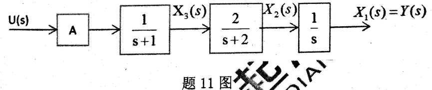

# 一、系统定义

**（工作原理画框图，系统结构图巴拉巴拉）**

**格式：先写好年份和题号，不然找不到题号**

**（2005年01）电冰箱制冷系统原理。。。。。。**

- 

# 二、系统模型

## 1. 模型之间的转化

**（转化：微分方程、传递函数、结构图、信号流图）**

- 2007  七. 是非题（每题1分）
    3） 由己知系统的传递函数转化为状态方程，其形式惟一。

- 2007 二. （10%） 求图2所示系统输出$y(s)$的表达式。

    

- 2008 二、系统方框图如图2所示，试用方框图等效变换求$Y(s)$的表达式。

    

- 2008 七、求如图7所示的系统闭环传递函数

    

- 2009 二、（10分）系统方框图如图2所示，试用方框图等效变换法求传递函数$G(s)=\frac{Y(s)}{R(s)}$

    

- 2010 1、（10分）系统的微分方程模型如下：
    $$
    \begin{array}{l}
    e(t)=k_{1}[r(t)-y(t)] \\
    \ddot{x}(t)=T d_{2} \ddot{e}(t)+T d_{1} \dot{e}(t)+e(t) \\
    \dot{y}(t)=k_{2}[n(t)+x(t)]
    \end{array}
    $$
    式中，$r$、$n$、$y$分别是输入、干扰和输出，$k_{1}, k_{2}, T d_{1}, T d_{2}$为常数，试建立系统方框结构图。

- 2010 2、（15分）系统结构图如图2所示，试用方框图等效变换法求传递函数$G(s)=\frac{Y(s)}{R(s)}$

    
    
- 2011 三. （15分）系统结构图如图3所示，试用方框图等等效变换法求传
    递函数$G(s)=\frac{Y_{1}(s)}{R_{1}(s)}$

    

- 2011 七.（10分）某采样系统如图7所示，$T$为采样周期。请根据方块图给出$C(z)$和$C(z) / R(z)$的表达式（如果有的话）。要求：写出所有标出变量的相关方程。

    

## 2. 模型建立

**（建模：电气系统、机械系统、水箱等）**

**（非线性微分方程线性化）**

- 2007 一. （10%） 图1为转动物体，$J$表示转动惯量，$f$表示摩擦系数。若输入为转矩$M(t)$，输出为轴角位移，求传递函数$G(s)=\frac{\theta(s)}{M(s)}$

- 2008 一、试求图中所示电路的传递函数$\mathrm{G}(\mathrm{s})=\frac{U_{0}(s)}{U_{1}(s)}$

    

- 2009 一、（10分）图1是一个液体贮槽的示图。设阀1前压力恒定，阀2的流通面积$f$不变，请推导液体流入量$Q_m$与液体贮槽的液位$h$在工作点附近之间的关系。（提示：液体力学公式$Q_{out}=\alpha \cdot f \sqrt{h}$，其中$\alpha $是阀的节流系数，可近似为常数。）

    

- 2011 一. （10分）机械系统如图10所示，$r(t)$为外力，$M_{1}, M_{2}$为质量，$x_1,x_2$为位移，$f_{1}, f_{2}$为阻尼系数，$k$为弹性系数，求以速度$v_1$为输出，$r(t)$为输入的系统传递函数

    

- 2012 1 （10分）加速度计如图1所示，$x(t)$为加速度计壳体的位移，$y(t)$为质量块$m$相对壳体的位移，$k$为弹簧的弹性系数，$f$为粘性摩擦系数。取$a(t)=\ddot{x}(t)$为输入变量，$y(t)%$为输出变量。试建立加速度计的微分方程模型，并简述测得加速度的机理和方法。

    

 - 2013 1 （10分）某被控对象$sys$为黑箱，为获取其数学模型，在输入端给予单位阶跃信号，得到其单位阶跃响应曲线如图1所示，图中还给出了所有的己知信息。请你：（1）用解析法给出该象的传递函数$Y(s)/X(s)$；（2）给出微分方程形式。

    

## 3. 其他

# 三、动态响应

## 1. 系统动态性能分析

**二阶、一阶（超调量、上升时间、峰值时间等）**

- 2008 四、控制系统的方块图如图所示，若系统以$\omega=5rad/s$的角频率作等幅持续振荡，试确
    定$K$和$τ$的数值。

    

- 2010 3、（10 分）已知二阶系统的单位阶跃响应为：$y(t)=10-12.5 e^{-1.2t /} \sin \left(1.6 t+53.1^{\circ}\right)$

    试求：系统的超调量$σ\%$、峰值时间$t_p$和调节时间$t_s$。

    【提示：$15 e^{-1.2 t} \sin \left(1.6 t+53.1^{\circ}\right)-20 e^{-1.2 t} \cos \left(1.6 t+53.1^{\circ}\right)=25 e^{-1.2 t} \sin 1.6 t$】

- 2012 3（15分）单位负反馈系统的开环传递函数为$G(s)=\frac{0.4 s+1}{s(s+0.6)}$，试求系统的单位阶跃响应，并求最大超调量$\sigma \%$

## 2. 求稳态误差

**（定值随动即扰动和输入）**

- 2008 三、单位负反馈系统的传递函数为$\mathrm{G}(s)=\frac{K}{s(s+10)}$，若单位阶跃响应的超调量$\sigma \leq 16.3 \%$； 误差$\mathbf{e}(t)=\gamma(t)-y(t)$ ， 当输入$\gamma(t)=(10+t)$时，要求稳态误差$e_{ss} \leq 0.1$ ，
    试求：

    （1） K值；

    （2）单位阶跃响应的调节时间$t_s(\triangle=5%)$；

    （3）当$\gamma(t)=(10+t+t^2)$时的稳态误差。

- 2009 四、（15分）系统结构如图4所示：

    （1）用劳斯判据判断闭环系统的稳定性。

    （2）设系统的输入信号和扰动信号均为单位斜坡信号，试求系统的输入稳态误态$e_{ssr}$和扰动稳态误差$e_{ssf}$。

    

- 2010 4、（15分）单位负反领系统的开环传递函数为： $G(s)=\frac{K(\tau S+1)}{S^{2}(T S+1)}$，其中$K>0, \tau>0，T>0$，输入$r(t)=t^{2}$，试求系统稳态误差$e_{s s}(\infty)<0.1$时它系统应满足的条件。

- 2011 二.（10分）杭州某实验室温度计的传递函数为$G(s)=\frac{1}{TS+1}$，用温度计测量沸腾水的温度，3分钟显示水温为95℃。若给盛水的容器加热，水温以$2℃/min$的速度上升，试求温度计的稳态指示误差。

- 2011 四. （15分）某复合控制系统如图4所示，系统稳定。试选择$a$、$b$值，
    使系统满足：当输入$r(t)=kt^2$时（$k>0$)， 系统的$e_{ss}=0$。

    

- 2014 四、（10分）某反馈控制系统如图4所示。若系统一对闭环极极点应的$\zeta=0.707$，确定：

    （1）系统的闭环极点；

    （2）系统在单位阶跃输入下的稳态输出

    

## 3. 求系统响应

## 4. 零极点对系统的影响

## 5. 其他

- 2007 三. （20\%） 单位负反馈系统的开环传递函数为$G(s)=\frac{K}{s(T s+1)(2 s+1)}$试求：

    （1） 闭环系统稳定，$K$和$T$应满足的条件；在$K-T$直角坐标系中画出该系统稳定的区域。

    （2） 若闭环系统处于临界稳定，且振动频率$\omega = 1rad/s$，求$K$和$T$的值。

    （3） 若系统的输入为单位阶跃函数，分析闭环系统的稳态误差。

- 2009 三、（15分）图3 （a）所示系统的单位阶跃响应曲线如图3 (b)所示，试确定$K, a, b$的数值（$K,a,b>0$)。

    

- 2009 五、（15分）图5所示控制系统只有闭环极点$2 \pm j \sqrt{10}$，试确定相应的$K、T$值。根据求出的$T$值，以$K$为参数画出根轨迹，确定使系统稳定的$K$值范围以及临界状态时的振荡频率。

    

- 2011 八.（20分）己知采样系统如图8所示，其中时间常数$T=1s$。

    （1）当采样周期$T_s=1s$时，求使系统稳定的$K$值范围；

    （2）为满足系统提出的动态性能指标，已设计出在$\zeta=0.707$时的闭环极点为：$Z_{1,2}=0.635+j 0.249$，问：在这种情况下的动态过程大约需要多长时间？

    （3）若要求动态过程没有振荡，请给出临界振荡的极点坐标及K值，并绘出根轨迹草图。

    （4）当输入为单位斜坡时，系统的静态误差为多少？

    

- 2012 2（15分）系统的结构如图2所示，试设计$H_2(s)$使干扰$F(s)$对输出$C(s)$无影响。

    

- 2012 4 （10分）非零初始条件下，单位负反馈系统的单位阶跃误差响应为$e(t)=e^{-t}-e^{-2 t}$，求系统的闭环传递函数、阻尼比、开环传递函数。

- 2012 8（15分）己知采样系统如图8所示，其中时间常数$T=2s$。

    （1）当采样周期$Ts=5s$时，求使系统稳定的$K$值范围；（2）若要求动态过程没有振荡请，求出临界振荡的极点坐标及$K$值，并以根轨迹草图示意。
    
    （3）若系统输入为1$1+\frac{1}{2} t$函数，请问系统的静态误差为多少

    

- 2013 2 （20分）某控制系统方块图如图2所示，要求：

    （1）请用方块图等效简化法，求取$Y(s) / R(s), \quad E(s) / R(s)$
    
    （2）若$G_3(s)$为可以设计的调节器，欲使系统的输出$Y(s)$不受扰动$N(s)$的影响，$G_3(s)$该如何选择？
    
    （3）若此时系统的闭环特征方程为$D(s)=s^{5}+8 s^{4}+25 s^3+40 s^{2}+39 s+12=0$，请判定系统的稳定性

    
    
- 2013 3 （15分）己知某控制系统的方块图如图3所示$(K_c>0,T>0)$，其中控制器环节中的$Kc$与$T$均可设计。问：

    

    （1）若要求系统在$T=0.5$时产生振荡，$Kc$至少满足什么条件？

    （2）当$T=1$时，若要系统产生4:1衰减振荡（输出响应的第一个波峰与同方向的第二个波峰之比），$Kc$应为多少？此时系统的超调量、调节时间、峰值时间、稳态误差各为多少？

- 2013 4（20分）己知某控制系统的方块图如图4（1）所示$K>0,T>0$

    （1）设系统$K=5$时作等幅持续振荡，请求出此时的角频率与时间常数$T$值

    （2）当$T=0.2$，$K=0.5$时，若输入为$x(t)=1(t)+t+\frac{t^{2}}{2}$，请问系统的稳态误差是多少？

    （3）在（2）中求出的稳态误差不为零，问：加上补偿器之后（如图4（2）所示)，能否过择参数$a$与$b$来达到无稳态偏差的目的？

    

# 四、根轨迹

- 2007 四. （20%）系统结构如图4所示。

    （1） 画出系统的根轨迹图，并确定使闲环系统稳定的$K$值范围;

    （2） 若已知闭环系统的一种极点为$s_1 =-1$，试确定闭环传递函数。

    

- 2008 五、单位负反馈系统的开环传递函数为$G(s)=\frac{\frac{s+a}{4}}{s^{2}(s+1)}$

    （1） 试绘制参数$a$由零到正无穷变化的闭环根轨迹。

    （2） 求出系统处于临界单调衰减时乘积形式的闭环传递函数。

- 2008 八、已知采样系统如图8所示，其中时间常数$T=0.5s$。

    （1） 当采样周期$T=0.4s$时，求使系统稳定的$K$值范围；

    （2） 若去掉零阶保持器，请采用根轨迹的方法求出使系统稳定的$K$值范围，并画出这种情况下的根轨迹草图。

    

- 2010 5、（15 分）系统结构图如图5所示。使闭环极点为$S=-1 \pm j \sqrt{3}$，试确定$K、τ$值，以计算出的K值为基准，绘制以$τ$为参变量的根轨迹。

    

- 2011 五. （15分）单位负反馈系统的开环传递函数为$G(s)=\frac{K(S+1)}{(S-1)^{2}}$，绘制$K$从$0\rightarrow \infty$的根轨迹，求系统为衰减震荡形式的$K$值范围，以及一闭环特征根为-2时的闭环传递函数

- 2012 5 （15分）反馈控制系统的开环传递函数为$G(s) H(s)=\frac{K}{\left(s_{2}+2 s+2\right)\left(s_{2}+2 s+5\right)}(k>0)$。欲保证闭环系统在正、负反下都稳定，试用根轨迹法确定$K$的范围，并概略绘制根轨迹图
- 2014 一、（10分）某单位负反馈系统的开环传递函数为： $G(s)=\frac{K(s-z)}{\left(s^{2}+2 \zeta \omega s_{n}+\omega_{n}^{2}\right)(s-p)}$
    其中$K>0, z, p ,\zeta, \omega_{n}$均为实数且已知$-1<\zeta<0$.求该系统根轨迹的出发角度。

# 五、频域

## 1. 奈氏图判稳定性

- 2007 六、（10％）己知单位负反馈系统开环频率特性的极坐标图如图6所示，图示曲线的开环放大倍数$K=500$，右半s平面内的开环极点数$P=0$，试求：
    （1）图示系统是否稳定，为什么？
    （2）确定使系稳定的$K$值范围

    
    
- 2009 六、（15分）某系统的结构图和开环幅相曲线如图6（a）、图6(b)所示，图中$G(s)=\frac{K\left(T_{3} s+1\right)}{\left(T_{1} s+1\right)\left(T_{2} s-1\right)},H(s)=T_{2} s-1,K_{1}>0, K>0, T>0$，试判定闭环系统的稳定性，并求复平面左半平面、右半平面、虚轴上的闭环极点数。

    

## 2. 由奈氏图、伯德图求开环传函

- 2007 五. （10%）系统动态框图及开环对数频率特性见图5，求$K_{1}, K_{2}, T_{1},T_2$的值。

    

    

- 2008 六、最小相位系统的开环对数幅频特性曲线如图所示，使确定系统的开环传递函数，并求出相角稳定裕量。

    

- 2012 6 （15分）最小相位系统的幅相特性如图6所示。根据幅相特性，写出与之对应的开环传递函数（设开环增益为$K$），并指出参数间关系；$K=\dot{K}$时，图6的$A$点值为$-1$，试分折$K$的取值范围与系统稳定性的关系。
  
    

## 3. 画奈氏图、伯德图

- 2010 6、（15分）系统开环传递函数为$G(s)=\frac{10}{\left(T_{1} S+1\right)\left(T_{2} S-1\right)}$，试绘制$T_{2}<T_{1}, T_{2}=T_{1}, T_{2}>T_{1}$三种情况下的奈奎斯特图。
- 2011 六.（15分）开环传递函数$G(s)=\frac{K}{S(S+1)(10 S+1)}$，绘制开环幅相曲线，确定系统闭环稳定的K值范围。

## 4. 幅值裕度、相角裕度

- 2014 三、（10分）己知单位负反馈系统的开环传递函数为$G(s)=\frac{K(3 s+1)}{s^{2}(s+1)}$。欲使该系统相位裕度达到最大，$K$值应该为多少？

## 5. 其他

- 2013 5（15分）系统的开环传递困数为$G(s) H(s)=\frac{K\left(1+T_{a} s\right)}{s^{2}\left(T_{1} s+1\right)\left(T_{2} s+1\right)\left(T_{3} s+1\right)}$，其中$K> 0$，
    $T_{a}>0, T_{1}>0,T_{2}>0, T_{3}>0$， 且 $T_{a}>\sum\left(T_{1}+T_{2}+T_{3}\right)$。请你：

    （1）给出该系统的开环频率特性（包括幅频特性与相频特性)；
    （2）给出该系统的极坐标概略图；

    （3）用奈奎斯特稳定判据证明，若系统不稳定，则系统必有2个闭环极点在右半平面。

- 2013 6（20分）某控制系统如6所示，请：

    （1）用根轨迹的方法求取当$K_c$从$0^{+} \rightarrow+\infty$变化时，使得系统稳定的$K_1$值范围
    
    （2）给出系统的闭环传递函数。
    
    （3）若给定$K_{1}=0.5$，求出使系统衰减振荡的$K_c$值的范围

    

# 六、离散

## 1. 方框图求传函

- 2010 8、（10分）某采样系统如图8所示，请给出$C(z)$ 和 $C(z) / R(z)$表达式。

    

- 2012 7 （10分）闭环离散控制系统的结构图如图7所示，试求$Y(z),Y(z)/R(z)$

    

## 2. 求离散输出

- 2009 九、（10分）闭环离散控结构图如图所示，试求与$Y(s)$与$Y(z)$

## 3. 差分方程运算

## 4. 求稳态误差

## 5. 稳定性（根轨迹等）

- 2007 八. （10%） 如图所示离散系统， $T=1$，问：系统的$T_s$取在什么范围，系统是稳定的。

    

- 2010 9、一采样控制系统结构见图9，采样周期$T=1s$，$H_0(s)$为零阶保持器。试确定使系统稳定时的K值范围。注：图9中$D(k): e_{2}(k)=e_{2}(k-1)+10\left[e_{1}(k)-0.5 e_{1}(k-1)\right]$

    

- 2013 7 （15分）某采样系统的结构如图7所示，已如采样周期$T =1s$， $ZOH$为零阶保持器，$D(z)$为数字控制器，结构为$D(z)=\frac{z+i a}{z+b}$，其中$a$和$b$为待定参数，其设计要求：

    （1）单位阶跃输入下的输出响应无稳态误差，即$e_{ss} =0$；

    （2）保证系统稳定。

    

## 6. 其他

# 七、现控（连续+离散）

## 1. 建模-列写状态空间方程

- 2009 十一、已知控制系统的状态方程为

$$
\begin{array}{l}
\dot{x}_{1}=f_{1}\left(x_{1}\right)+x_{2} \\
\dot{x}_{2}=x_{1}-a x_{2}
\end{array}
$$

​		设$f(0)=0$，试确定系统在原点渐进稳定的条件。

- 2010 11、（5分）请用李亚普诺夫方法研究如下系统。给出系统在平衡点稳定时参数a需满足的条件。
    $$
    \begin{array}{c}
    \dot{x}_{1}=-x_{2}+a x_{1}^{3} \\
    \dot{x}_{2}=x_{1}+a x_{2}^{3}
    \end{array}
    $$

## 2. 模型之间转换（传函能控能观正则、结构图等）

## 3. 能控能观判断、能控能观结构分解

- 2007  七. 是非题（每题1分）
    1） 经过状态反馈后的系统，其能控能观性均不发生改变。

    4） 一个能控能观的连续系统离散化后仍然保持其能控与能观性。

    8） 对一个$n$维的能控能观线性SISO系统，其状态方程与传递函数描述是等价的。

    9） 系统$S1$能控的充要条件是其对偶系统$S2$能观。

    10） 经过非奇异线性变换的线性定常系统不改变其状态的能控性。

- 2009 七、（20分）控制系统方块图如图7所示，根据图中指定的状态变量，（1）写出相应的状态
    空间表达式；（2）并进行该系统的能控性与能观性分析（请给出过程)

    

- 2010 7、（15分）列写如图7所示系统的状态空间表达式，并判断该系统是否能控？是否能观？

    

## 4. 状态反馈极点配置

- 2012 9 （15分） 线性定常连续系统如下. （1）已知$u(t)=0$，$y(t)=3e^{-t}-2e^{-2t}$， 试求$x(0)$. 

    （2）若系统状态由于某种原因不能直接测量，请你通过设计观测器给出，且要求：设计的观测器闭环极点为$-5, -5$.
    
    $$
    \left\{\begin{array}{l}
    x(t)=\left[\begin{array}{cc}
    0 & 1 \\
    -2 & -3
    \end{array}\right]x(t)+\left[\begin{array}{c}
    1 \\
    -1
    \end{array}\right] u(t) \\
    y(t)=[1, 0] x(t)+u(t)
    \end{array} \quad t \in[0, \infty)\right.
    $$

## 5. 设计全维/降维状态观测器

- 2007  七. 是非题（每题1分）
    2） 若一个可观的n维动态系统其输出矩阵的秩为$m$，则可设计$m$维的降维观测器。

## 6. 求解状态方程、状态转移矩阵

- 2009 八、（10分）说明矩阵$\Phi(t)$是否为某系统的状态转移矩阵；如果是，请求出其逆阵以及该
    系统的$A$阵。

$$
\Phi(t)=
    \left[
    \begin{matrix}
       9 e^{-t}-8 e^{-2 t} & 5 e^{-t}-5 e^{-2 t} \\
       -3 e^{-t}+3 e^{-2 t} & 4 e^{-t}+5 e^{-2 t}
    \end{matrix}
    \right]
$$

## 7. 其他

- 2007 九. （15\%） 如图所示电路。当$R_1=R_2= R_3$，$C_1 =C_2$，且$RC= 1/3$。设在$t= t_0$时，开关合上。$x_1(t_0)=x_2(t_0)$，状态变量为电容器上的电压。

    （1） 写出电路的状态空间模型； 

    （2） 求出状态迁移矩阵，画出状态变量图； 

    （3） 并分析系统的可控性和可观性。
    

- 2007 十.（15%）系统的状态空间表达式为
    $$
    \dot{X}=\left[\begin{array}{ccc}0 & 0 & -1 \\ 1 & 0 & -3 \\ 0 & 1 & -3\end{array}\right] \cdot x+\left[\begin{array}{c}1 \\ 1 \\ 0\end{array}\right] \cdot u \\
    y(t)=\left[\begin{array}{lll}0 & 1 & 2\end{array}\right] x
    $$
    试判断系统的可控性，若不完全可控，则分解出可控、不可控子空间，讨论能否用状态反馈$u=+K * x$（**K前面是加号嘛？？**）使闭环系统稳定。

- 2007 十一.（20\%）如图所示的被控对象，欲用状态反馈控制来满足下列需求：（1）在阶跃作用下没有稳态偏差；（2）闭环系统主导极点为$-2±j3$；（3）对所有的$A>0$，系统都是稳定的。

    

    

    要求：

    （a）画出带有状态反馈阵$K$的方块图

    （b）将画出的方块图化简为如图A所示的单回路，分别求出图中的前向通道传递函数与反向通道传递函数$G(s)$ 与 $H_{eq}(s)$

    （c）求出所需的反馈系数阵；

    （d）若将图A转化为如图B所示的单位负反馈，求出图B中的$G_{eq}(s)$以及系统的静态误位系数

    （e）假设输入为单位阶跃，确定该系统的超调量$\sigma$和调节时间$t_s$

- 2008 九、设图中的$u_{c1}=x_1,u_{c2}=x_2$

    （1） 写出该电路的状态空间模型；

    （2） 当$R=1$， $C1=C2=1$时，由状态空间模型写出其传递函数；

    （3） 分析系统的稳定性、能控性和能观性。

    

- 2008 十、系统的状态空间如下：
    $$
    \dot{X}=\left[\begin{array}{ccc}1 & 0 & 1 \\ 0 & 1 & 0 \\ 1 & 0 & 0\end{array}\right]  x+\left[\begin{array}{c}0 \\ 1 \\ 1\end{array}\right]u \\
    y(t)=\left[\begin{array}{lll}1 & 0 & 0\end{array}\right] x
    $$

    （1）请用标准型法求出将系统的闭环极点配置在$-1,-2,-3$处的状态反馈阵$K$

    （2）若状态不可测量，请设计极点处于$-10,-10,-10$处的全维状态观测器。

- 2009 十、（30分）如图10（a）所示的被控对象，欲用状态反馈控制来满足下列需求： （1）在阶跃作用下没有稳态偏差；（2）闭环系统的主导极点为$-5±j8.66$；（3）对所有的$A>0$，系统都是稳定的。
    在实现状态反馈后，（1）确定该系统的超调量$σ$和$5\%$误差的调节时间$t$；（2）若将闭环系统化成如图(b)所示的单位反馈，请求出等效的$G_{eq}(s)$；（3） 若系统输入为单位斜坡，则系统是否存在稳态误差？稳态误差系数是多少？稳态误差值为多少? （4） 若系统的$x_2$不能检测，是否仍可最经济实现状态反馈？

    

- 2010 10、（25分）设一被控对象由以下状态空间代表式描述
    $$
    \dot{x}=\left[\begin{array}{rrr}
    -1 & 0 & 2 \\ 
    0 & -2 & 1 \\ 
    1 & 0 & 3\end{array}\right] x+\left[\begin{array}{l}
    2 \\ 0 \\ 1 
    \end{array}\right]u \\
    y=\left[\begin{array}{lll}
    0 & 1 & 0
    \end{array}\right] x
    $$
    要求：1)推导该系统的开环传递函数$G_{open}$；2）设计状态反馈控制器，使得闭环系统满足阻尼比$\zeta=0.707$，调节时间$t_{s}=2s(\pm 2 \%)$；3）分别判断开环系统稳定性与闭环系统稳定性；4）请对该系统设计状态观测器，使得状态观测器的闭环极点均为：$s=5$。

- 2011 九.（10分）己知某系统的状态转移矩阵为：
    $$
    \Phi(t)=
    \left[
    \begin{matrix}
       3 e^{-2 t}-2 e^{-3 t} & 6 e^{-2 t}-6 e^{-3 t} \\
       -e^{-2t}+e^{-3 t} & -2 e^{-2 t}+3 e^{-3 t}
    \end{matrix}
    \right]
    $$
    （1）请确定系统矩阵$A$

    （2）$b=\left[\begin{array}{l}0 \\ 1\end{array}\right], x(0)=\left[\begin{array}{l}x_{1}(0) \\ x_{2}(0)\end{array}\right]$，请给出在$u(t)=1(t)$作用下状态方程的解

- 2011 十、（10分）己知一系统的传递函数为$G(s)=\frac{6.5(s+2)}{s(s+1)\left(s^{2}+8 s+8\right)}$，请确定：
    （1）系统的能控性、能观性、稳定性，
    
    （2）如果系统是能控的，请写出系统的能控标准型及其对偶系统的状态方程。
    
- 2011 十一、（20分）设某开环系统的状态空间模型：
    $$
    \dot{x}=\left[\begin{array}{rrr}-1 & 0 & 3 \\ 1 & -4 & 0 \\ 0 & 0 & -2\end{array}\right] x+\left[\begin{array}{l}1 \\ 2 \\ 5 \end{array}\right]u \\
    y(t)=\left[\begin{array}{lll}0 & 1 & 0\end{array}\right] x
    $$
    己知系统状态变量不能直接测量，问：

    （1）系统的开环特征值为多少？

    （2）能否设计状态反馈控制器使该系统的闭环极点任意配置？如果可以，则要求：

    （3）用直接设计法设计状态观测器，使其主导极点的实部为-10，且具有0.707的阻尼比；

    （4）要求同（3），但请采用标准型法设计

    （5）如果可以设计观测器，则其最小维数为多少？

- 2012 10 （30分）已知某实际生产过程抽象后的系统方块图。其中$G_{1}(S)=\frac{1}{s+1};G_{2}(s)=\frac{1}{s+2};G_{3}(s)=\frac{1}{s} ; G_{4}(s)=2 ; G_{5}(s)=1 ; G_{6}=0.5$，$u$和$y$分别是系统的输入与输出。假定：系统的状态变量如图上所标注的$x_1$，$x_3$，$x_3$（**这里错了吧？？？**）。要求：

    （1） 列写出该系统的状态空间模型。
    
    （2） 请判断该系统是否稳定?
    
    （3） 能否设计状态反馈控制器使该系统的闭环极点任意配置？如果可以，则请你分别采用标准型法与直接设计法设计状态反馈控制器，使闭环系统的输出$y_1$满足超调量$σ≤5%$和峰值时间$T_p≤5s$;如果不能设计状态反馈控制器，请你将状态空间模型按能控性分解为能控子空间与不能控子空间。

    
    
- 2013 8 （35分） 如图8所示的被控对象，假设状态变量如图中所示，诮：

    （1） 写出系统状态空间表达式

    （2） 若该系统的状态不可测，对该系统设计状态观测器，使得状态观测器的闭环极点均为$s=- 5$，并说明该系统观测器的最小维数为多少?

    （3） 设计状态反馈控制器以满足下列需求：①在阶跃输入作用下系统没有稳态偏差；②闭环系统的主导极点为$-2±j3$；③对所有的$A>0$，系统都是稳定的。
    （a）求出图中的未知参数$A$
    （b）给出满足要求的状态反馈矩阵$K$
    （c）确定该系统的超调量$σ$和调节时间$t_s$
    （d）给出状态反馈后的稳态速度误差系数

    

- 2014 二、（10分）己知系统的状态空间模型为$\left\{\begin{array}{l}\dot{x}=A x+B u \\ y=C x+D u\end{array}\right.$，其中$A=\left[\begin{array}{ccccc}0 & 1 & 0 & 0 & 0 \\ 0 & 0 & 1 & 0 & 0 \\ 0 & 0 & 0 & 1 & 0 \\ 0 & 0 & 0 & 0 & 1 \\ -240 & -152 & -72 & -10 & -1\end{array}\right],B=[0 \quad 0 \quad 0 \quad 0 \quad 5]^{T}, C=\left[\begin{array}{lllll}
    1 & 0 & 0 & 0 & 0
\end{array}\right],D=1$
    问： （1） 该系统共有多少个特征根，其中几个特征根位于右半平面?
    （2）系统是否稳定?
    （3）系统是否能控?系统是否能观?

# 八、非线性

- 2007  七. 是非题（每题1分）
    5） 非线性系统的稳定性概念是全局性的，与系统的初始条件和外部输入无关。

    7） 描述函数法是线性系统频率法的推广，但它只考虑了主导极点的频率响应。

- 2008 十一、某单位负反馈非线性系统如图所示，非线性环节的描述函数为$N（a）=\frac{1}{A} e^{-j \frac{\pi}{3}}$，线性部分的传递函数如图中所示。试分析：

    （1）系统是否存在自振；

    （2）若存在自振，计算自振频率及振幅，并讨论极限环的稳定性。

    