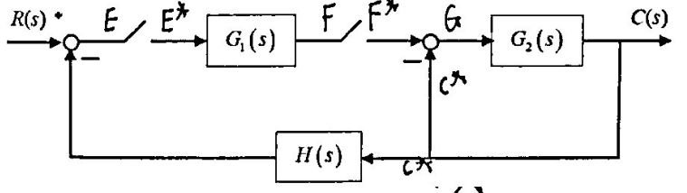

# 2014 

- 2014 五、（10分）某离散闭环控制系统如图5所示。请求出：

    （1）系统的闭环脉冲传递函数。（2）输出$Z$变换$Y(z)$。

    

- 2014 六、（10分）某系统的方块图如图6所示。请求出：
    （1） 系统的$Y(s)/U_1(s)$与$Y(s)/U_2(s)$； （2）系统的状态空间表达式。

    

- 2014 七、（15分）有一闭环控制系统的被控对象可抽象为如图7所示的$RC$电路，假设执行机构因老化只能完成80%的控制作用，而测量值与实际输出呈完全相等关系。要求

    （1） 给出针对该对象的闭环控制系统方块图（需要标明各个环节）。
   
    （2） 求出该被控对象的微分方程表达式。
    
    （3） 若对该对象施加的是纯比例控制作用，得到的单位阶跃响应曲线始终存在20%的余差。请给出系统的闭环传递函数。
    
    （4） 若要求你消除系统余差，你采取什么方法？试通过计算说明。

    

- 2014 八、（15分）设随动系统的微分方程为：
    $$
    \begin{array}{c}
    T_{1} \frac{d^{2} c(t)}{d t^{2}}+\frac{d c(t)}{d t}=K_{2} u(t) \\
    u(t) = K_{1}[r(t)-b(t)] \\
    T_{2} \frac{d b(t)}{d t}+{b}(t)=c(t)
    \end{array}
    $$
    其中，$T_1, T_2$和$K_2$为正常数。如果要求当$r(t)=1+t$时，$c（1）$对$r(t)$ 的稳态误差不大于正常数$\mathcal{E}_{0}$，试求$K_1$的取值范围。已知全部初始条件为零。

- 2014 九、（10分）某系统的开环传递函数为$G_{o}(s)=\frac{s+a}{s\left(s^{2}+2 s+K\right)}$。问：（1）保证系统稳定的$K$值与$a$值范围？（2）请绘制以$K$为参变量的根轨迹（$K>0, a>0$)

- 2014 十、（20分）一个最小相位系统的对数幅频线如图10所示。求该系统的开环放大系数$K, \omega_1,\omega_2$，以及系统的开环传递函数

    

- 2014 十一、（30分）设被控系统状态方程为（**下面方程里面的x和加号应该换个位置吧？？？**）
    $$
    \dot{x}=\left[\begin{array}{rrr}0 & 1 & 0 \\ 0 & -1 & 1 \\ 0 & -1 & 10\end{array}\right]+ x\left[\begin{array}{l}1 \\ 2 \\ 5 \end{array}\right]u,y=x_1+x_2+u
    $$
    
    （1）求系统的开环传递函，并问开环系统是否稳定？如果不稳定，不稳定极点有几个？
    
    （2）可否用状态反馈任意配置闭环极点？如果可以，请求出状态反馈阵$K$，使闭环极点位于$-50, a \pm j b$，画出状态反馈系统结构框图。并问：状态反馈控制以后的闭环系统是否稳定？
    
    （3）若要满足系统超调量$\sigma_{p} \leq 5 \%$，峰值时间$t_{p} \leq 0.5$的性能指标，则状态反馈阵$K$该怎么取值？（提示：$t_{p}=\frac{\pi}{\omega_{0} \sqrt{1-\zeta^{2}}}$）
    
    （4）设计全维状态观器，使得使闭环极点均位于${-2r},r>0$
    
    （5）若希望状态观测器的的动态响应比状态反馈控制器的动态响应快3倍以上，则$r$应该如何取值？

# 2015

- 2015 一、填空

2015 一、填空
1. （10分，每空2分）蒸汽加热器被控对象，被控变量，给定值，控制变量，主要干扰量，并画出系统方块图。

    

2015 一、填空
2. （10分）电路网失是什么：符号（1）          ，符号（2）          ，环节1          ，环节2          ，环节3          ，电路传递函数          ，系统微分方程模型为                    $\left(R_{1}=R_{2}=R ,C_{1} = C_{2}=C\right)$

    
    
    
    

2015 一、填空
3. （10）系统结构图如图，系统输出$C(s)$的表达式为。（请给你认为必须的步骤）

    

2015 一、填空
4. （15分，每空1.5分） 

    （1）己知系统特征方程为：$S^{6}-2 S^{5}+2 S^{4}-S^{2}+2 S-2=0$，请用劳斯判据判别系统（稳定/不稳定）；极点在s平面的左半平面有          个，在右半平面有          个，以及位于虚轴上有          个。
    
    （2）如图1-4（a）所示开环频率特性曲线，其中（**这里好像少了啥**）为不稳定开环极点数。请根据给出的Nyquist图，确定图1-4（a）系统为          型，闭环（稳定/不稳定），且闭环不稳定极点          个；确定图1-4(b)系统为          型，闭环（稳定/不稳定），且闭环不稳定极点          个。

    

2015 一、填空
5. （15分，每空1.5分）
    如图1-5所示系统，己知其满足性能指标：超量和峰值时间分别为$\sigma_{p} \%=10 \%, t_{p}=0.5 s$。（1）要求写出该系统的开环传递函数                            ，闭环传递函数                           ，系统参数$K$               ，系统参数$A$              ；系统上升时间$t_r$              ，调节时间$t_s$          。（2）系统恰无震荡，设$A=1$，则$K$应取               。当输入$r(t)$分别为单位阶跃信号，单位斜坡信号，单位抛物线信号时，系统的稳态误差$e_s$分别为          ，          ，          ，          。

    

- 2015 二、（15分）复合控制系统如图2所示，（1） （8分）若要求闭环回路过阻尼，试确定参数$K$的取值范围。（2） （7分）在系统闭环回路过阻尼的条件下，若$G_{r}(s)=\tau s$， 且要使系统在斜坡输入作用下的稳态误差为0，确定参数$\tau$的范围?

    

    

- 2015 三、（10分）系统$G(s)=\frac{K}{T S+1} e^{-01 s}, K>0, T>0$当对$G(s)$输入$2 \sin \left(t+\frac{\pi}{4}\right)$时，其稳态输出为$3 \sin \left(t-\frac{\pi}{6}\right)$，当对$G (s)$输入$2\sin(2t+\frac{2\pi}{3})$， 求其稳态输出?

- 2015 四、（10分）某系统的开环传递函数为$G(s)=\frac{K\prod^{l}_{j=1}(1+r_js)}{S^m\prod^{n}_{i=1}(1+T_is)}$（**有点看不清楚**） 的根轨迹如图4，已知$\omega=3$，此时对应的系统$K=4$，问：当K=2时该开环传递函数的幅值裕度$h$为多少$dB$？

    

- 2015 五、证明题（10分）请证明：系统能控性的PBH秩判据中的充要条件。
    注:PBH秩判据：线性常连续系统$\dot x(t)=A x(t)+B u(t)$完全能控的充分必要条件是，对系统矩阵的所有特征值$\lambda_i(i=1,2,...n),rank[\lambda-A,B]=n(i=1,2,...n)$均成立。

- 2015 六、（15分）已知某采样系统如图6所示，有四个环节组成： ZOH为零阶保持器，环节A,B,P分别是比例控制器，积分器和放大倍数k为1的一阶惯性环节（其中时间常数$T=2s$）

    （1）请给出A,B,P这三个环节在连续域的输入输出传递函数关系。
    
    （2）求出图6中所示的开环系统的脉冲传递函数。
    
    （3）当采样周期$T=0.5s$时，求使系统稳定的k值范围。
    
    （4）若要求动态过程没有震荡，给出临界震荡时的极点坐标及k值，并以根轨迹草图示意。
    
    （5）若系统输入为$r(t)=1+\frac{1}{2} t$，请问系统的稳态误差为多少?
    
    

- 2015 七、（30分）如图7（a）所示的被控对象：

    （1）（4分）若该系统加上虚线构成7(b)，所示闭环系统，要求： （a）判断该系统的型别；（b）给出使得系统稳定的A的范围。（c）在阶跃输入下的系统稳态误差。
    
    （2）（12分）假设状态变量如图7（a）中所示，要求： （a)写出$A=1$时的系统状态空间表达式。（b)对该系统设计状态反馈控制器：①给出状态反馈矩阵$K$，使得系统的闭环传递函数为$\phi(s)=\frac{s-1}{(s+2)(s+3)}$；②画出反馈后的状态变量图；③判别状态反馈后的系统稳定性。
    
    （3）（8分）在上面第二步设计的状态反馈器的基础上，按照7(c)，7(d)进行等效变换，给出等效传递函数$H_{\mathrm{eq}}(s), G_{x}(s)$ 与 $G_{\mathrm{eq}}(s)$，问如何可以使系统在单位阶跃输入下达到零稳态误差；又系统在单位斜坡输入下的稳态误差为多少。
    
    （4）（6分）若该系统的状态不可检测，请对该控制系统设计状态观测器，使得状态观测器的闭环极点均为$s=-5$。

    

# 2016

- 2016 一、已知闭环传递函数为$G_{p}(s)=\frac{K e^{-\tau}}{T s+1}$，单位阶跃响应的图像如下图，求$\mathrm{K}, \mathrm{T}, \tau$

    
- 2016 二. 单位负反馈的系统的开环传递函数为$G_{0}(s)=\frac{6 e^{-s}}{s(s+5)}$，求闭环传递函数$\phi(s)$;当输入$u(t)=2 \cdot 1(t)$时，求$e_{s s}(\infty)$
    如图：

    

    （1）$a=0$，求$\xi,w$和单位斜坡输入时的$e_{ss}(\infty)$
    
    （2）当$\xi=0.7$时， 求$a$及单位斜坡输入时的$e_{ss}(\infty)$
    
    （3） $a≠0$时，令8变为$K, \xi=0.7, e_{ss}(\infty)= 0.25$时，求$a,K$

- 2016 三、差分方程为$y(k+2)-3 y(k+1)+2 y(k)=x(k)$，求脉冲传递函数$G(z)$；当$k≤0$时，$y(k)=0$，输入为单位阶跃信号，请给出差分方程的解并求终值
  
- 2016 四、$s^{6}+4 s^{5}-4s^{4}+4 s^{3}-7 s^{2}-8 s+10=0$，请判断：
    系统是否稳定；系统特征值为多少个；位于s左半平面的根有几个；位于s右半平面的根有几个。
    
- 2016 五、求$\left\{\begin{array}{c}\dot{x}_{1}(t)=-x_{1}(t) \\ x_{2}(t)=x_{1}(t)+x_{2}(t)-\left[x_{2}(t)\right]^{3}\end{array}\right.$的平衡状态
  
- 2016 六、如图：
  
  
  
  （1）$a=0$，求$\xi,w_n$和单位斜坡输入时的$e_{s s}(\infty)$
  （2）当$\xi=0.7$时，求$a$及单位斜坡输入时的$e_{s s}(\infty)$
  （3）$a≠0$时，令8变为$K,\xi=0.7,e_{s s}(\infty)=0.25$时，求$a,K$
  
- 2016 七. 方框图如下其中$T_1=0.5,T_3 =1,T_4 =0.25,K= K_1K_2K_3$求：

    （1）求$K$的取值范围，使得系统稳定。
    
    （2）单位阶跃输入时系统的调节时间为$4 s(\Delta=2 \%)$，求$K$的取值范围，并计算系统的特征根。
    
    

- 2016 八. 求$K$的范围，使得$\xi$在0.707-1.0之间。
  
    

- 2016 九. 单位反馈系统的开环传递函数为$G(s)=\frac{5 s^{2} e^{-\pi}}{(s+1)^{4}}, \tau>0$。若系统闭环稳定，求$\tau$的取值范围
  
- 2016 十. 求$Y(z), Y(z) / R(z)$
  
    

- 2016 十一、已知$T=1s,a=1$求$K$的取值范围；当$K$为1，求系统的单位脉冲响应；
    $K$为3时，求单位阶跃输入时的稳态误差。
    
    

- 2016 十二. $\frac{Y(s)}{U(s)}=\frac{s+1}{s^{2}+3 s+2}$请写出系统可控不可测、可观不可控、不可控不可观的状态描述。

- 2016 十三. 系统传递函数为$G_{1}(s)=\frac{10 s+10}{s^{3}-9 s^{2}-9 s}$

    （1）判断系统的稳定性。
    
    （2）求反馈阵$K$，使得$\sigma_{p} \leq 5 \%, t_{p} \leq 0.5, t_{p}=\frac{\pi}{w_{0} \sqrt{1-\xi^{2}}}$
    
    （3）若系统的状态不能获取，能否实现反馈?设计闭环极点均位于{-18)的全维状态观测器。
    
    （4）观测器动态响应至少比状态反馈控制器动态响应快2.5倍以上，问所设计的观测器能满足要求吗? （误差均为2%）
    
    （5）求能设计的最小观测器的维数。

# 2017 

- 2017 1  有电阻$R_1$，$R_2$，电容$C_1, C_2$组成的无源网络，请根据以下网络的微分方程求该网络的方框图(或结构图)，再求出该网络的传递函数$u_o(S)/u_i(S)$

    ①$i_{R_{1}}=\frac{u_{i}-u_{0}}{R_{1}}$；②$i_{C_{1}}=\frac{d(u_{i}-u_{o})}{dt}$；

    ③$i_{R_2}=i_{R_{1}}+i_{C_{1}}$；④$u_{0}=i_{R_{2}} \cdot R_{2}+\frac{1}{C_{2}}\int_{0}^{t}{i_{R_2} }d t$

    （注：全部省略了时间变量$t$）

- 2017 2  实验测得某最小相位系统的幅频特性对数坐标图如图所示。

    （1） 求系统的传递函数；
    
    （2） 计算系统的相角裕度和幅值裕度；
    
    （3） 判别系统的稳定性

    

- 2017 3 控制系统的结构图如图所示，其中还，参数$K_1>0,K_2>0$且为常数，$B$为非负常数。试分析：

    （1）$B$值对系统稳定性的影响

    （2）$B$值对系统阶跃响应动态性能的影响

    （3）$B$值对系统斜坡响应稳态误差的影响

    

- 2017 4 某单位负反系统的闭环传递函数为$\Phi(s)=\frac{a_{2} s+a_{1}}{s^{3}+a_{3} s^{2}+a_{2} s+a_{1}}$，其中$a_{1}, a_{2}, a_{3}$是均不为0的常数。

    （1）请给出$a_{1}, a_{2}, a_{3}$满足什么条件下，此系统对阶跃输入和斜坡输入的误差均为0，并证明之。
    
    （2）求系统在输入$r(t)=\frac{1}{2} t^{2}$作用下的稳态误差。

- 2017 5 设系统的状态空间表达式$\left\{\begin{array}{l}\dot{x}=A x+B u \\ y=C x+D\end{array}\right.$，其中$x$为$n$维状态变量。在令$x=T \bar{x}$，式中$T$为任意$n*n$非奇异线性变换矩阵。间：请问该变换是否改变系统的传递函数?请给出证明。

- 2017 6 某离散系统表示为$\left\{\begin{array}{l}x(k+1)=A x(k)+B u(k) \\ y(k)=C x(k)\end{array}\right.$，其中$A=\left[\begin{array}{ccc}1 & 0 & -1 \\ 0 & -2 & 1 \\ 3 & 0 & 2\end{array}\right], B=\left[\begin{array}{l}1 \\ 0 \\ 1\end{array}\right],C=\left[\begin{array}{lll}
    0 & 0 & 1 \\
    0 & 1 & 0
    \end{array}\right]$
    问：（1）第三个采样周期的输出$y$与$x_1,x_2,x_3$之间的关系?
    
    （2）请设计状态反馈控制器使系统受控后的闭环极点为$-2,-5,-7$。

- 2017 7 某线性系统模型如下：
    $$
    z=\left[\begin{array}{cccc}0 & 1 & 0 & 0 \\ -8 & -5 & -K & -6 \\ 0 & 0 & 0 & 1 \\ 1 & 0 & 0 & 0\end{array}\right] x+\left[\begin{array}{l}0 \\ 1 \\ 0 \\ 0\end{array}\right] u \\
    y=\left[\begin{array}{llll}0 & 0 & -1 & 1\end{array}\right] x
    $$
    试给出该系统关于$K(K >0)$的根轨迹。

- 2017 8 （1）求下图所示系统的脉冲传递函数$C(z)/R(z)$

    （2） 设采样周期$T=1$，若$G_{1}(S)=\frac{1}{S}, H_{0}(S)=\frac{1-e^{-T s}}{S}, G_{2}(S)=\frac{1}{S+1}, H_{1}(S)=S+1, H_2(S)=1$，请判断闭环系统的稳定性，并分别给出在单位阶跃和单位斜坡输入下系统的稳态误差

    （3）若$H_2(S)=K$，则使闭环系统稳定的$K$的取值范围是多少?

    

- 2017 9 某单位负反馈系统的闭环传递函数为中$\Phi(S)=\frac{P(S+1)}{S^{3}-9 S^{2}+S+P}$

    （1）求该系统的开环传递函数?并求使得该系统稳定的$P$的取值范围。
    
    （2）若$P=1$，且是能控标准型实现，请设计状态反馈阵$K$使得闭环系统满足系统超调量$≤5%$，峰值时间$t_p≤0.5$的性能指标（提示： $t_{p}=\frac{\pi^{\alpha}}{\omega_{0} \sqrt{1-\xi^{2}}}$，并假设有一个闭环极点为$S=-50$）
    
    （3）给出实施状态反馈后的闭环传递函数，并分析此时系统的闭环稳定性
    
    （4）若上面（2）小题所设计的状态反馈控制器因状态不能获取，问能否仍能实现系统的状态反馈?如果可以，请设计闭环极点均位于{-18}的全维观测器，并请求出观测器的动态响应时间（假设设差均为2%）

# 2018 

- 2018 一、

2018 1. 下列系统中属于不属于稳定系统的是(     )

    A. 闭环特征方程为$s^{2}+5 s+5=0$的系统
    B. 闭环极点为$s_{1,2}=-2 \pm j 5$的系统
    C. 阶跃响应为$c(t)=10\left(1+e^{t}\right)$的系统（**有点看不清**）
    D. 斜坡响应为$2t+8 e^{-45 t} \sin (100 t)$的系统

2018 2. 若系统$G(s)=\frac{1}{s+1}$，当输入$\sin \left(t+\frac{\pi}{2}\right)$时，系统稳态输出表达式是(     )

    A. $\sqrt{2} \sin \left(t+\frac{\pi}{2}\right)$				B. $\frac{\sqrt{2}}{2} \sin \left(t+\frac{\pi}{2}\right)$
    C. $\frac{\sqrt{2}}{2} \sin \left(t+\frac{\pi}{4}\right)$				D.$\frac{\sqrt{2}}{2} \sin \left(t-\frac{\pi}{4}\right)$

2018 3. 某负反馈系统开环传函为$\frac{k(s+2)}{s}(k>0)$，在其根轨迹上对应$k=1$的闭环极点是(     )

    A. $s=-2$		B. $s=0$		C. $s=-1$		D. $s=1$

2018 4. 对有限频谱$(-w_{max}≤w≤w_{max})$的连续信号$e(t)$采样，当希望采样信号$e^*(t)$能不失真地完全复现采样前的连续信号$e(t)$，则要求采样周期为$T_s$(     )

    A. $T_{s} \leq \frac{1}{w_{\max }}$		B. $T_{s} \geq \frac{2 \pi}{w_{\max }}$		C. $T_{s} \geq \frac{\pi}{w_{\max }}$		D. $T_{s} \leq \frac{\pi}{w_{\max }}$

2018 5. 某系统的闭环特征方程为$s^{5}+s^{4}+4 s^{3}+4 s^{2}+2 s+1=0$，则该系统一定为(     )
    A. 稳定，在$s$右半平面没有根				  B. 不稳定且在$s$石半平面有1个根
    C. 不稳定，且在$s$右半平面有2个根		D. 不稳定且在$s$右半平面有3个根

- 2018 二、（10分）某单位负反馈系统的单位脉冲响应为$y(t)=4 e^{-2 t}-4 e^{-4 t}$，求：

    （1）系统的开环传递函数
    （2）系统的误差传递函数
    （3）当输入为$1+\frac{1}{3} t$时，求系统的静态误差。

- 2018 三、某电网络如图所示，系统输入$u_1,u_2$ 均为电压源，输出为$x_n$，选取各电容器两端的电压（自左向右）为状态变量，试列写系统状态方程。

    

- 2018 四、已知系统方框图如图1

    （1）按照指定的状态变量列写该系统的状态方程
    
    （2）若该系统状态变量不直接可测，构造一个全维状态观测器，使状态观测误差以$e^{-10t}$的速率衰减，确定图2中字母$a、b、c、d、 e$的值。

    

- 2018 五、（15分）如图所示控制系统，其中$e(t)$为误差传函，参数均为非负。

    

    （1）求$r(t)=t$，$n(t)=0$时，系统的稳态误差$e_{ss}$
    
    （2）求$r(t)=0$，$n(t)=t$时，系统的稳态误差$e_{ss}$
    
    （3）求$r(t)=t$，$n(t)=t$时，系统的稳态误差$e_{ss}$
（4）当系统参数变$K_{0}, T,K_{P}, T_{1}$化时，上述结果有何变化?

- 2018 六、？？？题目没有拍到！！！

    （1） 试绘出参数$k$和$a$从零变到无穷大时的根轨迹簇。
    （2） 如果系统具有振荡形式的动态响应，请分别求出下列情况下参数$a$和$k$的取值范围。（并在根轨迹图上示意）
    	a） 当系统百分比超调量小于4.3%时
    	b） 当系统峰值时间小于0.395秒时
    	c） 当系统调节时间（考虑2%误差带）小于2秒时。
    
- 2018 七、（20分） 某系统结构图如图所示，要求：

    （1） 设图中$k=20$，绘制此时该系统的奈奎斯特概略曲线
    
    （2） 设$k$为大于0的可调参数，绘制$k$为参变量的根轨迹，绘出使系统稳定的$k$值范围，以及在临界稳定时的系统的闭环极点。

    

- 2018 八、（15分） 离散闭环系统如图，已知被控对象$G(z)=\frac{z+0.5}{(z-1)(z-1.2)}$，试设计控制器使闭环极点为： $0.2±j0.3$

    

- 2018 九、（20分）已知完全能控的被控对象的状态方程如下： ($t$单位为秒)

    $\dot{x}(t)=\left[\begin{array}{ccc}0 & 1 & 0 \\ 0 & 0 & 1 \\ 0 & -3 & -4\end{array}\right] x(t)+\left[\begin{array}{l}0 \\ 0 \\ 1\end{array}\right] u(t)$		$y(t)=\left[\begin{array}{lll}1 & 0 & 0\end{array}\right] x(t)$

    要求设计状态反馈控制器$u(t)= d(t)-kx(t)$，其中$d(t)$为外部输入，使得：
    
    （1） 闭环系统的一个极点在$-20$，
    
    （2） 零初始条件下，闭环系统单位阶跃响应的超调量不大于$4.33%$，且调节时间不大于2秒，试确定状态反馈矩阵$k$

# 2019 

- 一、

2019 1. 某系统传函为$G(s)=\frac{(s+1)(s+3)}{(s-1)(s-2)(s+4)}$，经过状态反馈后，传函为$\Phi(s)=\frac{s+1}{s^{2}+8 s+12}$，问系统中特征方程为        ，特征根为      。

2019 2. 对于$F(Z)=\sum_{n=0}^{\infty} f(n T) Z^{-n}$，     决定了幅值，     给出 了时间信息。

2019 3. 离散信号$e(n)=1+a^{n}$，Z变换$E(Z)$为    ， 终值存在的条件为  

2019 4. 一个系统的状态空间为$\dot{x}=\left[\begin{array}{rrr}0 & 0 & -1 \\ 1 & 0 & -3 \\ 0 & 1 & -3\end{array}\right] x+\left[\begin{array}{l}1 \\ 1 \\ 0 \end{array}\right]u$，$y=\left[\begin{array}{lll}0 & 1 & 2\end{array}\right] x$，其能控子空间维数为      ，不能控子空间维数为

2019 5. 某系统负单位反馈，开环传递函数为$G(s)=\frac{8}{s(s+6)}$，则系统脉冲响应为     ，误差传函为     。

2019 6. 某系统负单位反馈，开环传递函数为$G(s)=\frac{5 s+1}{s^{3}(s+1)(s+2)}$，该系统是否稳定?为什么?

2019 7. 请写一个平衡状态有$x=-1, 0, 1$的非线性状态方程  

2019 8. 某单位负反馈系统，开环传递函数为$G(s)=\frac{K(s+1)}{s^{2}+5 s+6}$，它的最小转折频率为     ，系统稳定的K值范围     。

2019 9. 某微分方程$T \frac{\mathrm{d} y(t)}{\mathrm{d} t}+y(t)=K r(t)$其初始状态为0，问在$r(t)=\delta(t)$时，它的脉冲响应$g(t_1)=1$，则$t_1$=     。

2019 10. 某单位负反馈系统开函$G(s)=\frac{4}{s+1}$，当输入$x(t)=\sin \left(5 t+45^{\circ}\right)$时，闭环传递函数为     ，系统稳态输出为     。

2019 11. 该系统的闭环传递函数为     ，若希望该系统动态响应更快，$a$应该     。

2019 12、已知系统奈氏图如下，系统____型，是否稳定____，如果不稳定，判断不稳定极点数____

- 2019 二、某系统等效的开环传递函数为
    $$
    Geq(s)=\frac{G_1G_2G_3G_4}{1+G_2G_3G_6+G_2G_6G_7-G_1G_5+G_1G_2G_3G_4(G_8-1)}
    $$

    （1） 该系统的闭环传递函数中$\Phi(s)$？

    （2） 若反馈回路是$H(s)=G_8$，则该系统实际的开函传递函数是？

- 2019 三、某单位负反馈系统，开函传递函数为$G(s)=\frac{K}{(s+2)^{2}(s+6)^{2}}$

    （1） 请绘制其根轨迹。

    （2） 若要求系统$Ts≤2s (2\%)$， 问K应该为何值，说明理由?

    （3） 若要求系统的单位阶跃误差$e_{ss}≤0.1$，$K$应该为何值，说明理由?

- 2019 四、某最小相位系统的Bode图如下所示： 

    
    
    （1）根据Bode图，请写出系统传递函数。
    
    （2）当$r(t)=1+2t$时，系统的稳态误差$e_{ss}$? 

- 2019 五、某采样系统如下，T为采样时间。

    

    （1）该系统的脉冲传递函数
    
    （2）已知$G_{1}=\frac{1-e^{-Ts}}{s},G_{2}=\frac{2 K}{s+2}, H=\frac{s+2}{K}$，该系统的稳定K值的范围。

- 2019 六、如图所示系统，$x_1,x_2$为已指定的状态变量。

    

    （提示：$\frac{s}{s^{2}+s+1}=\frac{\frac{s}{s+1}}{s+\frac{1}{s+1}}$）

    （1）请写出该系统状态空间方程。
    
    （2）该系统是否能观能控?

- 2019 七、某系统的状态方程为$\dot{x}(t)=\left[\begin{array}{ccc}0 & 1 & 0 \\ 0 & 0 & 1 \\ 0 & -3 & -4\end{array}\right] x(t)+\left[\begin{array}{l}0 \\ 0 \\ 1\end{array}\right] u(t),y=\left[\begin{array}{lll}
    1 & 0 & 0
    \end{array}\right] x(t)$

    （1）判断系统是否能观，如果能观，请设计全维观测器，使状态观测误差以设计速率$e^{-10 t}$的速率衰减。
    
    （2）请设计极点位于下图根轨迹所示的状态反馈控制器。

    

- 2019 八、某非线性系统方程为$\ddot{y}+\sqrt{y}+y \cdot \dot{y}=u^{2}$， $u$为输入，$y(t)$为输出

    （1）令$x_{1}=y, \quad x_{2}=\dot{y}$，请根据$x_{1}, x_{2}$写出该系统的状态方程。

    （2）请写出系统的所有平衡点。
    
    （3）当$u=1$时，系统处于工作点状态，请在工作点处把该系统线性化。