# 2007

- 一. （10%） 图1为转动物体，$J$表示转动惯量，$f$表示摩擦系数。若输入为转矩$M(t)$，输出为轴角位移，求传递函数$G(s)=\frac{\theta(s)}{M(s)}$

    

- 二. （10%） 求图2所示系统输出$y(s)$的表达式。

    

- 三. （20%） 单位负反馈系统的开环传递函数为$G(s)=\frac{K}{s(T s+1)(2 s+1)}$试求：

    （1） 闭环系统稳定，$K$和$T$应满足的条件；在$K-T$直角坐标系中画出该系统稳定的区域。

    （2） 若闭环系统处于临界稳定，且振动频率$\omega = 1rad/s$，求$K$和$T$的值。

    （3） 若系统的输入为单位阶跃函数，分析闭环系统的稳态误差。

- 四. （20%）系统结构如图4所示。

    （1） 画出系统的根轨迹图，并确定使闲环系统稳定的$K$值范围;

    （2） 若已知闭环系统的一种极点为$s_1 =-1$，试确定闭环传递函数。

    

- 五. （10%）系统动态框图及开环对数频率特性见图5，求$K_{1}, K_{2}, T_{1},T_2$的值。

    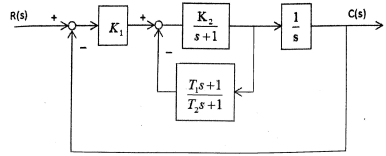

    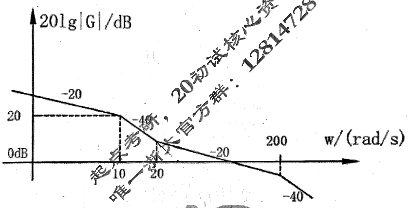

- 
    
- 七. （10%） 是非题（若你认为正确，则在题号后打√，否则打X，每题1分）
  

1） 经过状态反馈后的系统，其能控能观性均不发生改变。
    
2） 若一个可观的n维动态系统其输出矩阵的秩为$m$，则可设计$m$维的降维观测器。
    
3） 由己知系统的传递函数转化为状态方程，其形式惟一。
    
4） 一个能控能观的连续系统离散化后仍然保持其能控与能观性。
    
5） 非线性系统的稳定性概念是全局性的，与系统的初始条件和外部输入无关。
    
6） 若系统完全能控能观，则可以设计该系统的状态反馈控制器与状态观测器，但需要注意的是其设计结果将相互影响。
    
7） 描述函数法是线性系统频率法的推广，但它只考虑了主导极点的频率响应。
    
8） 对一个$n$维的能控能观线性SISO系统，其状态方程与传递函数描述是等价的。
    
9） 系统$S1$能控的充要条件是其对偶系统$S2$能观。
    
10） 经过非奇异线性变换的线性定常系统不改变其状态的能控性。
    

- 八. （10%） 如图所示离散系统， $T=1$，问：系统的$T_s$取在什么范围，系统是稳定的。

    

- 九. （15%） 如图所示电路。当$R_1=R_2= R_3$，$C_1 =C_2$，且$RC= 1/3$。
    设在$t= t_0$时，开关合上。$x_1(t_0)=x_2(t_0)$，状态变量为电容器上的电
    压。

    （1） 写出电路的状态空间模型； 

    （2） 求出状态迁移矩阵，画出状态变量图； 

    （3） 并分析系统的可控性和可观性。
    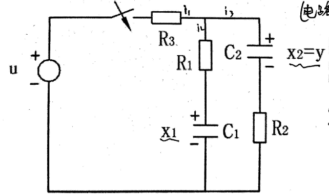

- 十.（15%）系统的状态空间表达式为
    $$
    \dot{X}=\left[\begin{array}{ccc}0 & 0 & -1 \\ 1 & 0 & -3 \\ 0 & 1 & -3\end{array}\right] \cdot x+\left[\begin{array}{c}1 \\ 1 \\ 0\end{array}\right] \cdot u \\
    y(t)=\left[\begin{array}{lll}0 & 1 & 2\end{array}\right] x
    $$
    试判断系统的可控性，若不完全可控，则分解出可控、不可控子空间，讨论能否用状态反馈$u=+K * x$（**K前面是加号嘛？？**）使闭环系统稳定。

- 十一.（20%）如图所示的被控对象，欲用状态反馈控制来满足下列需求：（1）在阶跃作用下没有稳态偏差；（2）闭环系统主导极点为$-2±j3$；（3）对所有的$A>0$，系统都是稳定的。

    
    
    
    
    要求：
    
    （a）画出带有状态反馈阵$K$的方块图
    
    （b）将画出的方块图化简为如图A所示的单回路，分别求出图中的前向通道传递函数与反向通道传递函数$G(s)$ 与 $H_{eq}(s)$
    
    （c）求出所需的反馈系数阵；
    
    （d）若将图A转化为如图B所示的单位负反馈，求出图B中的$G_{eq}(s)$以及系统的静态误位系数
    
    （e）假设输入为单位阶跃，确定该系统的超调量$\sigma$和调节时间$t_s$

# 2008

- 一、试求图中所示电路的传递函数$\mathrm{G}(\mathrm{s})=\frac{U_{0}(s)}{U_{1}(s)}$
  
  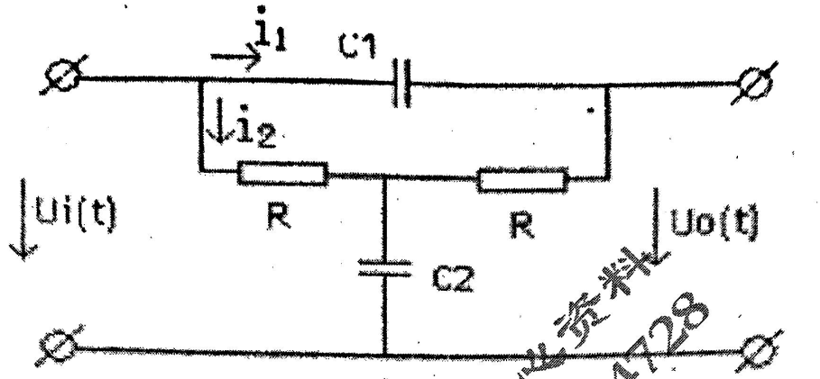
  
- 二、系统方框图如图2所示，试用方框图等效变换求$Y(s)$的表达式。
  
    
    
- 三、单位负反馈系统的传递函数为$\mathrm{G}(s)=\frac{K}{s(s+10)}$，若单位阶跃响应的超调量$\sigma \leq 16.3 \%$； 误差$\mathbf{e}(t)=\gamma(t)-y(t)$ ， 当输入$\gamma(t)=(10+t)$时，要求稳态误差$e_{ss} \leq 0.1$ ，
    试求：
    
    （1） K值；
    
    （2）单位阶跃响应的调节时间$t_s(\triangle=5%)$；
    
    （3）当$\gamma(t)=(10+t+t^2)$时的稳态误差。
    
- 四、控制系统的方块图如图所示，若系统以$\omega=5rad/s$的角频率作等幅持续振荡，试确
    定$K$和$τ$的数值。
    
    
    
- 五、单位负反馈系统的开环传递函数为$G(s)=\frac{\frac{s+a}{4}}{s^{2}(s+1)}$

    （1） 试绘制参数$a$由零到正无穷变化的闭环根轨迹。
    
    （2） 求出系统处于临界单调衰减时乘积形式的闭环传递函数。

- 六、最小相位系统的开环对数幅频特性曲线如图所示，使确定系统的开环传递函数，并求出相角稳定裕量。
  
    

- 七、求如图7所示的系统闭环传递函数

    

- 八、已知采样系统如图8所示，其中时间常数$T=0.5s$。

    （1） 当采样周期$T=0.4s$时，求使系统稳定的$K$值范围；
    
    （2） 若去掉零阶保持器，请采用根轨迹的方法求出使系统稳定的$K$值范围，并画出这种情况下的根轨迹草图。

    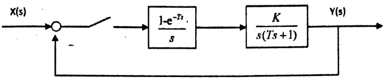

- 九、设图中的$u_{c1}=x_1,u_{c2}=x_2$

    （1） 写出该电路的状态空间模型；
    
    （2） 当$R=1$， $C1=C2=1$时，由状态空间模型写出其传递函数；
    
    （3） 分析系统的稳定性、能控性和能观性。

    

- 十、系统的状态空间如下：
    $$
    \dot{X}=\left[\begin{array}{ccc}1 & 0 & 1 \\ 0 & 1 & 0 \\ 1 & 0 & 0\end{array}\right]  x+\left[\begin{array}{c}0 \\ 1 \\ 1\end{array}\right]u \\
    y(t)=\left[\begin{array}{lll}1 & 0 & 0\end{array}\right] x
    $$
    
    （1）请用标准型法求出将系统的闭环极点配置在$-1,-2,-3$处的状态反馈阵$K$
    
    （2）若状态不可测量，请设计极点处于$-10,-10,-10$处的全维状态观测器。

- 十一、某单位负反馈非线性系统如图所示，非线性环节的描述函数为$N（a）=\frac{1}{A} e^{-j \frac{\pi}{3}}$，线性部分的传递函数如图中所示。试分析：

    （1）系统是否存在自振；
    
    （2）若存在自振，计算自振频率及振幅，并讨论极限环的稳定性。
    
    

# 2009

- 一、（10分）图1是一个液体贮槽的示图。设阀1前压力恒定，阀2的流通面积$f$不变，请推导液体流入量$Q_m$与液体贮槽的液位$h$在工作点附近之间的关系。（提示：液体力学公式$Q_{out}=\alpha \cdot f \sqrt{h}$，其中$\alpha $是阀的节流系数，可近似为常数。）
  
  
  
- 二、（10分）系统方框图如图2所示，试用方框图等效变换法求传递函数$G(s)=\frac{Y(s)}{R(s)}$

    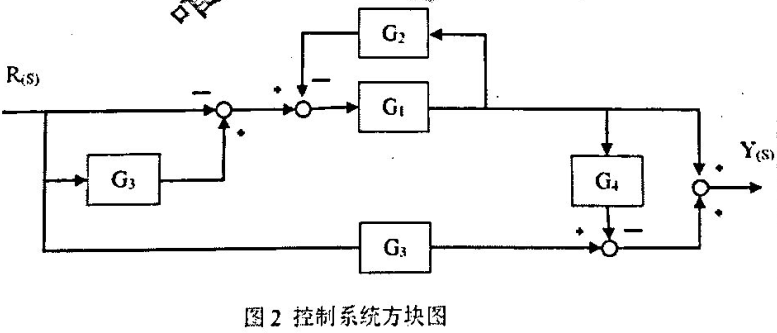

- 三、（15分）图3 （a）所示系统的单位阶跃响应曲线如图3 (b)所示，试确定$K, a, b$的
    数值（$K,a,b>0$)。

    

- 四、（15分）系统结构如图4所示：

    （1）用劳斯判据判断闭环系统的稳定性。
    
    （2）设系统的输入信号和扰动信号均为单位斜坡信号，试求系统的输入稳态误态$e_{ssr}$和扰动稳态误差$e_{ssf}$。

    

- 五、（15分）图5所示控制系统只有闭环极点$2 \pm j \sqrt{10}$，试确定相应的$K、T$值。根据求出的$T$值，以$K$为参数画出根轨迹，确定使系统稳定的$K$值范围以及临界状态时的振荡频率。

    

- 六、（15分）某系统的结构图和开环幅相曲线如图6（a）、图6(b)所示，图中$G(s)=\frac{K\left(T_{3} s+1\right)}{\left(T_{1} s+1\right)\left(T_{2} s-1\right)},H(s)=T_{2} s-1,K_{1}>0, K>0, T>0$，试判定闭环系统的稳定性，并求复平面左半平面、右半平面、虚轴上的闭环极点数。

    

- 七、（20分）控制系统方块图如图7所示，根据图中指定的状态变量，（1）写出相应的状态
    空间表达式；（2）并进行该系统的能控性与能观性分析（请给出过程)

    
    
- 八、（10分）说明矩阵$\Phi(t)$是否为某系统的状态转移矩阵；如果是，请求出其逆阵以及该
    系统的$A$阵。
$$
    \Phi(t)=
    \left[
    \begin{matrix}
       9 e^{-t}-8 e^{-2 t} & 5 e^{-t}-5 e^{-2 t} \\
       -3 e^{-t}+3 e^{-2 t} & 4 e^{-t}+5 e^{-2 t}
    \end{matrix}
    \right]
$$

- 九、（10分）闭环离散控结构图如图所示，试求与$Y(s)$与$Y(z)$
  

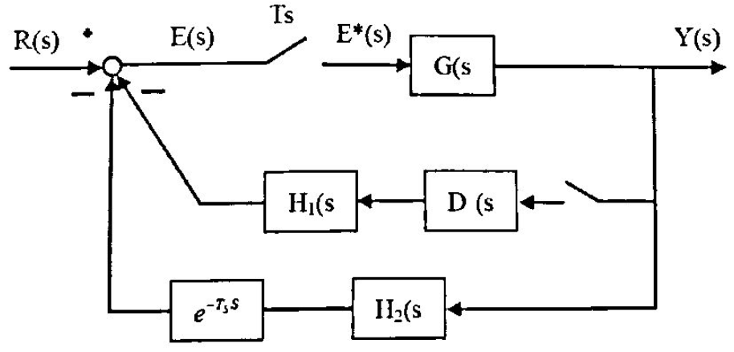
    
- 十、（30分）如图10（a）所示的被控对象，欲用状态反馈控制来满足下列需求： （1）在阶跃作用下没有稳态偏差；（2）闭环系统的主导极点为$-5±j8.66$；（3）对所有的$A>0$，系统都是稳定的。
    在实现状态反馈后，（1）确定该系统的超调量$σ$和$5%$误差的调节时间$t$；（2）若将闭环系统化成如图(b)所示的单位反馈，请求出等效的$G_{eq}(s)$；（3） 若系统输入为单位斜坡，则系统是否存在稳态误差？稳态误差系数是多少？稳态误差值为多少? （4） 若系统的$x_2$不能检测，是否仍可最经济实现状态反馈？

    

- 十一、已知控制系统的状态方程为
    $$
    \begin{array}{l}
    \dot{x}_{1}=f_{1}\left(x_{1}\right)+x_{2} \\
    \dot{x}_{2}=x_{1}-a x_{2}
    \end{array}
    $$
    设$f(0)=0$，试确定系统在原点渐进稳定的条件。

# 2010

- 1、（10分）系统的微分方程模型如下：
    $$
    \begin{array}{l}
    e(t)=k_{1}[r(t)-y(t)] \\
    \ddot{x}(t)=T d_{2} \ddot{e}(t)+T d_{1} \dot{e}(t)+e(t) \\
    \dot{y}(t)=k_{2}[n(t)+x(t)]
    \end{array}
    $$
    式中，$r$、$n$、$y$分别是输入、干扰和输出，$k_{1}, k_{2}, T d_{1}, T d_{2}$为常数，试建立系统方框结构图。

- 2、（15分）系统结构图如图2所示，试用方框图等效变换法求传递函数$G(s)=\frac{Y(s)}{R(s)}$

    

- 3、（10 分）已知二阶系统的单位阶跃响应为：$y(t)=10-12.5 e^{-1.2t /} \sin \left(1.6 t+53.1^{\circ}\right)$

    试求：系统的超调量$σ%$、峰值时间$t_p$和调节时间$t_s$。
    
    【提示：$15 e^{-1.2 t} \sin \left(1.6 t+53.1^{\circ}\right)-20 e^{-1.2 t} \cos \left(1.6 t+53.1^{\circ}\right)=25 e^{-1.2 t} \sin 1.6 t$】

- 4、（15分）单位负反领系统的开环传递函数为： $G(s)=\frac{K(\tau S+1)}{S^{2}(T S+1)}$，其中$K>0, \tau>0，T>0$，输入$r(t)=t^{2}$，试求系统稳态误差$e_{s s}(\infty)<0.1$时它系统应满足的条件。

- 5、（15 分）系统结构图如图5所示。使闭环极点为$S=-1 \pm j \sqrt{3}$，试确定$K、τ$值，以计算出的K值为基准，绘制以$τ$为参变量的根轨迹。

    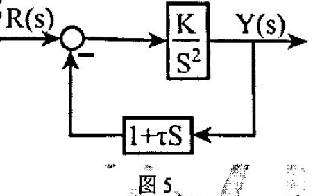

- 6、（15分）系统开环传递函数为$G(s)=\frac{10}{\left(T_{1} S+1\right)\left(T_{2} S-1\right)}$，试绘制$T_{2}<T_{1}, T_{2}=T_{1}, T_{2}>T_{1}$三种情况下的奈奎斯特图。

- 7、（15分）列写如图7所示系统的状态空间表达式，并判断该系统是否能控？是否能观？

    

- 8、（10分）某采样系统如图8所示，请给出$C(z)$ 和 $C(z) / R(z)$表达式。

    

- 9、一采样控制系统结构见图9，采样周期$T=1s$，$H_0(s)$为零阶保持器。试确定使系统稳定时的K值范围。注：图9中$D(k): e_{2}(k)=e_{2}(k-1)+10\left[e_{1}(k)-0.5 e_{1}(k-1)\right]$

    

- 10、（25分）设一被控对象由以下状态空间代表式描述
    $$
    \dot{x}=\left[\begin{array}{rrr}
    -1 & 0 & 2 \\ 
    0 & -2 & 1 \\ 
    1 & 0 & 3\end{array}\right] x+\left[\begin{array}{l}
    2 \\ 0 \\ 1 
    \end{array}\right]u \\
    y=\left[\begin{array}{lll}
    0 & 1 & 0
    \end{array}\right] x
    $$
    要求：1)推导该系统的开环传递函数$G_{open}$；2）设计状态反馈控制器，使得闭环系统满足阻尼比$\zeta=0.707$，调节时间$t_{s}=2s(\pm 2 \%)$；3）分别判断开环系统稳定性与闭环系统稳定性；4）请对该系统设计状态观测器，使得状态观测器的闭环极点均为：$s=5$。

- 11、（5分）请用李亚普诺夫方法研究如下系统。给出系统在平衡点稳定时参数a需满足的条件。
    $$
    \begin{array}{c}
    \dot{x}_{1}=-x_{2}+a x_{1}^{3} \\
    \dot{x}_{2}=x_{1}+a x_{2}^{3}
    \end{array}
    $$
    
# 2011

- 一. （10分）机械系统如图10所示，$r(t)$为外力，$M_{1}, M_{2}$为质量，$x_1,x_2$为位移，$f_{1}, f_{2}$为阻尼系数，$k$为弹性系数，求以速度$v_1$为输出，$r(t)$为输入的系统传递函数
  

    
- 二.（10分）杭州某实验室温度计的传递函数为$G(s)=\frac{1}{TS+1}$，用温度计测量沸腾水的温度，3分钟显示水温为95℃。若给盛水的容器加热，水温以$2℃/min$的速度上升，试求温度计的稳态指示误差。
  
- 三. （15分）系统结构图如图3所示，试用方框图等等效变换法求传
    递函数$G(s)=\frac{Y_{1}(s)}{R_{1}(s)}$

    

- 四. （15分）某复合控制系统如图4所示，系统稳定。试选择$a$、$b$值，
    使系统满足：当输入$r(t)=kt^2$时（$k>0$)， 系统的$e_{ss}=0$。

    
    
- 五. （15分）单位负反馈系统的开环传递函数为$G(s)=\frac{K(S+1)}{(S-1)^{2}}$，绘制$K$从$0\rightarrow \infty$的根轨迹，求系统为衰减震荡形式的$K$值范围，以及一闭环特征根为-2时的闭环传递函数
  
- 六.（15分）开环传递函数$G(s)=\frac{K}{S(S+1)(10 S+1)}$，绘制开环幅相曲线，确定系统闭环稳定的K值范围。
  
- 七.（10分）某采样系统如图7所示，$T$为采样周期。请根据方块图
  给出$C(z)$和$C(z) / R(z)$的表达式（如果有的话）。要求：写出所有标出
    变量的相关方程。
  
    
  
- 八.（20分）己知采样系统如图8所示，其中时间常数$T=1s$。

    （1）当采样周期$T_s=1s$时，求使系统稳定的$K$值范围；
    
    （2）为满足系统提出的动态性能指标，已设计出在$\zeta=0.707$时的闭环极点为：$Z_{1,2}=0.635+j 0.249$，问：在这种情况下的动态过程大约需要多长时间？
  
    （3）若要求动态过程没有振荡，请给出临界振荡的极点坐标及K值，并绘出根轨迹草图。
    
    （4）当输入为单位斜坡时，系统的静态误差为多少？
  
    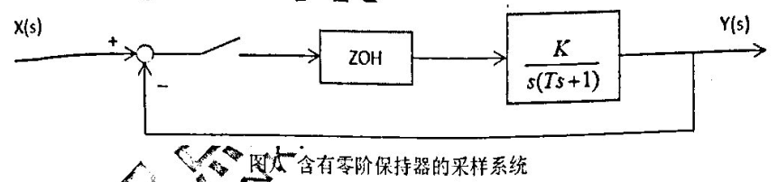
  
- 九.（10分）己知某系统的状态转移矩阵为：
    $$
    \Phi(t)=
    \left[
    \begin{matrix}
       3 e^{-2 t}-2 e^{-3 t} & 6 e^{-2 t}-6 e^{-3 t} \\
       -e^{-2t}+e^{-3 t} & -2 e^{-2 t}+3 e^{-3 t}
    \end{matrix}
    \right]
    $$
    （1）请确定系统矩阵$A$
    
    （2）$b=\left[\begin{array}{l}0 \\ 1\end{array}\right], x(0)=\left[\begin{array}{l}x_{1}(0) \\ x_{2}(0)\end{array}\right]$，请给出在$u(t)=1(t)$作用下状态方程的解

- 十、（10分）己知一系统的传递函数为$G(s)=\frac{6.5(s+2)}{s(s+1)\left(s^{2}+8 s+8\right)}$，请确定：
    （1）系统的能控性、能观性、稳定性，
    
    （2）如果系统是能控的，请写出系统的能控标准型及其对偶系统的状态方程。

- 十一、（20分）设某开环系统的状态空间模型：
    $$
    \dot{x}=\left[\begin{array}{rrr}-1 & 0 & 3 \\ 1 & -4 & 0 \\ 0 & 0 & -2\end{array}\right] x+\left[\begin{array}{l}1 \\ 2 \\ 5 \end{array}\right]u \\
    y(t)=\left[\begin{array}{lll}0 & 1 & 0\end{array}\right] x
    $$
    己知系统状态变量不能直接测量，问：
    
    （1）系统的开环特征值为多少？
    
    （2）能否设计状态反馈控制器使该系统的闭环极点任意配置？如果可以，则要求：
    
    （3）用直接设计法设计状态观测器，使其主导极点的实部为-10，且具有0.707的阻尼比；
    
    （4）要求同（3），但请采用标准型法设计
    
    （5）如果可以设计观测器，则其最小维数为多少？

# 2012

- 1 （10分）加速度计如图1所示，$x(t)$为加速度计壳体的位移，$y(t)$为质量块$m$相对壳体的位移，$k$为弹簧的弹性系数，$f$为粘性摩擦系数。取$a(t)=\ddot{x}(t)$为输入变量，$y(t)%$为输出变量。试建立加速度计的微分方程模型，并简述测得加速度的机理和方法。
  
    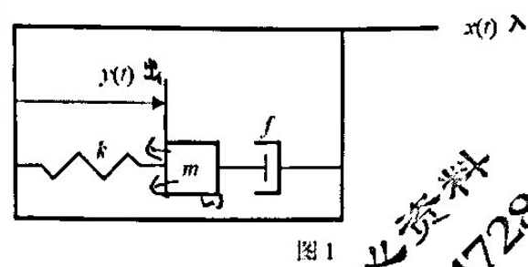
    
- 2（15分）系统的结构如图2所示，试设计$H_2(s)$使干扰$F(s)$对输出$C(s)$无影响。
  
    
    
- 3（15分）单位负反馈系统的开环传递函数为$G(s)=\frac{0.4 s+1}{s(s+0.6)}$，试求系统的单位阶跃响应，并求最大超调量$\sigma \%$
  
- 4 （10分）非零初始条件下，单位负反馈系统的单位阶跃误差响应为$e(t)=e^{-t}-e^{-2 t}$，求系统的闭环传递函数、阻尼比、开环传递函数。
  
- 5 （15分）反馈控制系统的开环传递函数为$G(s) H(s)=\frac{K}{\left(s_{2}+2 s+2\right)\left(s_{2}+2 s+5\right)}(k>0)$。欲保证闭环系统在正、负反下都稳定，试用根轨迹法确定$K$的范围，并概略绘制根轨迹图
  
- 6 （15分）最小相位系统的幅相特性如图6所示。根据幅相特性，写出与之对应的开环传递函数（设开环增益为$K$），并指出参数间关系；$K=\dot{K}$时，图6的$A$点值为$-1$，试分折$K$的取值范围与系统稳定性的关系。
  
    
    
- 7 （10分）闭环离散控制系统的结构图如图7所示，试求$Y(z),Y(z)/R(z)$

    

- 8（15分）己知采样系统如图8所示，其中时间常数$T=2s$。

    （1）当采样周期$Ts=5s$时，求使系统稳定的$K$值范围；（2）若要求动态过程没有振荡请，求出临界振荡的极点坐标及$K$值，并以根轨迹草图示意。
    
    （3）若系统输入为1$1+\frac{1}{2} t$函数，请问系统的静态误差为多少

    

- 9 （15分） 线性定常连续系统如下. （1）已知$u(t)=0$，$y(t)=3e^{-t}-2e^{-2t}$， 试求$x(0)$. 

    （2）若系统状态由于某种原因不能直接测量，请你通过设计观测器给出，且要求：设计的观测器闭环极点为$-5, -5$.
    
    $$
    \left\{\begin{array}{l}
    x(t)=\left[\begin{array}{cc}
    0 & 1 \\
    -2 & -3
    \end{array}\right]x(t)+\left[\begin{array}{c}
    1 \\
    -1
    \end{array}\right] u(t) \\
    y(t)=[1, 0] x(t)+u(t)
    \end{array} \quad t \in[0, \infty)\right.
    $$
    
- 10 （30分）已知某实际生产过程抽象后的系统方块图。其中$G_{1}(S)=\frac{1}{s+1};G_{2}(s)=\frac{1}{s+2};G_{3}(s)=\frac{1}{s} ; G_{4}(s)=2 ; G_{5}(s)=1 ; G_{6}=0.5$，$u$和$y$分别是系统的输入与输出。假定：系统的状态变量如图上所标注的$x_1$，$x_3$，$x_3$（**这里错了吧？？？**）。要求：

    （1） 列写出该系统的状态空间模型。
    
    （2） 请判断该系统是否稳定?
    
    （3） 能否设计状态反馈控制器使该系统的闭环极点任意配置？如果可以，则请你分别采用标准型法与直接设计法设计状态反馈控制器，使闭环系统的输出$y_1$满足超调量$σ≤5%$和峰值时间$T_p≤5s$;如果不能设计状态反馈控制器，请你将状态空间模型按能控性分解为能控子空间与不能控子空间。

    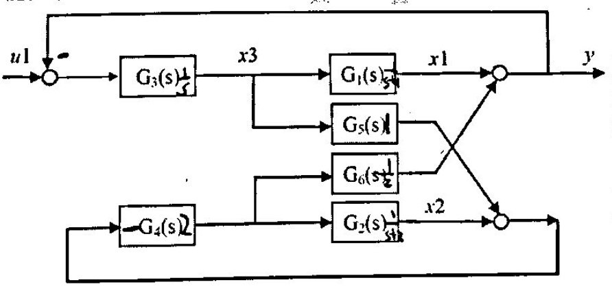

# 2013

- 1 （10分）某被控对象$sys$为黑箱，为获取其数学模型，在输入端给予单位阶跃信号，得到其单位阶跃响应曲线如图1所示，图中还给出了所有的己知信息。请你：（1）用解析法给出该象的传递函数$Y(s)/X(s)$；（2）给出微分方程形式。

    

- 2 （20分）某控制系统方块图如图2所示，要求：

    （1）请用方块图等效简化法，求取$Y(s) / R(s), \quad E(s) / R(s)$
    
    （2）若$G_3(s)$为可以设计的调节器，欲使系统的输出$Y(s)$不受扰动$N(s)$的影响，$G_3(s)$该如何选择？
    
    （3）若此时系统的闭环特征方程为$D(s)=s^{5}+8 s^{4}+25 s^3+40 s^{2}+39 s+12=0$，请判定系统的稳定性

    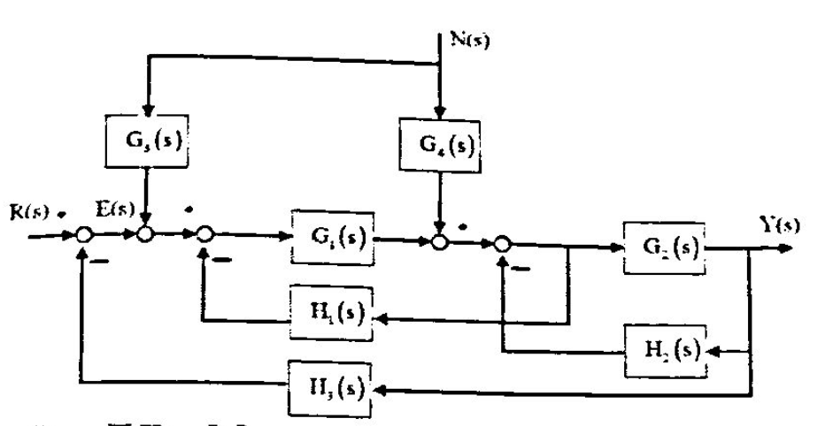

- 3 （15分）己知某控制系统的方块图如图3所示$(K_c>0,T>0)$，其中控制器环节中的$Kc$与$T$均可设计。问：

    

    （1）若要求系统在$T=0.5$时产生振荡，$Kc$至少满足什么条件？
    
    （2）当$T=1$时，若要系统产生4:1衰减振荡（输出响应的第一个波峰与同方向的第二个波峰之比），$Kc$应为多少？`此时系统的超调量`、调节时间、峰值时间、稳态误差各为多少？

- 4（20分）己知某控制系统的方块图如图4（1）所示$K>0,T>0$

    （1）设系统$K=5$时作等幅持续振荡，请求出此时的角频率与时间常数$T$值
    
    （2）当$T=0.2$，$K=0.5$时，若输入为$x(t)=1(t)+t+\frac{t^{2}}{2}$，请问系统的稳态误差是多少？
    
    （3）在（2）中求出的稳态误差不为零，问：加上补偿器之后（如图4（2）所示)，能否过择参数$a$与$b$来达到无稳态偏差的目的？
    
    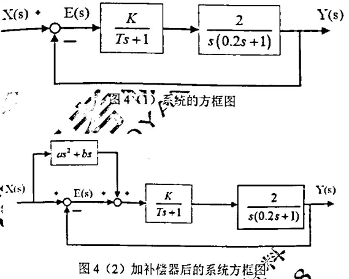
    
- 5（15分）系统的开环传递困数为$G(s) H(s)=\frac{K\left(1+T_{a} s\right)}{s^{2}\left(T_{1} s+1\right)\left(T_{2} s+1\right)\left(T_{3} s+1\right)}$，其中$K> 0$，
    $T_{a}>0, T_{1}>0,T_{2}>0, T_{3}>0$， 且 $T_{a}>\sum\left(T_{1}+T_{2}+T_{3}\right)$。请你：
    
    （1）给出该系统的开环频率特性（包括幅频特性与相频特性)；
    。
    （2）给出该系统的极坐标概略图；
    
    （3）用奈奎斯特稳定判据证明，若系统不稳定，则系统必有2个闭环极点在右半平面。

- 6（20分）某控制系统如6所示，请：

    （1）用根轨迹的方法求取当$K_c$从$0^{+} \rightarrow+\infty$变化时，使得系统稳定的$K_1$值范围
    
    （2）给出系统的闭环传递函数。
    
    （3）若给定$K_{1}=0.5$，求出使系统衰减振荡的$K_c$值的范围

    

- 7 （15分）某采样系统的结构如图7所示，已如采样周期$T =1s$， $ZOH$为零阶保持器，$D(z)$为数字控制器，结构为$D(z)=\frac{z+i a}{z+b}$，其中$a$和$b$为待定参数，其设计要求：

    （1）单位阶跃输入下的输出响应无稳态误差，即$e_{ss} =0$；
    
    （2）保证系统稳定。
    
    
    
- 8 （35分） 如图8所示的被控对象，假设状态变量如图中所示，诮：
  
    （1） 写出系统状态空间表达式
    
    （2） 若该系统的状态不可测，对该系统设计状态观测器，使得状态观测器的闭环极点均为$s=- 5$，并说明该系统观测器的最小维数为多少?
    
    （3） 设计状态反馈控制器以满足下列需求：①在阶跃输入作用下系统没有稳态偏差；②闭环系统的主导极点为$-2±j3$；③对所有的$A>0$，系统都是稳定的。
    （a）求出图中的未知参数$A$
    （b）给出满足要求的状态反馈矩阵$K$
    （c）确定该系统的超调量$σ$和调节时间$t_s$
    （d）给出状态反馈后的稳态速度误差系数
    
    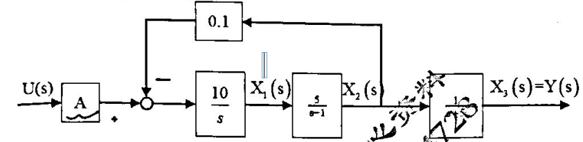

# 2014

- 一、（10分）某单位负反馈系统的开环传递函数为： $G(s)=\frac{K(s-z)}{\left(s^{2}+2 \zeta \omega s_{n}+\omega_{n}^{2}\right)(s-p)}$
    其中$K>0, z, p ,\zeta, \omega_{n}$均为实数且已知$-1<\zeta<0$.求该系统根轨迹的出发角度。

- 二、（10分）己知系统的状态空间模型为$\left\{\begin{array}{l}\dot{x}=A x+B u \\ y=C x+D u\end{array}\right.$，其中$A=\left[\begin{array}{ccccc}0 & 1 & 0 & 0 & 0 \\ 0 & 0 & 1 & 0 & 0 \\ 0 & 0 & 0 & 1 & 0 \\ 0 & 0 & 0 & 0 & 1 \\ -240 & -152 & -72 & -10 & -1\end{array}\right],B=[0 \quad 0 \quad 0 \quad 0 \quad 5]^{T}, C=\left[\begin{array}{lllll}
    1 & 0 & 0 & 0 & 0
\end{array}\right],D=1$
    
    问： （1） 该系统共有多少个特征根，其中几个特征根位于右半平面?
    
    （2）系统是否稳定?
    
    （3）系统是否能控?系统是否能观?
    
- 三、（10分）己知单位负反馈系统的开环传递函数为$G(s)=\frac{K(3 s+1)}{s^{2}(s+1)}$。欲使该系统相位裕度达到最大，$K$值应该为多少？
  
- 四、（10分）某反馈控制系统如图4所示。若系统一对闭环极极点应的$\zeta=0.707$，确定：

    （1）系统的闭环极点；

    （2）系统在单位阶跃输入下的稳态输出
    
    

- 五、（10分）某离散闭环控制系统如图5所示。请求出：

    （1）系统的闭环脉冲传递函数。（2）输出$Z$变换$Y(z)$。

    

- 六、（10分）某系统的方块图如图6所示。请求出：
    （1） 系统的$Y(s)/U_1(s)$与$Y(s)/U_2(s)$； （2）系统的状态空间表达式。

    

- 七、（15分）有一闭环控制系统的被控对象可抽象为如图7所示的$RC$电路，假设执行机构因老化只能完成80%的控制作用，而测量值与实际输出呈完全相等关系。要求

    （1） 给出针对该对象的闭环控制系统方块图（需要标明各个环节）。
   
    （2） 求出该被控对象的微分方程表达式。
    
    （3） 若对该对象施加的是纯比例控制作用，得到的单位阶跃响应曲线始终存在20%的余差。请给出系统的闭环传递函数。
    
    （4） 若要求你消除系统余差，你采取什么方法？试通过计算说明。

    

- 八、（15分）设随动系统的微分方程为：
    $$
    \begin{array}{c}
    T_{1} \frac{d^{2} c(t)}{d t^{2}}+\frac{d c(t)}{d t}=K_{2} u(t) \\
    u(t) = K_{1}[r(t)-b(t)] \\
    T_{2} \frac{d b(t)}{d t}+{b}(t)=c(t)
    \end{array}
    $$
    其中，$T_1, T_2$和$K_2$为正常数。如果要求当$r(t)=1+t$时，$c（1）$对$r(t)$ 的稳态误差不大于正常数$\mathcal{E}_{0}$，试求$K_1$的取值范围。已知全部初始条件为零。

- 九、（10分）某系统的开环传递函数为$G_{o}(s)=\frac{s+a}{s\left(s^{2}+2 s+K\right)}$。问：（1）保证系统稳定的$K$值与$a$值范围？（2）请绘制以$K$为参变量的根轨迹（$K>0, a>0$)

- 十、（20分）一个最小相位系统的对数幅频线如图10所示。求该系统的开环放大系数$K, \omega_1,\omega_2$，以及系统的开环传递函数

    

- 十一、（30分）设被控系统状态方程为（**下面方程里面的x和加号应该换个位置吧？？？**）
    $$
    \dot{x}=\left[\begin{array}{rrr}0 & 1 & 0 \\ 0 & -1 & 1 \\ 0 & -1 & 10\end{array}\right]+ x\left[\begin{array}{l}1 \\ 2 \\ 5 \end{array}\right]u,y=x_1+x_2+u
    $$
    
    （1）求系统的开环传递函，并问开环系统是否稳定？如果不稳定，不稳定极点有几个？
    
    （2）可否用状态反馈任意配置闭环极点？如果可以，请求出状态反馈阵$K$，使闭环极点位于$-50, a \pm j b$，画出状态反馈系统结构框图。并问：状态反馈控制以后的闭环系统是否稳定？
    
    （3）若要满足系统超调量$\sigma_{p} \leq 5 \%$，峰值时间$t_{p} \leq 0.5$的性能指标，则状态反馈阵$K$该怎么取值？（提示：$t_{p}=\frac{\pi}{\omega_{0} \sqrt{1-\zeta^{2}}}$）
    
    （4）设计全维状态观器，使得使闭环极点均位于${-2r},r>0$
    
    （5）若希望状态观测器的的动态响应比状态反馈控制器的动态响应快3倍以上，则$r$应该如何取值？

# 2015

- 一、填空

1. （10分，每空2分）蒸汽加热器被控对象，被控变量，给定值，控制变量，主要干扰量，并画出系统方块图。

    

2. （10分）电路网失是什么：符号（1）          ，符号（2）          ，环节1          ，环节2          ，环节3          ，电路传递函数          ，系统微分方程模型为                    $\left(R_{1}=R_{2}=R ,C_{1} = C_{2}=C\right)$

    
    
    
    
3. （10）系统结构图如图，系统输出$C(s)$的表达式为。（请给你认为必须的步骤）

    

4. （15分，每空1.5分） 

    （1）己知系统特征方程为：$S^{6}-2 S^{5}+2 S^{4}-S^{2}+2 S-2=0$，请用劳斯判据判别系统（稳定/不稳定）；极点在s平面的左半平面有          个，在右半平面有          个，以及位于虚轴上有          个。
    
    （2）如图1-4（a）所示开环频率特性曲线，其中（**这里好像少了啥**）为不稳定开环极点数。请根据给出的Nyquist图，确定图1-4（a）系统为          型，闭环（稳定/不稳定），且闭环不稳定极点          个；确定图1-4(b)系统为          型，闭环（稳定/不稳定），且闭环不稳定极点          个。

    

5. （15分，每空1.5分）
    如图1-5所示系统，己知其满足性能指标：超量和峰值时间分别为$\sigma_{p} \%=10 \%, t_{p}=0.5 s$。（1）要求写出该系统的开环传递函数                            ，闭环传递函数                           ，系统参数$K$               ，系统参数$A$              ；系统上升时间$t_r$              ，调节时间$t_s$          。（2）系统恰无震荡，设$A=1$，则$K$应取               。当输入$r(t)$分别为单位阶跃信号，单位斜坡信号，单位抛物线信号时，系统的稳态误差$e_s$分别为          ，          ，          ，          。

    

- 二、（15分）复合控制系统如图2所示，（1） （8分）若要求闭环回路过阻尼，试确定参数$K$的取值范围。（2） （7分）在系统闭环回路过阻尼的条件下，若$G_{r}(s)=\tau s$， 且要使系统在斜坡输入作用下的稳态误差为0，确定参数$\tau$的范围?

    

    

- 三、（10分）系统$G(s)=\frac{K}{T S+1} e^{-01 s}, K>0, T>0$当对$G(s)$输入$2 \sin \left(t+\frac{\pi}{4}\right)$时，其稳态输出为$3 \sin \left(t-\frac{\pi}{6}\right)$，当对$G (s)$输入$2\sin(2t+\frac{2\pi}{3})$， 求其稳态输出?

- 四、（10分）某系统的开环传递函数为$G(s)=\frac{K\prod^{l}_{j=1}(1+r_js)}{S^m\prod^{n}_{i=1}(1+T_is)}$（**有点看不清楚**） 的根轨迹如图4，已知$\omega=3$，此时对应的系统$K=4$，问：当K=2时该开环传递函数的幅值裕度$h$为多少$dB$？

    

- 五、证明题（10分）请证明：系统能控性的PBH秩判据中的充要条件。
    注:PBH秩判据：线性常连续系统$\dot x(t)=A x(t)+B u(t)$完全能控的充分必要条件是，对系统矩阵的所有特征值$\lambda_i(i=1,2,...n),rank[\lambda-A,B]=n(i=1,2,...n)$均成立。

- 六、（15分）已知某采样系统如图6所示，有四个环节组成： ZOH为零阶保持器，环节A,B,P分别是比例控制器，积分器和放大倍数k为1的一阶惯性环节（其中时间常数$T=2s$）

    （1）请给出A,B,P这三个环节在连续域的输入输出传递函数关系。
    
    （2）求出图6中所示的开环系统的脉冲传递函数。
    
    （3）当采样周期$T=0.5s$时，求使系统稳定的k值范围。
    
    （4）若要求动态过程没有震荡，给出临界震荡时的极点坐标及k值，并以根轨迹草图示意。
    
    （5）若系统输入为$r(t)=1+\frac{1}{2} t$，请问系统的稳态误差为多少?
    
    

- 七、（30分）如图7（a）所示的被控对象：

    （1）（4分）若该系统加上虚线构成7(b)，所示闭环系统，要求： （a）判断该系统的型别；（b）给出使得系统稳定的A的范围。（c）在阶跃输入下的系统稳态误差。
    
    （2）（12分）假设状态变量如图7（a）中所示，要求： （a)写出$A=1$时的系统状态空间表达式。（b)对该系统设计状态反馈控制器：①给出状态反馈矩阵$K$，使得系统的闭环传递函数为$\phi(s)=\frac{s-1}{(s+2)(s+3)}$；②画出反馈后的状态变量图；③判别状态反馈后的系统稳定性。
    
    （3）（8分）在上面第二步设计的状态反馈器的基础上，按照7(c)，7(d)进行等效变换，给出等效传递函数$H_{\mathrm{eq}}(s), G_{x}(s)$ 与 $G_{\mathrm{eq}}(s)$，问如何可以使系统在单位阶跃输入下达到零稳态误差；又系统在单位斜坡输入下的稳态误差为多少。
    
    （4）（6分）若该系统的状态不可检测，请对该控制系统设计状态观测器，使得状态观测器的闭环极点均为$s=-5$。

    

# 2016

- 一、已知闭环传递函数为$G_{p}(s)=\frac{K e^{-\tau}}{T s+1}$，单位阶跃响应的图像如下图，求$\mathrm{K}, \mathrm{T}, \tau$
  

    
- 二. 单位负反馈的系统的开环传递函数为$G_{0}(s)=\frac{6 e^{-s}}{s(s+5)}$，求闭环传递函数$\phi(s)$;当输入$u(t)=2 \cdot 1(t)$时，求$e_{s s}(\infty)$
    如图：

    

    （1）$a=0$，求$\xi,w$和单位斜坡输入时的$e_{ss}(\infty)$
    
    （2）当$\xi=0.7$时， 求$a$及单位斜坡输入时的$e_{ss}(\infty)$
    
    （3） $a≠0$时，令8变为$K, \xi=0.7, e_{ss}(\infty)= 0.25$时，求$a,K$

- 三、差分方程为$y(k+2)-3 y(k+1)+2 y(k)=x(k)$，求脉冲传递函数$G(z)$；当$k≤0$时，$y(k)=0$，输入为单位阶跃信号，请给出差分方程的解并求终值
  
- 四、$s^{6}+4 s^{5}-4s^{4}+4 s^{3}-7 s^{2}-8 s+10=0$，请判断：
    系统是否稳定；系统特征值为多少个；位于s左半平面的根有几个；位于s右半平面的根有几个。
    
- 五、求$\left\{\begin{array}{c}\dot{x}_{1}(t)=-x_{1}(t) \\ x_{2}(t)=x_{1}(t)+x_{2}(t)-\left[x_{2}(t)\right]^{3}\end{array}\right.$的平衡状态
  
- 七. 方框图如下其中$T_1=0.5,T_3 =1,T_4 =0.25,K= K_1K_2K_3$求：

    （1）求$K$的取值范围，使得系统稳定。
    
    （2）单位阶跃输入时系统的调节时间为$4 s(\Delta=2 \%)$，求$K$的取值范围，并计算系统的特征根。
    
    

- 八. 求$K$的范围，使得$\xi$在0.707-1.0之间。
  
    

- 九. 单位反馈系统的开环传递函数为$G(s)=\frac{5 s^{2} e^{-\pi}}{(s+1)^{4}}, \tau>0$。若系统闭环稳定，求$\tau$的取值范围
  
- 十. 求$Y(z), Y(z) / R(z)$
  
    

- 十一、已知$T=1s,a=1$求$K$的取值范围；当$K$为1，求系统的单位脉冲响应；
    $K$为3时，求单位阶跃输入时的稳态误差。
    
    

- 十二. $\frac{Y(s)}{U(s)}=\frac{s+1}{s^{2}+3 s+2}$请写出系统可控不可测、可观不可控、不可控不可观的状态描述。

- 十三. 系统传递函数为$G_{1}(s)=\frac{10 s+10}{s^{3}-9 s^{2}-9 s}$

    （1）判断系统的稳定性。
    
    （2）求反馈阵$K$，使得$\sigma_{p} \leq 5 \%, t_{p} \leq 0.5, t_{p}=\frac{\pi}{w_{0} \sqrt{1-\xi^{2}}}$
    
    （3）若系统的状态不能获取，能否实现反馈?设计闭环极点均位于{-18)的全维状态观测器。
    
    （4）观测器动态响应至少比状态反馈控制器动态响应快2.5倍以上，问所设计的观测器能满足要求吗? （误差均为2%）
    
    （5）求能设计的最小观测器的维数。

# 2017

- 1  有电阻$R_1$，$R_2$，电容$C_1, C_2$组成的无源网络，请根据以下网络的微分方程求该网络的方框图(或结构图)，再求出该网络的传递函数$u_o(S)/u_i(S)$

    ①$i_{R_{1}}=\frac{u_{i}-u_{0}}{R_{1}}$；②$i_{C_{1}}=\frac{d(u_{i}-u_{o})}{dt}$；

    ③$i_{R_2}=i_{R_{1}}+i_{C_{1}}$；④$u_{0}=i_{R_{2}} \cdot R_{2}+\frac{1}{C_{2}}\int_{0}^{t}{i_{R_2} }d t$

    （注：全部省略了时间变量$t$）

- 2  实验测得某最小相位系统的幅频特性对数坐标图如图所示。

    （1） 求系统的传递函数；
    
    （2） 计算系统的相角裕度和幅值裕度；
    
    （3） 判别系统的稳定性

    

- 3 控制系统的结构图如图所示，其中还，参数$K_1>0,K_2>0$且为常数，$B$为非负常数。试分析：

    （1）$B$值对系统稳定性的影响

    （2）$B$值对系统阶跃响应动态性能的影响

    （3）$B$值对系统斜坡响应稳态误差的影响

    

- 4 某单位负反系统的闭环传递函数为$\Phi(s)=\frac{a_{2} s+a_{1}}{s^{3}+a_{3} s^{2}+a_{2} s+a_{1}}$，其中$a_{1}, a_{2}, a_{3}$是均不为0的常数。

    （1）请给出$a_{1}, a_{2}, a_{3}$满足什么条件下，此系统对阶跃输入和斜坡输入的误差均为0，并证明之。
    
    （2）求系统在输入$r(t)=\frac{1}{2} t^{2}$作用下的稳态误差。

- 5 设系统的状态空间表达式$\left\{\begin{array}{l}\dot{x}=A x+B u \\ y=C x+D\end{array}\right.$，其中$x$为$n$维状态变量。在令$x=T \bar{x}$，式中$T$为任意$n*n$非奇异线性变换矩阵。间：请问该变换是否改变系统的传递函数?请给出证明。

- 6 某离散系统表示为$\left\{\begin{array}{l}x(k+1)=A x(k)+B u(k) \\ y(k)=C x(k)\end{array}\right.$，其中$A=\left[\begin{array}{ccc}1 & 0 & -1 \\ 0 & -2 & 1 \\ 3 & 0 & 2\end{array}\right], B=\left[\begin{array}{l}1 \\ 0 \\ 1\end{array}\right],C=\left[\begin{array}{lll}
    0 & 0 & 1 \\
    0 & 1 & 0
    \end{array}\right]$
    问：（1）第三个采样周期的输出$y$与$x_1,x_2,x_3$之间的关系?
    
    （2）请设计状态反馈控制器使系统受控后的闭环极点为$-2,-5,-7$。

- 7 某线性系统模型如下：
    $$
    z=\left[\begin{array}{cccc}0 & 1 & 0 & 0 \\ -8 & -5 & -K & -6 \\ 0 & 0 & 0 & 1 \\ 1 & 0 & 0 & 0\end{array}\right] x+\left[\begin{array}{l}0 \\ 1 \\ 0 \\ 0\end{array}\right] u \\
    y=\left[\begin{array}{llll}0 & 0 & -1 & 1\end{array}\right] x
    $$
    试给出该系统关于$K(K >0)$的根轨迹。

- 8 （1）求下图所示系统的脉冲传递函数$C(z)/R(z)$

    （2） 设采样周期$T=1$，若$G_{1}(S)=\frac{1}{S}, H_{0}(S)=\frac{1-e^{-T s}}{S}, G_{2}(S)=\frac{1}{S+1}, H_{1}(S)=S+1, H_2(S)=1$，请判断闭环系统的稳定性，并分别给出在单位阶跃和单位斜坡输入下系统的稳态误差

    （3）若$H_2(S)=K$，则使闭环系统稳定的$K$的取值范围是多少?

    

- 9 某单位负反馈系统的闭环传递函数为中$\Phi(S)=\frac{P(S+1)}{S^{3}-9 S^{2}+S+P}$

    （1）求该系统的开环传递函数?并求使得该系统稳定的$P$的取值范围。
    
    （2）若$P=1$，且是能控标准型实现，请设计状态反馈阵$K$使得闭环系统满足系统超调量$≤5%$，峰值时间$t_p≤0.5$的性能指标（提示： $t_{p}=\frac{\pi^{\alpha}}{\omega_{0} \sqrt{1-\xi^{2}}}$，并假设有一个闭环极点为$S=-50$）
    
    （3）给出实施状态反馈后的闭环传递函数，并分析此时系统的闭环稳定性
    
    （4）若上面（2）小题所设计的状态反馈控制器因状态不能获取，问能否仍能实现系统的状态反馈?如果可以，请设计闭环极点均位于{-18}的全维观测器，并请求出观测器的动态响应时间（假设设差均为2%）

# 2018

- 一、

1. 下列系统中属于不属于稳定系统的是(     )

    A. 闭环特征方程为$s^{2}+5 s+5=0$的系统

    B. 闭环极点为$s_{1,2}=-2 \pm j 5$的系统

    C. 阶跃响应为$c(t)=10\left(1+e^{t}\right)$的系统（**有点看不清**）

    D. 斜坡响应为$2t+8 e^{-45 t} \sin (100 t)$的系统

2. 若系统$G(s)=\frac{1}{s+1}$，当输入$\sin \left(t+\frac{\pi}{2}\right)$时，系统稳态输出表达式是(     )

    A. $\sqrt{2} \sin \left(t+\frac{\pi}{2}\right)$				B. $\frac{\sqrt{2}}{2} \sin \left(t+\frac{\pi}{2}\right)$

    C. $\frac{\sqrt{2}}{2} \sin \left(t+\frac{\pi}{4}\right)$				D.$\frac{\sqrt{2}}{2} \sin \left(t-\frac{\pi}{4}\right)$

3. 某负反馈系统开环传函为$\frac{k(s+2)}{s}(k>0)$，在其根轨迹上对应$k=1$的闭环极点是(     )

    A. $s=-2$		B. $s=0$		C. $s=-1$		D. $s=1$

4. 对有限频谱$(-w_{max}≤w≤w_{max})$的连续信号$e(t)$采样，当希望采样信号$e^*(t)$能不失真地完全复现采样前的连续信号$e(t)$，则要求采样周期为$T_s$(     )

    A. $T_{s} \leq \frac{1}{w_{\max }}$		B. $T_{s} \geq \frac{2 \pi}{w_{\max }}$		C. $T_{s} \geq \frac{\pi}{w_{\max }}$		D. $T_{s} \leq \frac{\pi}{w_{\max }}$

5. 某系统的闭环特征方程为$s^{5}+s^{4}+4 s^{3}+4 s^{2}+2 s+1=0$，则该系统一定为(     )
    A. 稳定，在$s$右半平面没有根				  B. 不稳定且在$s$石半平面有1个根
    
    C. 不稳定，且在$s$右半平面有2个根		D. 不稳定且在$s$右半平面有3个根

- 二、（10分）某单位负反馈系统的单位脉冲响应为$y(t)=4 e^{-2 t}-4 e^{-4 t}$，求：

    （1）系统的开环传递函数
    
    （2）系统的误差传递函数
    （3）当输入为$1+\frac{1}{3} t$时，求系统的静态误差。

- 三、某电网络如图所示，系统输入$u_1,u_2$ 均为电压源，输出为$x_n$，选取各电容器两端的电压（自左向右）为状态变量，试列写系统状态方程。

    

- 四、已知系统方框图如图1

    （1）按照指定的状态变量列写该系统的状态方程
    
    （2）若该系统状态变量不直接可测，构造一个全维状态观测器，使状态观测误差以$e^{-10t}$的速率衰减，确定图2中字母$a、b、c、d、 e$的值。

    

- 五、（15分）如图所示控制系统，其中$e(t)$为误差传函，参数均为非负。

    

    （1）求$r(t)=t$，$n(t)=0$时，系统的稳态误差$e_{ss}$
    
    （2）求$r(t)=0$，$n(t)=t$时，系统的稳态误差$e_{ss}$
    
    （3）求$r(t)=t$，$n(t)=t$时，系统的稳态误差$e_{ss}$
（4）当系统参数变$K_{0}, T,K_{P}, T_{1}$化时，上述结果有何变化?

- 六、？？？题目没有拍到！！！

    （1） 试绘出参数$k$和$a$从零变到无穷大时的根轨迹簇。
    （2） 如果系统具有振荡形式的动态响应，请分别求出下列情况下参数$a$和$k$的取值范围。（并在根轨迹图上示意）
    	a） 当系统百分比超调量小于4.3%时
    	b） 当系统峰值时间小于0.395秒时
    	c） 当系统调节时间（考虑2%误差带）小于2秒时。
    
- 七、（20分） 某系统结构图如图所示，要求：

    （1） 设图中$k=20$，绘制此时该系统的奈奎斯特概略曲线
    
    （2） 设$k$为大于0的可调参数，绘制$k$为参变量的根轨迹，绘出使系统稳定的$k$值范围，以及在临界稳定时的系统的闭环极点。

    

- 八、（15分） 离散闭环系统如图，已知被控对象$G(z)=\frac{z+0.5}{(z-1)(z-1.2)}$，试设计控制器使闭环极点为： $0.2±j0.3$

    

- 九、（20分）已知完全能控的被控对象的状态方程如下： ($t$单位为秒)

    $\dot{x}(t)=\left[\begin{array}{ccc}0 & 1 & 0 \\ 0 & 0 & 1 \\ 0 & -3 & -4\end{array}\right] x(t)+\left[\begin{array}{l}0 \\ 0 \\ 1\end{array}\right] u(t)$		$y(t)=\left[\begin{array}{lll}1 & 0 & 0\end{array}\right] x(t)$

    要求设计状态反馈控制器$u(t)= d(t)-kx(t)$，其中$d(t)$为外部输入，使得：
    
    （1） 闭环系统的一个极点在$-20$，
    
    （2） 零初始条件下，闭环系统单位阶跃响应的超调量不大于$4.33%$，且调节时间不大于2秒，试确定状态反馈矩阵$k$

# 2019

- 一、

1. 某系统传函为$G(s)=\frac{(s+1)(s+3)}{(s-1)(s-2)(s+4)}$，经过状态反馈后，传函为$\Phi(s)=\frac{s+1}{s^{2}+8 s+12}$，问系统中特征方程为        ，特征根为      。

2. 对于$F(Z)=\sum_{n=0}^{\infty} f(n T) Z^{-n}$，     决定了幅值，     给出 了时间信息。

3. 离散信号$e(n)=1+a^{n}$，Z变换$E(Z)$为    ， 终值存在的条件为  

4. 一个系统的状态空间为$\dot{x}=\left[\begin{array}{rrr}0 & 0 & -1 \\ 1 & 0 & -3 \\ 0 & 1 & -3\end{array}\right] x+\left[\begin{array}{l}1 \\ 1 \\ 0 \end{array}\right]u$，$y=\left[\begin{array}{lll}0 & 1 & 2\end{array}\right] x$，其能控子空间维数为      ，不能控子空间维数为

5. 某系统负单位反馈，开环传递函数为$G(s)=\frac{8}{s(s+6)}$，则系统脉冲响应为     ，误差传函为     。

6. 某系统负单位反馈，开环传递函数为$G(s)=\frac{5 s+1}{s^{3}(s+1)(s+2)}$，该系统是否稳定?为什么?

7. 请写一个平衡状态有$x=-1, 0, 1$的非线性状态方程  

8. 某单位负反馈系统，开环传递函数为$G(s)=\frac{K(s+1)}{s^{2}+5 s+6}$，它的最小转折频率为     ，系统稳定的K值范围     。

9. 某微分方程$T \frac{\mathrm{d} y(t)}{\mathrm{d} t}+y(t)=K r(t)$其初始状态为0，问在$r(t)=\delta(t)$时，它的脉冲响应$g(t_1)=1$，则$t_1$=     。

10. 某单位负反馈系统开函$G(s)=\frac{4}{s+1}$，当输入$x(t)=\sin \left(5 t+45^{\circ}\right)$时，闭环传递函数为     ，系统稳态输出为     。

11. 该系统的闭环传递函数为     ，若希望该系统动态响应更快，$a$应该     。

- 12、已知系统奈氏图如下，系统____型，是否稳定____，如果不稳定，判断不稳定极点数____

    

- 二、某系统等效的开环传递函数为
    $$
    Geq(s)=\frac{G_1G_2G_3G_4}{1+G_2G_3G_6+G_2G_6G_7-G_1G_5+G_1G_2G_3G_4(G_8-1)}
    $$

    （1） 该系统的闭环传递函数中$\Phi(s)$？

    （2） 若反馈回路是$H(s)=G_8$，则该系统实际的开函传递函数是？

- 三、某单位负反馈系统，开函传递函数为$G(s)=\frac{K}{(s+2)^{2}(s+6)^{2}}$

    （1） 请绘制其根轨迹。

    （2） 若要求系统$Ts≤2s (2\%)$， 问K应该为何值，说明理由?

    （3） 若要求系统的单位阶跃误差$e_{ss}≤0.1$，$K$应该为何值，说明理由?

- 四、某最小相位系统的Bode图如下所示： 

    
    
    （1）根据Bode图，请写出系统传递函数。
    
    （2）当$r(t)=1+2t$时，系统的稳态误差$e_{ss}$? 

- 五、某采样系统如下，T为采样时间。

    

    （1）该系统的脉冲传递函数
    
    （2）已知$G_{1}=\frac{1-e^{-Ts}}{s},G_{2}=\frac{2 K}{s+2}, H=\frac{s+2}{K}$，该系统的稳定K值的范围。

- 六、如图所示系统，$x_1,x_2$为已指定的状态变量。

    

    （提示：$\frac{s}{s^{2}+s+1}=\frac{\frac{s}{s+1}}{s+\frac{1}{s+1}}$）

    （1）请写出该系统状态空间方程。
    
    （2）该系统是否能观能控?

- 七、某系统的状态方程为$\dot{x}(t)=\left[\begin{array}{ccc}0 & 1 & 0 \\ 0 & 0 & 1 \\ 0 & -3 & -4\end{array}\right] x(t)+\left[\begin{array}{l}0 \\ 0 \\ 1\end{array}\right] u(t),y=\left[\begin{array}{lll}
    1 & 0 & 0
    \end{array}\right] x(t)$

    （1）判断系统是否能观，如果能观，请设计全维观测器，使状态观测误差以设计速率$e^{-10 t}$的速率衰减。
    
    （2）请设计极点位于下图根轨迹所示的状态反馈控制器。

    

- 八、某非线性系统方程为$\ddot{y}+\sqrt{y}+y \cdot \dot{y}=u^{2}$， $u$为输入，$y(t)$为输出

    （1）令$x_{1}=y, \quad x_{2}=\dot{y}$，请根据$x_{1}, x_{2}$写出该系统的状态方程。

    （2）请写出系统的所有平衡点。
    
    （3）当$u=1$时，系统处于工作点状态，请在工作点处把该系统线性化。