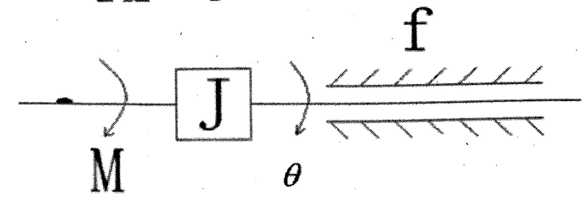
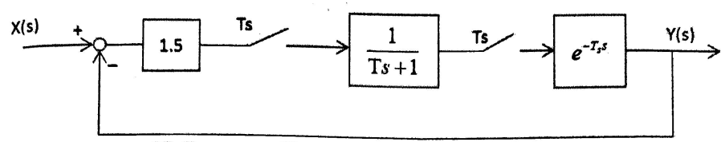
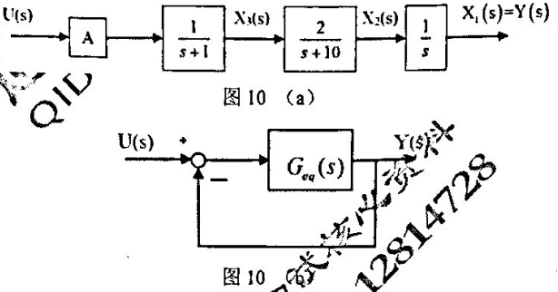
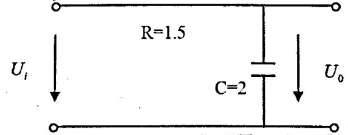
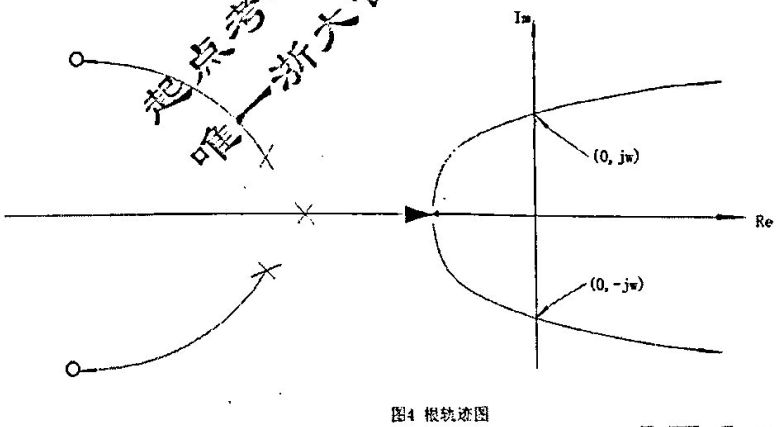
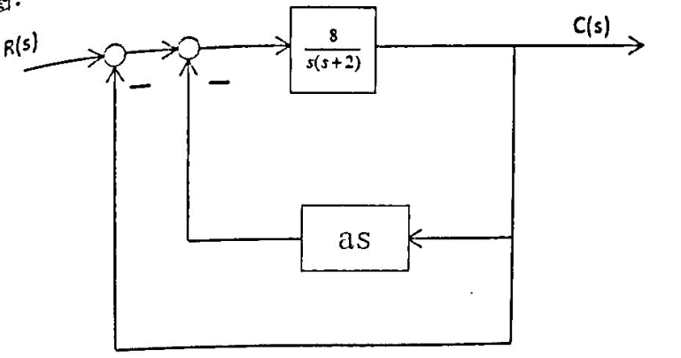
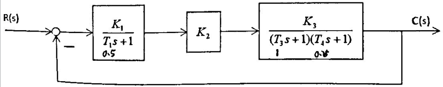
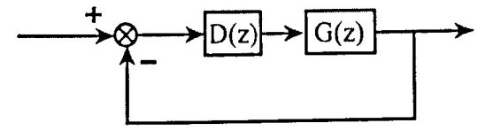

[TOC]

# 2007

- 一. (10%) 图1为转动物体，$J$表示转动惯量，$f$表示摩擦系数。若输入为转矩$M(t)$，输出为轴角位移，求传递函数$G(s)=\frac{\theta(s)}{M(s)}$

    

- 二. (10%) 求图2所示系统输出$y(s)$的表达式。

    

- 三. (20%) 单位负反馈系统的开环传递函数为$G(s)=\frac{K}{s(T s+1)(2 s+1)}$试求：

    (1) 闭环系统稳定，$K$和$T$应满足的条件；在$K-T$直角坐标系中画出该系统稳定的区域。

    (2) 若闭环系统处于临界稳定，且振动频率$\omega = 1rad/s$，求$K$和$T$的值。

    (3) 若系统的输入为单位阶跃函数，分析闭环系统的稳态误差。

- 四. (20%)系统结构如图4所示。

    (1) 画出系统的根轨迹图，并确定使闲环系统稳定的$K$值范围;

    (2) 若已知闭环系统的一种极点为$s_1 =-1$，试确定闭环传递函数。

    

- 七. (10%) 是非题(若你认为正确，则在题号后打√，否则打X，每
    题1分)

    1) 经过状态反馈后的系统，其能控能观性均不发生改变。

    2) 若一个可观的n维动态系统其输出矩阵的秩为$m$，则可设计$m$维的降维观测器。

    3) 由己知系统的传递函数转化为状态方程，其形式惟一。

    4) 一个能控能观的连续系统离散化后仍然保持其能控与能观性。

    5) 非线性系统的稳定性概念是全局性的，与系统的初始条件和外部输入无关。

    6) 若系统完全能控能观，则可以设计该系统的状态反馈控制器与状态观测器，但需要注意的是其设计结果将相互影响。

    7) 描述函数法是线性系统频率法的推广，但它只考虑了主导极点的频率响应。

    8) 对一个$n$维的能控能观线性SISO系统，其状态方程与传递函数描述是等价的。

    9) 系统$S1$能控的充要条件是其对偶系统$S2$能观。

    10) 经过非奇异线性变换的线性定常系统不改变其状态的能控性。

- 八. (10%) 如图所示离散系统， $T=1$，问：系统的$T_s$取在什么范围，系统是稳定的。

    

- 九. (15%) 如图所示电路。当$R_1=R_2= R_3$，$C_1 =C_2$，且$RC= 1/3$。
    设在$t= t_0$时，开关合上。$x_1(t_0)=x_2(t_0)$，状态变量为电容器上的电
    压。

    (1) 写出电路的状态空间模型; 

    (2) 求出状态迁移矩阵，画出状态变量图; 

    (3) 并分析系统的可控性和可观性。
    

# 2008

- 五、单位负反馈系统的开环传递函数为$G(s)=\frac{\frac{s+a}{4}}{s^{2}(s+1)}$
    (1) 试绘制参数$a$由零到正无穷变化的闭环根轨迹。
    

(2) 求出系统处于临界单调衰减时乘积形式的闭环传递函数。

- 六、最小相位系统的开环对数幅频特性曲线如图所示，使确定系统的开环传递函数，并求出相角稳定裕量。
  
    

- 七、求如图7所示的系统闭环传递函数

    

- 八、已知采样系统如图8所示，其中时间常数$T=0.5s$。
    (1) 当采样周期$T=0.4s$时，求使系统稳定的$K$值范围;
    (2) 若去掉零阶保持器，请采用根轨迹的方法求出使系统稳定的$K$值范围，并画出这种情况下的根轨迹草图。

    

- 九、设图中的$u_{c1}=x_1,u_{c2}=x_2$
    (1) 写出该电路的状态空间模型;
    (2) 当$R=1$， $C1=C2=1$时，由状态空间模型写出其传递函数;
    (3) 分析系统的稳定性、能控性和能观性。

    

# 2009

- 十、(30分)如图10(a)所示的被控对象，欲用状态反馈控制来满足下列需求: （1）在阶跃作用下没有稳态偏差；（2）闭环系统的主导极点为$-5±j8.66$；(3)对所有的$A>0$,系统都是稳定的。
    在实现状态反馈后，(1)确定该系统的超调量$σ$和$5%$误差的调节时间$t$；(2)若将闭环系统化成如图(b)所示的单位反馈，请求出等效的$G_{eq}(s)$；(3) 若系统输入为单位斜坡,则系统是否存在稳态误差？稳态误差系数是多少？稳态误差值为多少? (4) 若系统的$x_2$不能检测，是否仍可最经济实现状态反馈？

    

- 十一、已知控制系统的状态方程为
    $$
    \begin{array}{l}
    \dot{x}_{1}=f_{1}\left(x_{1}\right)+x_{2} \\
    \dot{x}_{2}=x_{1}-a x_{2}
    \end{array}
    $$
    设$f(0)=0$，试确定系统在原点渐进稳定的条件。

# 2011

- 三. (15分)系统结构图如图3所示，试用方框图等等效变换法求传
    递函数$G(s)=\frac{Y_{1}(s)}{R_{1}(s)}$

    

- 四. (15分)某复合控制系统如图4所示，系统稳定。试选择$a$、$b$值，
    使系统满足：当输入$r(t)=kt^2$时($k>0$)， 系统的$e_{ss}=0$。

    

# 2012

- 9 (15分) 线性定常连续系统如下. (1)已知$u(t)=0$，$y(t)=3e^{-t}-2e^{-2t}$, 试求$x(0)$. 
    (2)若系统状态由于某种原因不能直接测量，请你通过设计观测器给出，且要求：设计的观测器闭环极点为$-5, -5$.
    $$
    \left\{\begin{array}{l}
    x(t)=\left[\begin{array}{cc}
    0 & 1 \\
    -2 & -3
    \end{array}\right]x(t)+\left[\begin{array}{c}
    1 \\
    -1
    \end{array}\right] u(t) \\
    y(t)=[1, 0] x(t)+u(t)
    \end{array} \quad t \in[0, \infty)\right.
    $$
    
- 10 (30分)已知某实际生产过程抽象后的系统方块图。其中$G_{1}(S)=\frac{1}{s+1};G_{2}(s)=\frac{1}{s+2};G_{3}(s)=\frac{1}{s} ; G_{4}(s)=2 ; G_{5}(s)=1 ; G_{6}=0.5$，$u$和$y$分别是系统的输入与输出。假定:系统的状态变量如图上所标注的$x_1$，$x_3$，$x_3$（**这里错了吧？？？**）。要求：
    (1) 列写出该系统的状态空间模型。
    (2) 请判断该系统是否稳定?
    (3) 能否设计状态反馈控制器使该系统的闭环极点任意配置？如果可以，则请你分别采用标准型法与直接设计法设计状态反馈控制器，使闭环系统的输出$y_1$满足超调量$σ≤5%$和峰值时间$T_p≤5s$;如果不能设计状态反馈控制器,请你将状态空间模型按能控性分解为能控子空间与不能控子空间。

    

# 2014

- 六、(10分)某系统的方块图如图6所示。请求出:
    (1) 系统的$Y(s)/U_1(s)$与$Y(s)/U_2(s)$; (2)系统的状态空间表达式。

    

- 七、(15分)有一闭环控制系统的被控对象可抽象为如图7所示的$RC$电路，假设执行机构因老化只能完成80%的控制作用，而测量值与实际输出呈完全相等关系。要求
    (1) 给出针对该对象的闭环控制系统方块图（需要标明各个环节)。
    (2) 求出该被控对象的微分方程表达式。
    (3) 若对该对象施加的是纯比例控制作用，得到的单位阶跃响应曲线始终存在20%的余差。请给出系统的闭环传递函数。
    (4) 若要求你消除系统余差，你采取什么方法？试通过计算说明。

    

- 

# 2016

- 三、(10分)系统$G(s)=\frac{K}{T S+1} e^{-01 s}, K>0, T>0$当对$G(s)$输入$2 \sin \left(t+\frac{\pi}{4}\right)$时，其稳态输出为$3 \sin \left(t-\frac{\pi}{6}\right)$，当对$G (s)$输入$2\sin(2t+\frac{2\pi}{3})$, 求其稳
    态输出?

- 四、(10分)某系统的开环传递函数为$G(s)=\frac{K\prod^{l}_{j=1}(1+r_js)}{S^m\prod^{n}_{i=1}(1+T_is)}$（**有点看不清楚**） 的根轨迹如图4，已知$\omega=3$，此时对应的系统$K=4$,问:当K=2时该开环传递函数的幅值裕度$h$为多少$dB$？

    

- 如图：

    

    (1)$a=0$，求$\xi,w$和单位斜坡输入时的$e_{ss}(\infty)$
    (2)当$\xi=0.7$时， 求$a$及单位斜坡输入时的$e_{ss}(\infty)$
    (3) $a≠0$时，令8变为$K, \xi=0.7, e_{ss}(\infty)= 0.25$时,求$a,K$

    

- 七. 方框图如下其中$T_1=0.5,T_3 =1,T_4 =0.25,K= K_1K_2K_3$求:
    (1)求$K$的取值范围，使得系统稳定。
    (2)单位阶跃输入时系统的调节时间为$4 s(\Delta=2 \%)$,求$K$的取值范围，并计算系统的特征根。
    

- 十一、已知$T=1s,a=1$求$K$的取值范围;当$K$为1,求系统的单位脉冲响应;
    $K$为3时，求单位阶跃输入时的稳态误差。
    

- 十二. $\frac{Y(s)}{U(s)}=\frac{s+1}{s^{2}+3 s+2}$请写出系统可控不可测、可观不可控、不可控不可观的状态描述。

- 十三. 系统传递函数为$G_{1}(s)=\frac{10 s+10}{s^{3}-9 s^{2}-9 s}$
    (1)判断系统的稳定性。
    (2)求反馈阵$K$，使得$\sigma_{p} \leq 5 \%, t_{p} \leq 0.5, t_{p}=\frac{\pi}{w_{0} \sqrt{1-\xi^{2}}}$
    (3)若系统的状态不能获取，能否实现反馈?设计闭环极点均位于{-18)的全维状态观测器。
    (4)观测器动态响应至少比状态反馈控制器动态响应快2.5倍以上,问所设计的观测器能满足要求吗? (误 差均为2%）
    (5)求能设计的最小观测器的维数。

# 2017

- 1  有电阻$R_1$，$R_2$，电容$C_1, C_2$组成的无源网络，请根据以下网络的微分方程求该网络的方框图(或结构图)，再求出该网络的传递函数$u_o(S)/u_i(S)$

    ①$i_{R_{1}}=\frac{u_{i}-u_{0}}{R_{1}}$；②$i_{C_{1}}=\frac{d(u_{i}-u_{o})}{dt}$；

    ③$i_{R_2}=i_{R_{1}}+i_{C_{1}}$；④$u_{0}=i_{R_{2}} \cdot R_{2}+\frac{1}{C_{2}}\int_{0}^{t}{i_{R_2} }d t$

    (注:全部省略了时间变量t)

- 2  实验测得某最小相位系统的幅频特性对数坐标图如图所示。
    (1) 求系统的传递函数；
    (2) 计算系统的相角裕度和幅值裕度;
    (3) 判别系统的稳定性

    

# 2018

- 九、(20分)已知完全能控的被控对象的状态方程如下: ($t$单位为秒)

    $\dot{x}(t)=\left[\begin{array}{ccc}0 & 1 & 0 \\ 0 & 0 & 1 \\ 0 & -3 & -4\end{array}\right] x(t)+\left[\begin{array}{l}0 \\ 0 \\ 1\end{array}\right] u(t)$		$y(t)=\left[\begin{array}{lll}1 & 0 & 0\end{array}\right] x(t)$

    要求设计状态反馈控制器$u(t)= d(t)-kx(t)$，其中$d(t)$为外部输入，使得:
    (1) 闭环系统的一个极点在$-20$,
    (2) 零初始条件下，闭环系统单位阶跃响应的超调量不大于$4.33%$，且调节时间不大于2秒，试确定状态反馈矩阵$k$

    

# 2019

- 12、已知系统奈氏图如下，系统____型，是否稳定____，如果不稳定，判断不稳定极点数____

    

- 二、某系统等效的开环传递函数为
    $$
    Geq(s)=\frac{G_1G_2G_3G_4}{1+G_2G_3G_6+G_2G_6G_7-G_1G_5+G_1G_2G_3G_4(G_8-1)}
    $$
    

    (1) 该系统的闭环传递函数中$\Phi(s)$？

    (2) 若反馈回路是$H(s)=G_8$，则该系统实际的开函传递函数是？

- 三、某单位负反馈系统，开函传递函数为$G(s)=\frac{K}{(s+2)^{2}(s+6)^{2}}$

    (1) 请绘制其根轨迹。

    (2) 若要求系统$Ts≤2s (2\%)$， 问K应该为何值，说明理由?

    (3) 若要求系统的单位阶跃误差$e_{ss}≤0.1$，$K$应该为何值，说明理由?

- 四、某最小相位系统的Bode图如下所示: 

    

# 未知

- 8 (35分) 如图8所示的被控对象，假设状态变量如图中所示，诮:

    (1) 写出系统状态空间表达式

    (2) 若该系统的状态不可测，对该系统设计状态观测器，使得状态观测器的闭环极点均为$s=- 5$，并说明该系统观测器的最小维数为多少?
    (3) 设计状态反馈控制器以满足下列需求：①在阶跃输入作用下系统没有稳态偏差；②闭环系统的主导极点为$-2±j3$；③对所有的$A>0$，系统都是稳定的。
    (a) 求出图中的未知参数$A$
    (b) 给出满足要求的状态反馈矩阵$K$
    (c) 确定该系统的超调量$σ$和调节时间$t_s$
    (d) 给出状态反馈后的稳态速度误差系数

    

(1) 试绘出参数$k$和$a$从零变到无穷大时的根轨迹簇。
(2) 如果系统具有振荡形式的动态响应，请分别求出下列情况下参数$a$和$k$的取值范围。(并在根轨迹图上示意)
	a) 当系统百分比超调量小于4.3%时

​	b) 当系统峰值时间小于0.395秒时

​	c) 当系统调节时间(考虑2%误差带了小于2秒时。

- 七、(20分) 某系统结构图如图所示，要求:
    (1) 设图中$k=20$，绘制此时该系统的奈奎斯特概略曲线
    (2) 设$k$为大于0的可调参数，绘制$k$为参变量的根轨迹，绘出使系统稳定的$k$值范围，以及在临界稳定时的系统的闭环极点。

    

- 八、(15分) 离散闭环系统如图，已知被控对象$G(z)=\frac{z+0.5}{(z-1)(z-1.2)}$，试设计控制器使闭环极点为: $0.2±j0.3$

    