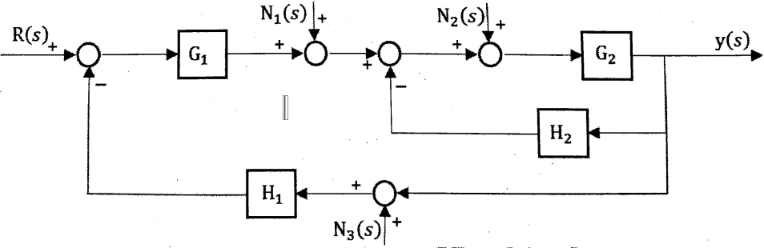

[TOC]

# 2007

- 一. (10%) 图1为转动物体，$J$表示转动惯量，$f$表示摩擦系数。若输入为转矩$M(t)$，输出为轴角位移，求传递函数$G(s)=\frac{\theta(s)}{M(s)}$

    

- 二. (10%) 求图2所示系统输出$y(s)$的表达式。

    

- 三. (20%) 单位负反馈系统的开环传递函数为$G(s)=\frac{K}{s(T s+1)(2 s+1)}$试求：

    (1) 闭环系统稳定，$K$和$T$应满足的条件；在$K-T$直角坐标系中画出该系统稳定的区域。

    (2) 若闭环系统处于临界稳定，且振动频率$\omega = 1rad/s$，求$K$和$T$的值。

    (3) 若系统的输入为单位阶跃函数，分析闭环系统的稳态误差。

- 四. (20%)系统结构如图4所示。

    (1) 画出系统的根轨迹图，并确定使闲环系统稳定的$K$值范围;

    (2) 若已知闭环系统的一种极点为$s_1 =-1$，试确定闭环传递函数。

    

- 七. (10%) 是非题(若你认为正确，则在题号后打√，否则打X，每
    题1分)

    1) 经过状态反馈后的系统，其能控能观性均不发生改变。

    2) 若一个可观的n维动态系统其输出矩阵的秩为$m$，则可设计$m$维的降维观测器。

    3) 由己知系统的传递函数转化为状态方程，其形式惟一。

    4) 一个能控能观的连续系统离散化后仍然保持其能控与能观性。

    5) 非线性系统的稳定性概念是全局性的，与系统的初始条件和外部输入无关。

    6) 若系统完全能控能观，则可以设计该系统的状态反馈控制器与状态观测器，但需要注意的是其设计结果将相互影响。

    7) 描述函数法是线性系统频率法的推广，但它只考虑了主导极点的频率响应。

    8) 对一个$n$维的能控能观线性SISO系统，其状态方程与传递函数描述是等价的。

    9) 系统$S1$能控的充要条件是其对偶系统$S2$能观。

    10) 经过非奇异线性变换的线性定常系统不改变其状态的能控性。

- 八. (10%) 如图所示离散系统， $T=1$，问：系统的$T_s$取在什么范围，系统是稳定的。

    

- 九. (15%) 如图所示电路。当$R_1=R_2= R_3$，$C_1 =C_2$，且$RC= 1/3$。
    设在$t= t_0$时，开关合上。$x_1(t_0)=x_2(t_0)$，状态变量为电容器上的电
    压。

    (1) 写出电路的状态空间模型; 

    (2) 求出状态迁移矩阵，画出状态变量图; 

    (3) 并分析系统的可控性和可观性。
    

# 2008

- 八、已知采样系统如图8所示，其中时间常数$T=0.5s$。
    (1) 当采样周期$T=0.4s$时，求使系统稳定的$K$值范围;
    (2) 若去掉零阶保持器，请采用根轨迹的方法求出使系统稳定的$K$值范围，并画出这种情况下的根轨迹草图。

    

- 九、设图中的$u_{c1}=x_1,u_{c2}=x_2$
    (1) 写出该电路的状态空间模型;
    (2) 当$R=1$， $C1=C2=1$时，由状态空间模型写出其传递函数;
    (3) 分析系统的稳定性、能控性和能观性。

    

# 2019

- 12、已知系统奈氏图如下，系统____型，是否稳定____，如果不稳定，判断不稳定极点数____

    

- 二、某系统等效的开环传递函数为
    $$
    Geq(s)=\frac{G_1G_2G_3G_4}{1+G_2G_3G_6+G_2G_6G_7-G_1G_5+G_1G_2G_3G_4(G_8-1)}
    $$
    

    (1) 该系统的闭环传递函数中$\Phi(s)$？

    (2) 若反馈回路是$H(s)=G_8$，则该系统实际的开函传递函数是？

- 三、某单位负反馈系统，开函传递函数为$G(s)=\frac{K}{(s+2)^{2}(s+6)^{2}}$

    (1) 请绘制其根轨迹。

    (2) 若要求系统$Ts≤2s (2\%)$， 问K应该为何值，说明理由?

    (3) 若要求系统的单位阶跃误差$e_{ss}≤0.1$，$K$应该为何值，说明理由?

- 四、某最小相位系统的Bode图如下所示: 

    

# 未知

- 8 (35分) 如图8所示的被控对象，假设状态变量如图中所示，诮:

    (1) 写出系统状态空间表达式

    (2) 若该系统的状态不可测，对该系统设计状态观测器，使得状态观测器的闭环极点均为$s=- 5$，并说明该系统观测器的最小维数为多少?
    (3) 设计状态反馈控制器以满足下列需求：①在阶跃输入作用下系统没有稳态偏差；②闭环系统的主导极点为$-2±j3$；③对所有的$A>0$，系统都是稳定的。
    (a) 求出图中的未知参数$A$
    (b) 给出满足要求的状态反馈矩阵$K$
    (c) 确定该系统的超调量$σ$和调节时间$t_s$
    (d) 给出状态反馈后的稳态速度误差系数

    

(1) 试绘出参数$k$和$a$从零变到无穷大时的根轨迹簇。
(2) 如果系统具有振荡形式的动态响应，请分别求出下列情况下参数$a$和$k$的取值范围。(并在根轨迹图上示意)
	a) 当系统百分比超调量小于4.3%时

​	b) 当系统峰值时间小于0.395秒时

​	c) 当系统调节时间(考虑2%误差带了小于2秒时。

- 七、(20分) 某系统结构图如图所示，要求:
    (1) 设图中$k=20$，绘制此时该系统的奈奎斯特概略曲线
    (2) 设$k$为大于0的可调参数，绘制$k$为参变量的根轨迹，绘出使系统稳定的$k$值范围，以及在临界稳定时的系统的闭环极点。

    

- 八、(15分) 离散闭环系统如图，已知被控对象$G(z)=\frac{z+0.5}{(z-1)(z-1.2)}$，试设计控制器使闭环极点为: $0.2±j0.3$

    